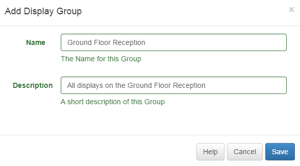
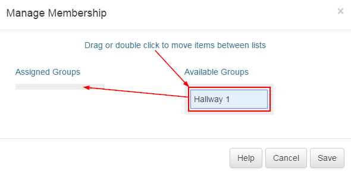

<!--toc=displays-->
#Groups
Displays can be assigned to one or more Display Groups for easier Scheduling and Media Assignment.

When a new Display Group is added in the CMS it will be available on the Schedule Calendar for events to be Scheduled against it. Display Groups are born empty and Displays will need to be added.

##Adding and Editing
A simple form is presented for Adding and Editing.

## Group Members
A special type of form is used for adding / removing Displays from a Display Group. This form is accessible on the row menu of each Display Group and includes a drag and drop list of Displays already assigned versus Displays that can be assigned.

