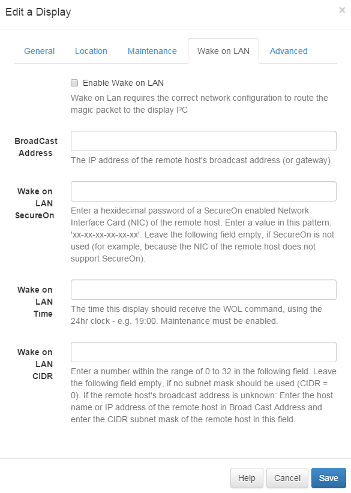

<!--toc=displays-->
#Wake on LAN
[[PRODUCTNAME]] has support for Wake on LAN if the signage player hardware supports it and if the signage player is addressable by the CMS. In this case "addressable" means that there is a clear network route between the CMS and the player hardware.

Assuming the hardware and network supports Wake on LAN it is configured in the CMS using the Display Edit Form.

##Wake Now
An immediate WOL message can be sent to the Display for testing purposes from the row action menu.

##Maintenance
The [maintenance module](cms_maintenance.html) must be correctly configured for a timed WOL message to be sent.

##Sleeping a Client
There are a few different options for putting the client to sleep - such as a scheduled task or [Shell Command](media_shellcommand.html).