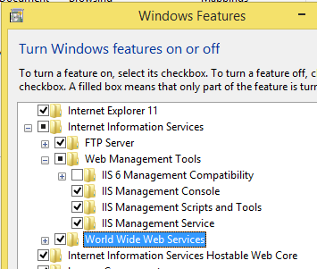
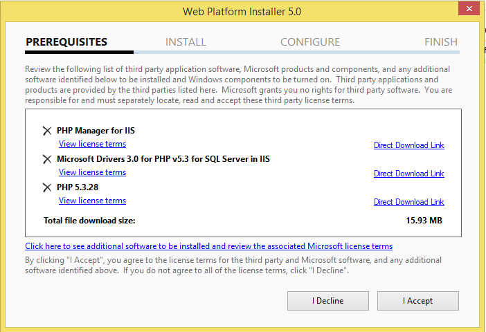
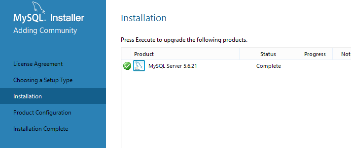
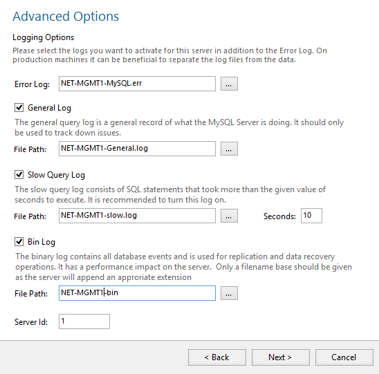
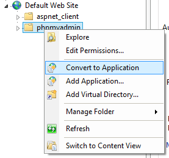
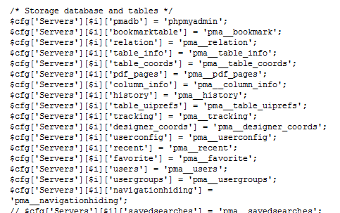

<!--toc=getting_started-->
# Install on Windows using IIS
This guide is written by Piermaria Spinazzola.

## Install Internet Information Services (IIS) Manager
If you are using Windows Server you’ll need to install the role from "Server Manager".

On Windows 7 and 8, open "Windows Features" and tick the box next to:
1. Internet Information Services

2. Web Management Tools

3. World Wide Web Services (With all Sub-Features)

4. Internet Information Services Hostable Web Core (With all Sub-Features)


    Click OK, wait for the features to be installed and when finished reboot windows.

## Install PHP
To get started go on: [http://php.iis.net](http://php.iis.net), You will be prompted to the Microsoft IIS page for PHP.

1. Click on install and when prompted on Run and start the installation using the Microsoft Web Platform Installer.

    If WPI is already installed, just open on IIS and click on the icon under management.


2. Click on install a screen like the one below should appear, check that all components have been selected for installation. 


3. At the end of the setup, click on Finish to exit the installer.


4. Close IIS

5. Go in the PHP installation folder, should be:

    C:\Program Files (x86)\PHP\v5.3
    Look for a file called "php.ini" is the php configuration file, once located, open it with text editor:

    By scrolling or searching the following strings of text check that the values are the ones shown below.

        ```
        fastcgi.impersonate = 1
        fastcgi.logging = 0
        cgi.fix_pathinfo=1
        cgi.force_redirect = 0
        ```

6. Open IIS

7. Click on Sites and Default Web Site


8. Click on PHP Manager


9. Click on Default Document and check that index.php is enabled.

10. Go back and click on "Handler Mappings", if you can't see the line:


11. Click on "Add Module Mapping" and enter the following in the dialog:

        ```
        Request path: *.php
        Module: FastCgiModule
        Executable: C:\[Path to PHP installation]\php-cgi.exe
        Name: PHP_via_FastCGI
        ```

12. Click "Request Restrictions" button and then configure the mapping to invoke handler only if request is mapped to a file or a folder;

13. Go Back to Default Web Site and click on PHP Manager and click on "Enable or Disable and Extension" and in the actions pane click on "Open php.ini". Find the [ExtensionList] and add:

    a. extension=php_fileinfo.dll, or if the line is present, remove the ";" at the beginning.

    b. extension=php_mcrypt.dll, or if the line is present, remove the ";" at the beginning.

    c. Check that php_gd2.dll and php_mbstring.dll are both present.
    You probably want to allow larger files to be uploaded than is currently available with your default PHP configuration.

    d. Find the upload_max_filesize line and set with a value > 128M if you want to upload files into [[PRODUCTNAME]] bigger than the default size.

    e. Find the post_max_size line and set with a value > 128M if you want to post files into [[PRODUCTNAME]] bigger than the default size.

    f. Find the max_execution_time line and set with a value > 120 this in order to limit the maximum exectuion time of each script, the values is in seconds.

14. Now Save the file using the same extension, close the text editor.
15. Press Win + R and type iisreset.exe and hit enter.

## Install MySQL
[[PRODUCTNAME]] Performs better on MySQL Community Server Edition, I strongly suggest to use this version rather than MySQL Server.

1. Go on http://dev.mysql.com/downloads/ and download the MyQL Community Server MSI installer.

2. Once downloaded the installer, run it.

3. Select the right installation for you, as for [[PRODUCTNAME]] we need on MySQL server, I will install the Server Only package.


4. Once Done, click next and select the right configuration for you server, for this tutorial as I assumed that server is shared with other services i’ve selected "Server Machine" as configuration type.


    Tick the box "Show Advanced Options" and click next

5. The next step is to set the "root" password, you can also create further users, with different responsibilities.
    Write down and store safely the "root" password you will always need it to let [[PRODUCTNAME]] access the my sql server and create a new DB.


6. Once done click next.

7. Configure the Windows Service


    Check that the MySQL server will run as a windows Service, if needed you can personalise the name.
    If the service needs to be run with a different account select it now otherwise keep the radio button on standard.
    TIP: in Windows Domain is good practice to create special windows account for special services.

8. Once done click next.

9. Configure Advanced Options:


    In this page you can disable or enable the service logs and rename them.
    If you’re happy with the basic settings, click next.

10. Apply Server Configuration

    The installer will now apply the selected configuration.

11. Click Finish to exit the installer configurator.

12. Now Click next again and then finish.

## Install PHP My Admin
PHPmyAdmin is a third party graphic interface for the MySQL server, this is not essential but useful if you want to manage and have a look at your MySQL Databases.

1. Go at: http://www.phpmyadmin.net/home_page/downloads.php and download the latest version, save it on your disk.

2. Once downloaded, open the Zip file and copy the content in your IIS default site folder, usually: "C:\inetpub\wwwroot"


3. Rename the folder with the following name: phpmyadmin and hit enter

4. Open IIS

5. Click on "Default Site" and right click on the "phpMyAdmin" Folder and from the drop down menu select "Convert to Application"


6. You can leave the default settings and click OK.


7. Now go to the directory that you copied the unzipped PHPMyAdmin folder to and open a file named config.sample.inc.php using WordPad

8. Find the line $cfg[‘blowfish_secret’] = ‘Value’; you have to fill in this line with anything that you want.
    Tips: The maximum number of characters is 46 and it can be alphanumeric.


9. Go down to the section User for advanced features and uncomment (Remove the // from the front of the line) the two lines under that and change the pmapass to a different password, I will use password.


10. Next, go down to the next section Storage database and tables and uncomment all the lines under it, unless you want to disable access to Database areas (remove the // from the front of the line).


11. Now save and close the file.

12. Open your browser and go to: http://localhost/phpmyadmin/

13. You should now see the following page:
    To login use your "root" username and password to get access.


## Install [[PRODUCTNAME]]
1. Download the latest version of [[PRODUCTNAME]] from the website [[PRODUCTHOME]], save it on your disk.

2. Once downloaded, open the Zip file and copy the content in your IIS default site folder, should be: "C:\inetpub\wwwroot"

3. Rename the folder just copied with the following name: [[PRODUCTNAME]]


4. Open IIS 

5. Click on "Default Site" and right click on the "[[PRODUCTNAME]]" Folder and from the drop down menu select "Convert to Application"


6. You can leave the default settings and click OK.


7. Now open your browser and type the following address http://localhost/[[PRODUCTNAME]]/ and follow the CMS installation guide you can find on the website.

```
Rev 30.11.2014 v.1.0 – IIS 8.5, MySQL 5.6.21 Community Server Edition, PHP 5.3, Windows Server 2012.
```