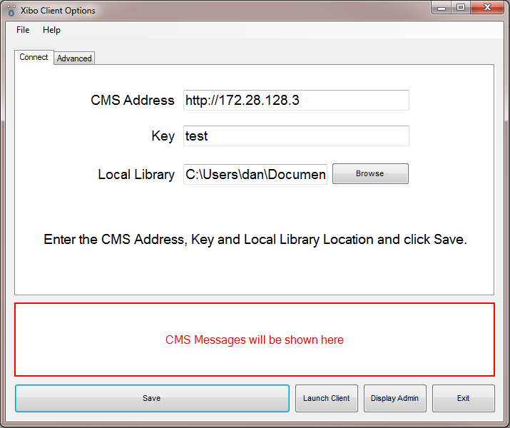

<!--toc=getting_started-->
#Windows Client Installation
The [[PRODUCTNAME]] windows client is distributed as a windows installer file (MSI) which is a standard "double click" installation.

There are 3 steps to follow:
1. Preparation - Minimum Requirements and MSI
2. Installation - Double click the MSI to start the installation process.
3. Connect - [Connect your client to the CMS](#configuration)

##Minimum Requirements
[[PRODUCTNAME]] is a low resource signage solution, however with the advance of technology it has been necessary to set out some minimum requirements. The installation process will check these for you, but they are listed below for convenience:

- A network connection to the CMS (possibly over the Internet)
- Microsoft Windows XP SP3 / Windows Vista / Windows 7 (*recommended Windows 7*)
- .NET Framework v3.5 SP1
- Internet Explorer 7+ (*recommended IE10 or higher*)
- Flash Player Version 9 or later
- Windows Media Player 11 or later
- For PowerPoint support, Microsoft PowerPoint 2003 or later. *PowerPoint viewer is not suitable*.

###Installation
To start the installation double click on the `[[PRODUCTNAME]]-client-1.7.0-beta-x86.msi` file you downloaded along with the package. The installer will take you through a number of screens asking for your confirmation at each stage. The steps are outlined below.

###Step 1
You may see the following security warning when installing [[PRODUCTNAME]]. Please click on "Run" to begin the installation.

###Step 2
The installer presents a welcome screen. Please press "Next".

###Step 3
Choose the location where [[PRODUCTNAME]] should be installed. The default location should normally be sufficient, however to change the location click browse. After making the selection (or if leaving to the default) click "Next" to continue.

###Step 4
A confirmation message is then shown. When happy with the selections made click "Install" to begin. Otherwise click "Back" to correct any errors.

###Step 5
The Installation is complete. Click finish to exit.

##Connect to the CMS
Newly installed clients must be configured and registered with the [[PRODUCTNAME]] CMS before they can be used. The [[PRODUCTNAME]] Configuration Options are accessible on each client installation from the Start Menu, All programs.

Select "[[PRODUCTNAME]] Client Options" to register this display on the [[PRODUCTNAME]] Network; or to make changes to this display configuration.

###Client Options Screen
Most of the client options are set on the CMS and delivered over the network to the client. This keeps the client configuration to a minimum on each new installation.

Before the options can be sent from the CMS it is necessary to register the display with the CMS. This can be done from the client options screen, pictured below. 

There are a few other settings that can only be set on the client side. These are explained below.

###Settings
**CMS Address**
This is the fully qualified address of your CMS installation. For example `http://your.domain/cms/`.

**Key**
The secret CMS Key that will authenticate this display with the CMS.

**Local Library**
The location for the display client to store its local files. Files are downloaded from the CMS so that the client will still function if it looses connection with the CMS.

**Display ID**
The unique ID for this display. An automatically generated unique ID will be assigned at installation but can be modified if appropriate.

**Splash Screen**
Optionally override the splash screen with an image stored locally on the client PC.

###Proxy settings
The display client needs to have access to the CMS during the registration process and also to get new content. If the client is behind a proxy server, then details of that server can be entered in the proxy section.

**Username**
The user name used to authenticate with the Proxy Server.

**Password**
The password used to authenticate with the Proxy Server.

**Domain**
The domain used to authenticate with the Proxy Server.

###The Save button and Status Messages
Once all of the settings have been filled in (minimum CMS Address, Key, Local 
Library and Display ID) the Save button should be pressed. At this point the message window will update with the status "Saving with CMS... Please Wait...."

Assuming there are no errors with the communication between the CMS Address and the client, the display will be registered and awaiting approval.

###CMS Display Management
Now log in to the server web interface, go to the "Display->Displays" page. You should see your newly registered client in the list. Click the "Edit" button next to the display. The "License Display" option will automatically change to "Yes". Optionally select a different default layout (the layout the client will play if nothing is scheduled).

####Display Setting Profiles
Once registered the display client will be given a default display setting profile. For more information see the display profiles section.

Make sure you click Click "Save" before exiting the Client Options.

##Start Client Player
You can now start the [[PRODUCTNAME]] Client Player. It should show you the [[PRODUCTNAME]] splash screen while the default layout and its media contents (and anything else you have scheduled) are downloaded and then begin playing layout contents.

##Windows Modifications
Here are some suggested settings for Windows / PowerPoint for a Display Client:

- Turn off all screen savers
- Turn off screen power saving
- Load the "No Sounds" Sound Scheme (Control Panel -> Sounds and Audio Devices Properties)
- Set a plain wallpaper (Hopefully nobody will see it, but you might need to reboot the client, or restart [[PRODUCTNAME]] and a sane wallpaper is a help)
- If the client is accessible from where you manage your displays from, you might want to install UltraVNC server so you can connect in and check on the client from time to time. Use the "View only" option in the VNC client to avoid disturbing the display.
- Set Windows to log on as your display client user automatically
- Disable balloon tips in the notification area
- Disable Windows Error Reporting. Occasionally PowerPoint seems to "crash" when [[PRODUCTNAME]] closes it. Unfortunately this leaves an unsightly "PowerPoint has encountered a problem and needs to close" message on the display. Follow the steps here to disable Windows Error Reporting completely - including notifications.
- Also disable Office Application Error reporting. Follow instructions at KB325075 or merge this registry patch.

**Please take a backup before modifying the registry**

If you're using PowerPoint, then there are a couple of extra steps:

First consider if you would be better converting your PowerPoint content to video files. PowerPoint 2010 and later can "Save As" a WMV file which can be loaded straight in to [[PRODUCTNAME]] and is far more reliable. If however you still need to play PowerPoint files, please ensure you action the following:

The first time you run [[PRODUCTNAME]] with a PowerPoint, you might get a popup appear that asks what [[PRODUCTNAME]] should do with the PowerPoint file. The popup actually originates from Internet Explorer. Choose to "Open" the file, and untick the box so you won't be prompted again.
In some circumstances, you may find that PowerPoint, the application, loads instead of the file opening within [[PRODUCTNAME]] itself. If that happens, try merging this registry patch. (Taken from pptfaq.com). Users of PowerPoint 2007 should go to Microsoft KB927009 and run the FixIT application instead. Users of PowerPoint 2010 should go here instead KB982995

Note also that PowerPoint will put scroll bars up the side of your presentation, unless you do the following for each PowerPoint file BEFORE you upload it:
- Open your PowerPoint Document
- Slide Show -> Setup Show
- Under "Show Type", choose "Browsed by an individual (window)" and then untick "Show scrollbar"