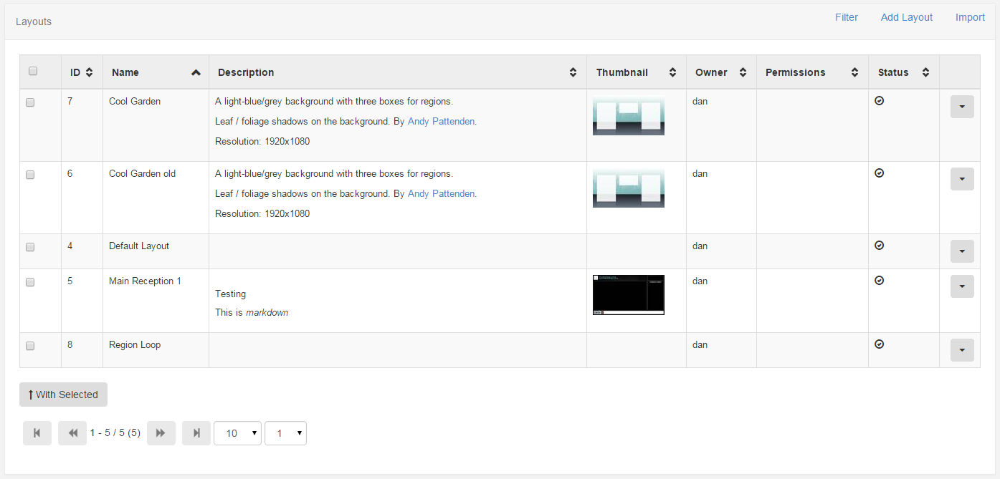
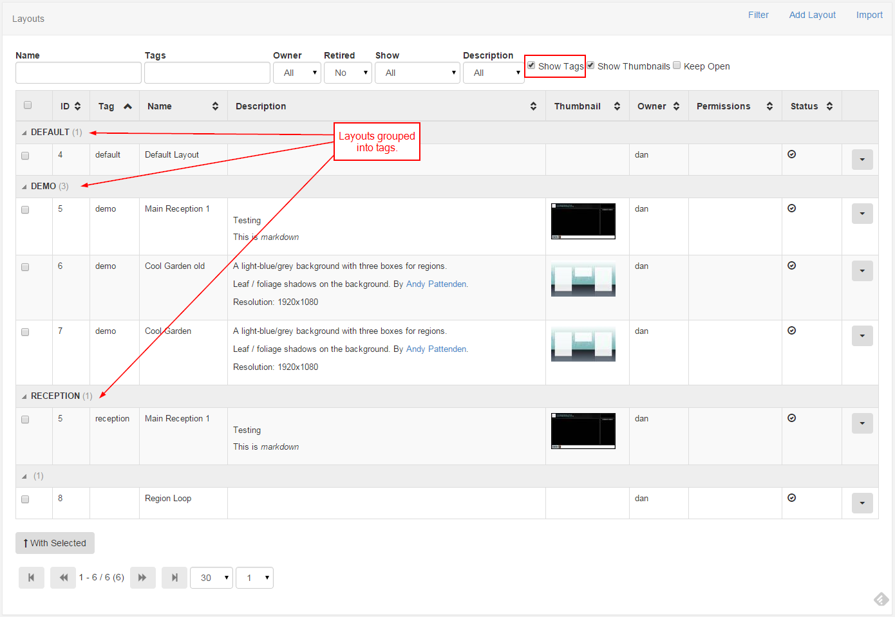

<!--toc=layouts-->
#Layouts
A layout is a complete screen design, including content and a background image, which can be scheduled across multiple displays at multiple times. A layout has one or more regions which contain a playlist of media to show. 

Layouts are designed at a **target resolution**, but they will dynamically resize if they are shown on a Display that has a different resolution. If they dynamically resize "bars" might be added if the two resolutions are different aspect ratios. See [Resolutions](layouts_resolutions.html) for more information.

[[PRODUCTNAME]] has no limit to the number of Layouts in the system or the number of Layouts each individual user can have.

Layouts are viewed from the Design section of the menu by clicking the Layouts menu item. The default view shows all Layouts the user has permission to view, their description and a thumbnail of their background image.

## Layout Transactions
Layouts can be:
- Added
- Edited
- Retired
- Deleted

Each transaction is available on the row menu and will present a form for confirmation before the transaction is executed.

###Templates and Resolutions
Before a Layout can be added a Template _or_ Resolution must be selected. Templates are saved Layouts and Resolutions are the intended display resolution. If a Template is selected it will already be designed at a pre-set resolution.

##When to create a Layout?
Layouts provide vast flexibility in the system, but can also cause confusion - when should a user create a new Layout and when should a user add to an existing Layout Region Playlist?

The recommended usage for a Layout is to only contain the design and media required for a set of related content that should be scheduled at the same time.

For example, if you have a video showing a fire safety demonstration and a video showing a advert of an upcoming production - it would be natural to have separate Layouts for these.

##Tags
Layouts can be tagged on the Add / Edit form which allows them to be viewed in a tag grouped format. This is particularly useful as the quantity of Layouts grows.

To enable the tag viewer select "Show Tags" from the filter.

_Layouts with more than one tag appear once for each tag with the tag viewer enabled._

##Schedule Now
Layouts can be instantly scheduled using the [Schedule Now](scheduling_now.html) functionality available on the row menu.

