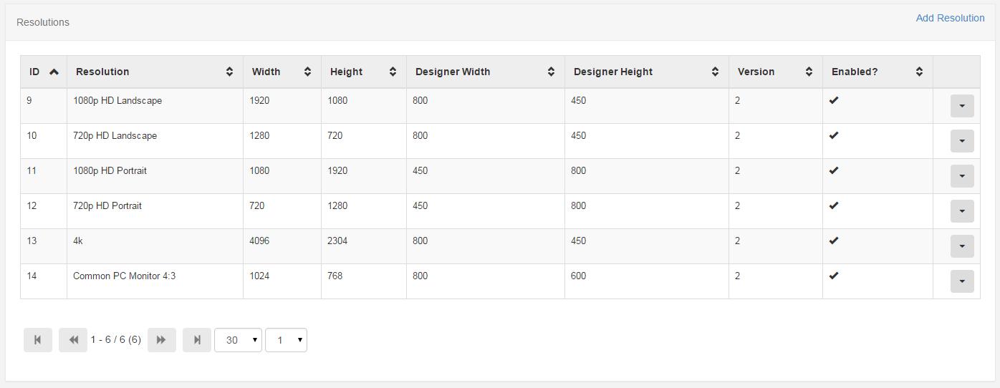

<!--toc=layouts-->
#Resolutions
Layouts are designed to run on a particular resolution and will function best when shown on a signage player with a matching resolution.

If they are shown on a signage player with a different resolution they will automatically scale to fit.

##Chosing the right resolution
[[PRODUCTNAME]] comes with a selection of default resolutions that cater for most digital signage applications (e.g. LCD TVs, projectors, portrait screens).

The [[PRODUCTNAME]] client will make its best effort to fit whatever shape layout you choose on to the screen. However sending a client a layout in a 4:3 aspect ratio when it is connected to a 16:9 TV wastes two bars on either side of your content.

You should choose a resolution closest to the screen you will be showing the layout on.

##Portrait Displays
If supported by the signage player hardware, portrait resolutions are available.