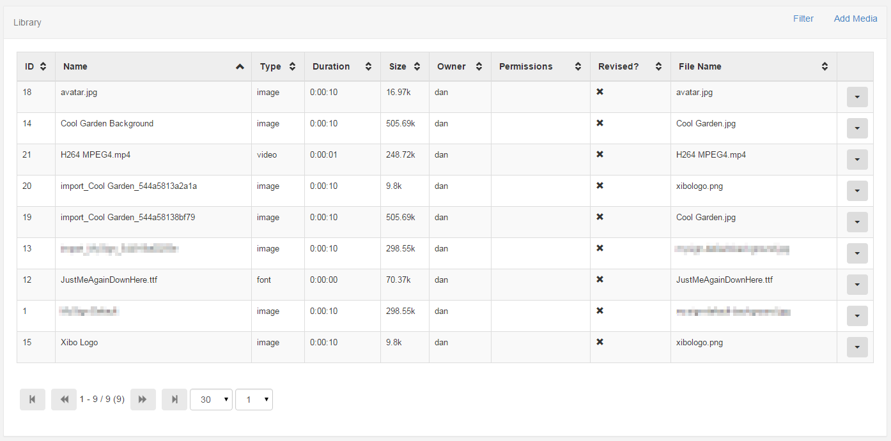
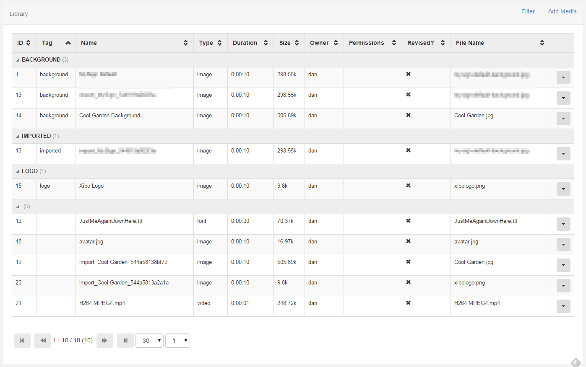

<!--toc=media-->
#Media
[[PRODUCTNAME]] supports a wide variety of media which can be categorised into 2 different types.

1. Library Media
2. Layout Media

## Library Media
Library Media is file based media that is uploaded and stored in the CMS Library for use on one or more Layouts.

Examples of Library Media are:
- Images
- Videos
- Fonts

**[DataSets](media_datasets.html)** are a special type of Library media used to represent tabular data.

## Layout Media
Layout media is created and stored directly on a Layout. This is for media that is not commonly reused, exists on only 1 Playlist and is specific to the Layout.

Examples of Layout Media are:
- Text
- Ticker
- Embedded Content

## Library Administration
The Library page is accessible from the side navigation bar by clicking on the Library menu item.

### Tag Viewer
A tag viewer is also available from the filter form.

**Please be aware that [[PRODUCTNAME]] takes no measures to control what is put on your Displays. It is your responsibility to ensure that any content is appropriate material for the audience and is either appropriately attributed or you own the rights to it.**