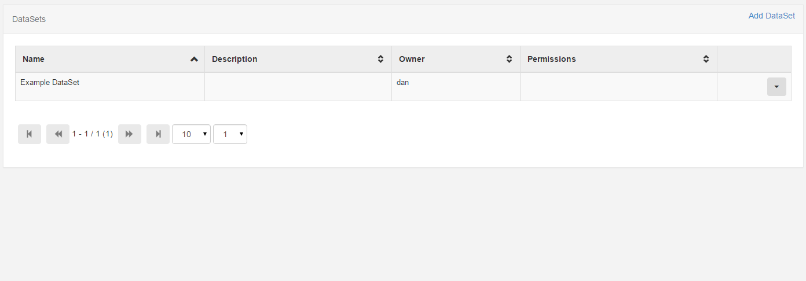

<!--toc=media-->
# DataSets <small>Tabular data</small>

DataSets are a feature to design and display tabular data, formatted nicely, in a region on a layout. This data can be imported from a CSV file and provides a convenient way to display data from other systems in [[PRODUCTNAME]].

Examples of where this could be used are:

*   A drinks menu at a bar
*   Tee times at a golf club
*   Meeting room bookings

DataSets have been designed to be versatile and reusable and therefore come in two parts:

*   The DataSet (Data Structure and Content)
*   The Display (DataSet View / Ticker)

The DataSet is defined in the Library and can be reused across multiple DataSet views and Layouts.

DataSets are accessed using the Library menu, DataSet sub menu.

Each data set can have a number of actions performed against it, using the Action Menu.

## Adding DataSets <small>create a new empty DataSet</small>

Use the Add DataSet button to show the Add DataSet form.

- **Name**

	A name for the DataSet - used to identify it later in the CMS.

- **Description**

	A description of this DataSet - what is it and what is it for.

The creator of a dataset (or an admin) is able to set the permissions for the DataSet on a user group, or on a user by 
user basis. Only users with Edit permissions will be able to add/edit data and reorganise the data structure, only users with 
a view permission will be able to use the DataSet in their layouts.

## Editing DataSets <small>changing the name</small>

DataSets can be Edited using the action menu. Select the Edit menu item to show the DataSet Edit form.

## Deleting DataSets

DataSets can be deleted using the action menu. Select the Delete menu item to show the DataSet Delete form.

DataSets can only be deleted if they are not currently being used.

## DataSet Columns <small>Defining Dataset Structure</small>

Data Columns are used to define the structure of the data, each column can have a number of settings to achieve this, these are:

- **Heading**
	
	The Heading for this Column

- **List Content**
	
	A comma separated list of values that can be selected for this field.

- **Column Order**
	
	The position this column should appear when viewing / entering data.

- **Data Type**
	
	What is the format for this data? String, Number or Date.

- **Column Type**
	
	Value or Formula. Is this column a user entered value (Value) or a calculated column (Formula).

There is no theoretical limit to the number of columns [[PRODUCTNAME]] can support; although a smaller DataSet is often easier to enter and display.

Columns can be added and removed after data has been entered. The ordering and list content of columns can also be changed after data has been collected.

### Adding Data

Once all the required columns have been added, the DataSet is ready to have data recorded against it. This is done using 
the "View Data" task on the DataSet table view. This view will contain all of the columns that were added in the 
previous step and allow you to go through each one and enter data.

There is no "save" button on this interface, [[PRODUCTNAME]] will automatically save your changes after each data entry.

Note: If all the rows are taken, more rows can be added to the data set by clicking the "More Rows" button.

## Importing from CSV file

The CMS has a DataSet CSV importer that can be used to extract data from a CSV file and put it into a DataSet.

