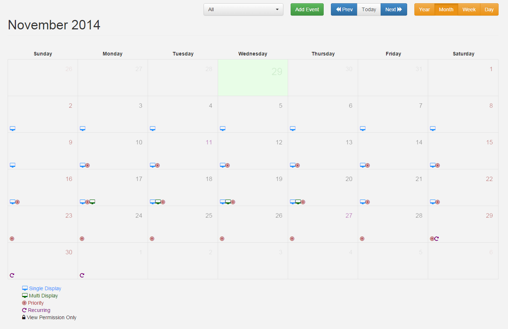
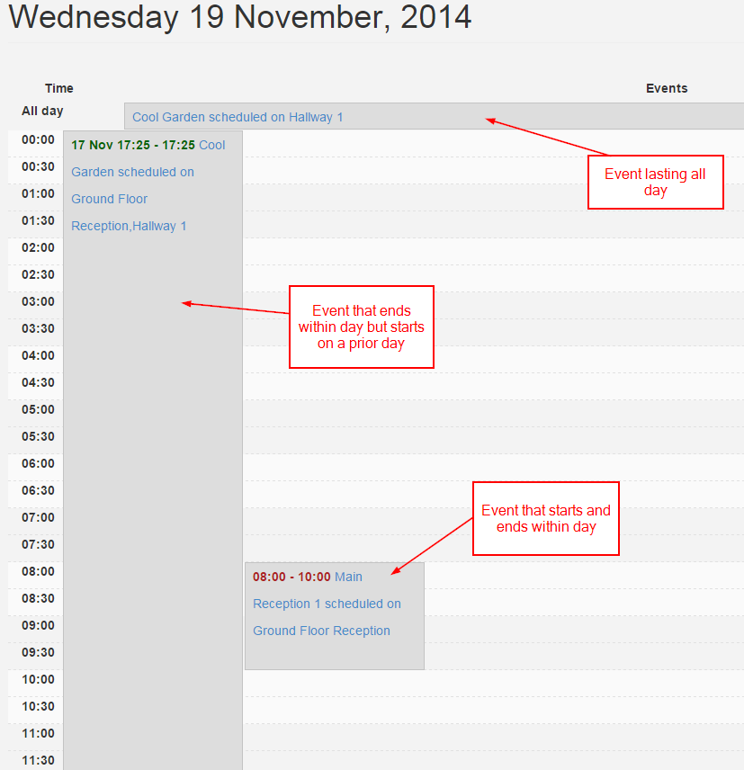
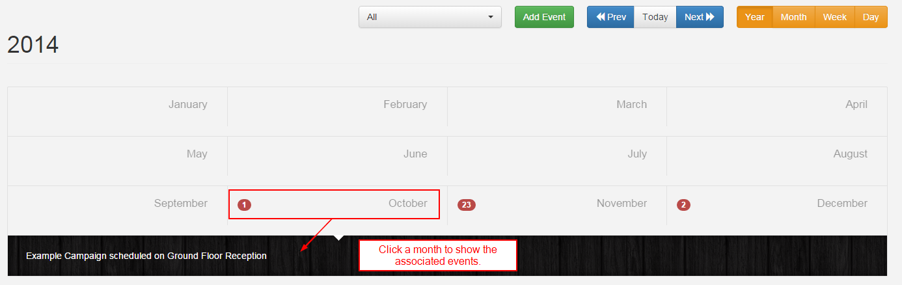

<!--toc=scheduling-->
#Calendar
The Calendar is accessible from the Scheduling link in the side bar and has 4 views:

- Year
- Month
- Week
- Day

Scheduling transactions can be performed when in any view.

## Controls
There is a control bar at the top of the calendar for selecting the Displays, Adding Events and navigating through time and the views.

## Month View
The month view is the most commonly used view of the calendar.

## Week View
The week view gives a week overview of events.

## Day View
The day view is the lowest resolution and shows all events occurring within a single day.

## Year View
The year view is intended as an overview of the events throughout the year.

