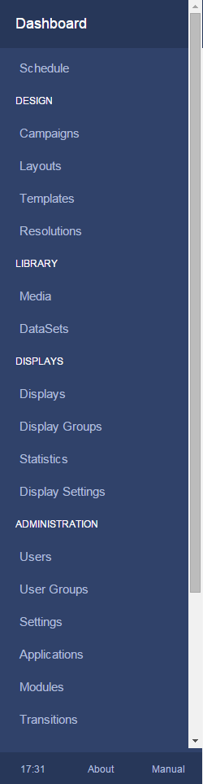

<!--toc=tour-->
#Navigation
Getting around the CMS is easy, with the intuitive side bar that shows only the items each user has permission to see.

The side bar is split into sections to further classify each page - these are:

1. Dashboard

   The dashboard section is actually a direct link to the logged in users dashboard.

2. Schedule

   The schedule section is actually a direct link to the calendar of events for each display in the signage network.

3. Design

   The design section contains all the pages for Layout design and Campaigns.

4. Library

   The library section contains all the stored media, including DataSets.

5. Displays

   The display section contains all the pages for managing connected Displays, sorting Displays into Groups and viewing statistics.

6. Administration

   The administration section contains all the pages for managing Users, User Groups, Modules and Global Settings.

7. Advanced

   The advanced section is for troubleshooting.

These options are enabled based on the user permissions for the logged in user. Permissions can be granted on a user by user or user group basis.

##Profile Icon
In the top right hand corner of the CMS is the profile icon. This provides access to user specific data and options.

**All new users should visit this menu to change their password the first time they log into the CMS**
