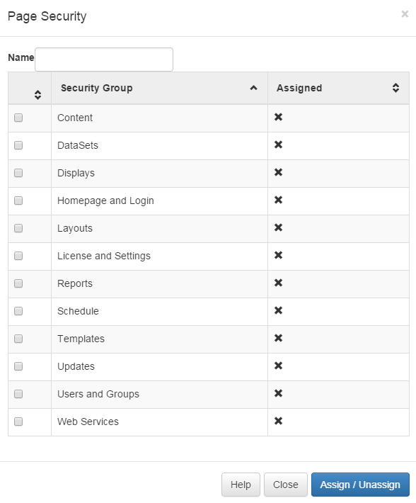

<!--toc=users-->
#Permissions
Every item in the CMS can have permissions applied to it so that users can be granted or denied access.

Permissions are split into two concepts:
1. Permissions on System Objects (pages and menu items)
2. Permissions on User Objects (media, layouts, displays and schedules)

## System Objects
System objects are configured on the User and / or Group. The highest level of permission is always taken.

### Page Security
Each page has its own security record, but they have been grouped into complementary categories for convenience.

The check box is used to **toggle** the assignment.

### Menu Security
There are 7 menus in the CMS:
- Top Nav
    
    The top nav menu provides the section headers in the side bar.

- Administration Menu (sub menu)
- Advanced Menu (sub menu)
- Design Menu (sub menu)
- Display Menu (sub menu)
- Library Menu (sub menu)
- Dashboard

    The dashboard menu represents the icons shown in the Icon Dashboard.

## User Objects
User objects have permissions configured on the object itself. The following objects have this facility:

- Library Media
- Layouts
- Regions in Layouts
- Media on Region Playlist's
- DataSets
- Display Groups
- Displays

All of these items have the permissions set in the same way, via a simple to use dialogue showing groups and users. In addition to this all permissions are validated with each form load, or save button clicked so you can guarantee "real time" modifications to the permissions on items.

The Highest permission is used (if a user belongs to 2 groups, one has edit permissions and the other doesn't, the user will have edit permissions).

Permissions are tested with each transaction.

Permissions on an item can only be changed by the owner or a super administrator (for displays and display groups that have no owner, this is super admin only).

These permissions are then reflected in all tables, forms, lists and on the layout designer.