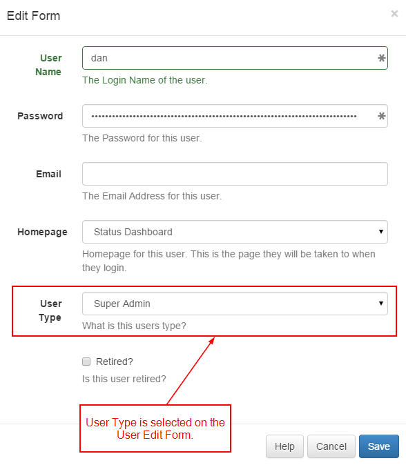

<!--toc=users-->
#User Types
Every user in the CMS must have a User Type, there are 3 to choose from:

- Super Admin
- Group Admin
- User

The types of user are pre-configured and cannot be changed.

The user type is configured per user on the User Add / Edit form.

##Super Admin
Super Admin users have access to every part of the CMS. They also have access to all the media, layouts and schedules added by other users of the system.

In most cases there will be one or two Super Admins that are the last contact point for the the CMS system. It should be noted that the Super Admin has permissions to every part of the CMS regardless of the permissions set on the User group they belong to.

The user account created during the install is a Super Admin.

##Group Admin
The group admin only has access to the parts of the CMS assigned to the group they belong to. However they also have access to all the media, layouts and schedule of users within that group. They are able to view shared items that have the public sharing setting.

##User
The user only has access to the parts of the CMS assigned to the group they belong to. They also only have access to their own media, layouts and schedules. They are able to view shared items that have the public or group sharing setting.