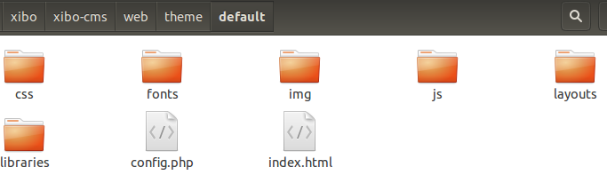
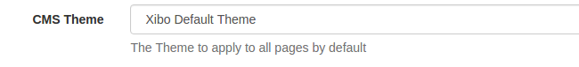

<!--toc=advanced-->
# Themes
The CMS has a theme system which allows a developer to customise the look and feel of the application by creating
a theme and adding it to the `web/theme/custom` folder. The theme engine has been designed with the 
principle of inheritance in mind, meaning that any resource requested by the CMS is passed through the currently active 
theme and if that theme does not contain the resource, the default theme resource is served.

Themes are modelled as sub-folders under the `theme/custom` folder. The theme folder is contained in the `/web` CMS installation 
folder. The default theme exists in a folder called "default".

<white>
Please contact your provider for further development details.
</white>

<nonwhite>



Each theme has a simple config file called `config.php` which sets the title for the theme and some other meta data, 
for example the default theme `config.php` is:

```
<?php
$config = array(
    'view_path' => '../views',
    'theme_name' => 'Xibo Default Theme',
    'theme_title' => 'Xibo Digital Signage',
    'app_name' => 'Xibo',
    'theme_url' => 'http://xibo.org.uk',
    'cms_source_url' => 'https://github.com/xibosignage/xibo/',
    'cms_install_url' => 'http://xibo.org.uk/manual/en/install_windows_client.html',
    'cms_release_notes_url' => 'http://xibo.org.uk/manual/en/release_notes.html',
    'latest_news_url' => 'http://xibo.org.uk/feed/'
);
```

The current CMS theme is activated in the General CMS Settings and is called `[[PRODUCTNAME]] Default Theme`.




## Basic Changes
Basic theme changes, such as minor modifications to the CSS can be achieved by providing an `override.css` file in your
themes `/web/theme/custom/<theme>/css` folder. This CSS file is included as the **last** CSS include on
all pages and can be used to override the CSS. The default version of this file is empty.

## Advanced Changes
The CMS uses the **Twig** engine for its view layer. The default view paths is `/views`. Each twig view can be overridden
by providing an alternative `view_path` setting in the theme `config.php` file.

### Pages
All pages in the CMS extend the `authed.twig` file, which in turn extends the `base.twig` file. Supplying an override to
either of these files is the place to start customising the HTML/CSS of the CMS.

### Forms
Forms in [[PRODUCTNAME]] are served over XHR and rendered by JavaScript in the browser. Each form extends the 
`form_base.twig` file.

# Examples

## Changing the logo

A typical use case is to change the logo shown in the header. This
example assumes that you do not have a theme yet. Create the following structure:

 - Create the `/web/theme/custom` folder if it does not exist
 - Create a sub-folder for your theme, for example `/web/theme/custom/mytheme`
 - Create a views sub-folder inside your theme, `/web/theme/custom/mytheme/views`

Next you need to provide a config file for your theme at `/web/theme/custom/mytheme/config.php`

```
<?php
$config = array(
    'theme_name' => 'My Theme',
    'theme_title' => 'My Theme',
    'app_name' => 'Xibo',
    'theme_url' => 'http://xibo.org.uk',
    'cms_source_url' => 'https://github.com/xibosignage/xibo/',
    'cms_install_url' => 'http://xibo.org.uk/manual/en/install_windows_client.html',
    'cms_release_notes_url' => 'http://xibo.org.uk/manual/en/release_notes.html',
    'latest_news_url' => 'http://xibo.org.uk/feed/'
);
```

The new theme can be activated in CMS settings under the Configuration tab. Do that now.

The CMS will now be checking your theme folder for all resources, including images, CSS and JavaScript.
This means that we can drop a replacement logo into the theme and it will render that instead.

The default logo is stored in `/web/theme/default/img/xibologo.png` - take a copy of it and save it in
`/web/theme/custom/mytheme/img/xibologo.png` and modify it according to your requirements.

## Adding a new link

A common example is to add a new link to the menu which directs the user to an external web page. This
example assumes that you have created the theme shown in the "Changing the logo" example.

To provide a new link it is necessary to override one of the Twig views the CMS uses to render its 
content.

Add a custom view path to your `config.php` file in the `$config` array :

```
'view_path' => PROJECT_ROOT . '/web/theme/custom/mytheme/views',
```

You can then add Twig views to override the default views provided by the CMS, for example
take a copy of `/views/authed.twig`, save it in your `view_path` and add a new link at the 
appropriate place in the html.

You may want to develop a custom page within the CMS itself - more information can be found in the 
[extending](advanced_extending.html) section.

</nonwhite>