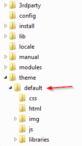

<!--toc=advanced-->
# Themes</small>
The CMS has a theme system which allows a developer to customise the look and feel of the application by creating
a theme and adding it to the `web/theme` folder. The theme engine has been designed with the 
principle of inheritance in mind, meaning that any resource requested by the CMS is passed through the currently active 
theme and if that theme does not contain the resource, the default theme resource is served.

Themes are modelled as sub-folders under the "theme" folder. The theme folder is contained in the root CMS installation 
folder. The default theme exists in a folder called "default".



Each theme has a simple config file called `config.php` which sets the title for the theme and some other meta data, 
for example the default theme `config.php` is:

```
$config = array(
    'view_path' => '../views',
    'theme_name' => 'Xibo Default Theme',
    'theme_title' => 'Xibo Digital Signage',
    'app_name' => 'Xibo',
    'theme_url' => 'http://xibo.org.uk',
    'cms_source_url' => 'https://github.com/xibosignage/xibo/',
    'cms_install_url' => 'http://xibo.org.uk/manual/en/install_windows_client.html',
    'cms_release_notes_url' => 'http://xibo.org.uk/manual/en/release_notes.html',
    'latest_news_url' => 'http://xibo.org.uk/feed/'
);
```

The current CMS theme is activated in the General CMS Settings and is called `CMS Theme`.


A typical use case is to change the logo and application name. This can be done with a new sub-folder, a 
`config.php` file and a new logo image file in the img sub folder.

## Basic Changes
Basic theme changes, such as minor modifications to the CSS can be achieved by providing an `override.css` file in your
themes `/web/theme/<theme>/css` folder.

## Advanced Changes
The CMS uses the **Twig** engine for its view layer. The default view paths is `/views`. Each twig view can be overridden
by providing an alternative `view_path` setting in the theme `config.php` file.

### Pages
All pages in the CMS extend the `authed.twig` file, which in turn extends the `base.twig` file. Supplying an override to
either of these files is the place to start customising the HTML/CSS of the CMS.

### Forms
Forms in [[PRODUCTNAME]] are served over XHR and rendered by JavaScript in the browser. Each form extends the 
`form_base.twig` twig file.