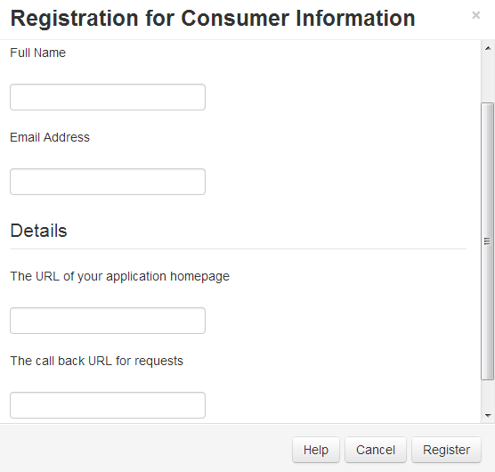
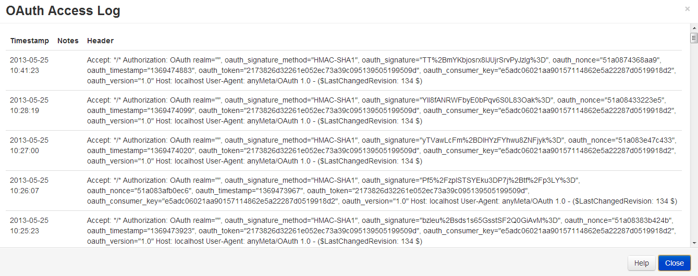

<!--toc=api-->
# Applications <small>API Authentication with oAuth</small>

Any application that connects to the CMS API will require pre-registration and user authentication before it is allowed to connect.

Applications must have an "Application" record in the CMS, which describes the application name, home page location and authentication information (application keys). Applications can be viewed from the Administration > Applications menu.

It is recommended to keep this information confidential and only accessible to super administrator users.

### Registered Applications

You must obtain a consumer_key and consumer_secret for your application. Keys for "Supported" applications will be shipped with [[PRODUCTNAME]] meaning no extra steps are required. If you have made your own application you will need to register it with your [[PRODUCTNAME]] CMS using the "Add Application" menu button.

### Callback URL

The Callback URL will be automatically called by [[PRODUCTNAME]] on a completely Authorize request. It will be called regardless 
of whether the authorization was successful and will contain an OAuth message indicating the authorize success.

If you do not specify a Callback URL [[PRODUCTNAME]] will show a message requesting the user return to the application once authorized.

## oAuth Log <small>Debugging authentication requests</small>

The CMS provides a log of all oAuth requests for tokens in the oAuth Log. Currently this log is a list of the last 50 oAuth requests, showing the date and header provided by the client.

# Application Code <small>within the 3rd party application</small>

The 3rd party application must obtain an access token which is used when making requests. This is done using the standard oAuth pattern. The specific URL's for the CMS are shown below:

Service location: `http:://**YourCMS**/services.php`

OAuth methods:

*   XRDS: `services.php?xrds`
*   Request Token: `services.php?service=oauth&method=request_token`
*   Authorize Token: `index.php?p=oauth&q=authorize`
*   Access Token: `services.php?service=oauth&method=access_token`

### XRDS

The service is also discoverable by XRDS. The schema is below: 

<pre>&lt;?xml version="1.0" encoding="UTF-8"?&gt;
  &lt;XRDS xmlns="xri://$xrds"&gt;
  &lt;XRD xmlns:simple="[http://xrds-simple.net/core/1.0](http://xrds-simple.net/core/1.0 "http://xrds-simple.net/core/1.0")"
  xmlns="xri://$XRD*($v*2.0)"  xmlns:openid="[http://openid.net/xmlns/1.0](http://openid.net/xmlns/1.0 "http://openid.net/xmlns/1.0")" version="2.0" xml:id="main"&gt; 
  &lt;Type&gt;xri://$xrds*simple&lt;/Type&gt;
&lt;Service&gt;
    &lt;Type&gt;[http://oauth.net/discovery/1.0](http://oauth.net/discovery/1.0 "http://oauth.net/discovery/1.0")&lt;/Type&gt;
    &lt;URI&gt;#main&lt;/URI&gt;
&lt;/Service&gt;
&lt;Service&gt;
    &lt;Type&gt;[http://oauth.net/core/1.0/endpoint/request](http://oauth.net/core/1.0/endpoint/request "http://oauth.net/core/1.0/endpoint/request")&lt;/Type&gt;
        &lt;Type&gt;[http://oauth.net/core/1.0/parameters/auth-header](http://oauth.net/core/1.0/parameters/auth-header "http://oauth.net/core/1.0/parameters/auth-header")&lt;/Type&gt;
    &lt;Type&gt;[http://oauth.net/core/1.0/parameters/uri-query](http://oauth.net/core/1.0/parameters/uri-query "http://oauth.net/core/1.0/parameters/uri-query")&lt;/Type&gt;
    &lt;Type&gt;[http://oauth.net/core/1.0/signature/HMAC-SHA1](http://oauth.net/core/1.0/signature/HMAC-SHA1 "http://oauth.net/core/1.0/signature/HMAC-SHA1")&lt;/Type&gt;
    &lt;Type&gt;[http://oauth.net/core/1.0/signature/PLAINTEXT](http://oauth.net/core/1.0/signature/PLAINTEXT "http://oauth.net/core/1.0/signature/PLAINTEXT")&lt;/Type&gt;
    &lt;URI&gt;http://[Template:XRDS LOCATION](/index.php?title=Template:XRDS_LOCATION&amp;action=edit&amp;redlink=1 "Template:XRDS_LOCATION&amp;action=edit&amp;redlink=1")/services.php?service=oauth&amp;method=request_token&lt;/URI&gt;
&lt;/Service&gt;
&lt;Service&gt;
    &lt;Type&gt;[http://oauth.net/core/1.0/endpoint/authorize](http://oauth.net/core/1.0/endpoint/authorize "http://oauth.net/core/1.0/endpoint/authorize")&lt;/Type&gt;
    &lt;Type&gt;[http://oauth.net/core/1.0/parameters/uri-query](http://oauth.net/core/1.0/parameters/uri-query "http://oauth.net/core/1.0/parameters/uri-query")&lt;/Type&gt;
    &lt;URI&gt;http://[Template:XRDS LOCATION](/index.php?title=Template:XRDS_LOCATION&amp;action=edit&amp;redlink=1 "Template:XRDS_LOCATION&amp;action=edit&amp;redlink=1")/index.php?p=oauth&amp;q=authorize&lt;/URI&gt;
&lt;/Service&gt;
&lt;Service&gt;
    &lt;Type&gt;[http://oauth.net/core/1.0/endpoint/access](http://oauth.net/core/1.0/endpoint/access "http://oauth.net/core/1.0/endpoint/access")&lt;/Type&gt;
    &lt;Type&gt;[http://oauth.net/core/1.0/parameters/auth-header](http://oauth.net/core/1.0/parameters/auth-header "http://oauth.net/core/1.0/parameters/auth-header")&lt;/Type&gt;
    &lt;Type&gt;[http://oauth.net/core/1.0/parameters/uri-query](http://oauth.net/core/1.0/parameters/uri-query "http://oauth.net/core/1.0/parameters/uri-query")&lt;/Type&gt;
    &lt;Type&gt;[http://oauth.net/core/1.0/signature/HMAC-SHA1](http://oauth.net/core/1.0/signature/HMAC-SHA1 "http://oauth.net/core/1.0/signature/HMAC-SHA1")&lt;/Type&gt;
    &lt;Type&gt;[http://oauth.net/core/1.0/signature/PLAINTEXT](http://oauth.net/core/1.0/signature/PLAINTEXT "http://oauth.net/core/1.0/signature/PLAINTEXT")&lt;/Type&gt;
    &lt;URI&gt;http://[Template:XRDS LOCATION](/index.php?title=Template:XRDS_LOCATION&amp;action=edit&amp;redlink=1 "Template:XRDS_LOCATION&amp;action=edit&amp;redlink=1")/services.php?service=oauth&amp;method=access_token&lt;/URI&gt;
&lt;/Service&gt;
&lt;/XRD&gt;
&lt;/XRDS&gt;
</pre>