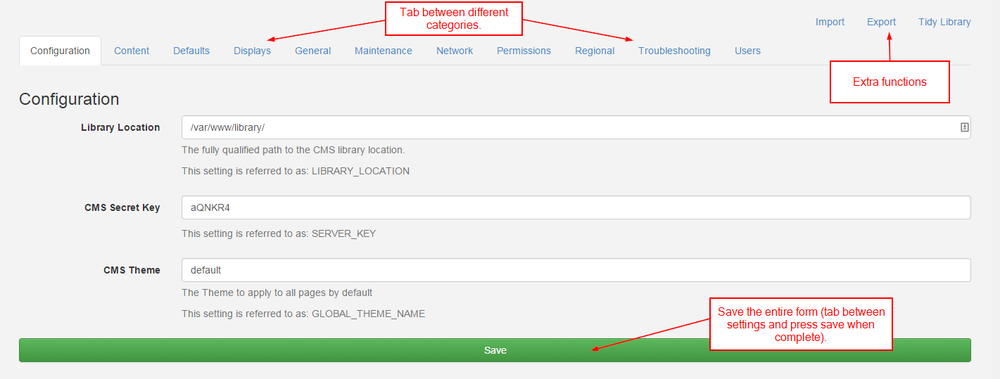

<!--toc=getting_started-->
# CMS Settings

Like any complex application the [[PRODUCTNAME]] CMS comes with a number of options. These are configured in the Administration menu, Settings sub menu.

The settings are organised into relevant categories which are accessible using the category selector on the left hand side.

Changes to settings can be saved using the Save button in the category selector or at the top of the page.

## Categories

The settings are split into related Categories:

**Configuration**

Essential configuration options that must be set.

**Content**

Settings for defaulting the durations of certain media items.

**Defaults**

Settings for defaulting certain form fields to particular selections.

**Displays**

Settings related to Displays and display management pages.

**General**

General settings for the behaviour of items in the CMS.

**Maintenance**

Settings related to the Maintenance Module.

**Network**

Network settings such as Proxy Server information (if your CMS is behind a proxy)

**Permissions**

Settings for controlling how permissions effect certain things in the CMS.

**Regional**

Timezone and Language regional settings.

**Troubleshooting**

Tab allows you to alter how [[PRODUCTNAME]] handles errors. You can turn the error and audit logs on and off. As logs records size growth rapidly, you should take care to enable it only when necessary e.g. during system debug.

**Users**

Authentication and Password policy settings.

## Notable Settings
### User Password Management

This section will take a look at the User Password Management with three features / improvements:

* Users can change their passwords without having access to the user administration page
* Administrators can set a regular expression to test password complexity
* Administrators can override users passwords in a more intuitive way

### User Password Policy

This feature has the utmost flexibility given to the administrator to test passwords in which ever way they chose.
This is done with a setting in the Permissions tab called `USER_PASSWORD_POLICY`.

An administrator can put any valid regular expression in this box, which will cause all users password change requests (and new users)
to be tested against this expression.

It is also important for the user to know what the policy actually is; the setting `USER_PASSWORD_ERROR` which will be presented
to the user when they enter a password that does not validate against the regular expression.

### Library Size &amp; Bandwidth

To manage limits on the library file size and monthly bandwidth usage. This is done by virtue of two settings in the database
table (LIBRARY_SIZE_LIMIT_KB &amp; MONTHLY_XMDS_TRANSFER_LIMIT_KB).

If no limits are entered in database, everything continues to work without restriction; however once a limit is entered [[PRODUCTNAME]] will start
validating against these limits, and when they are exceeded will prevent the upload of new media / updates to clients.

However these two settings are currently not available through the user interface; Only the statistical data is shown in Content page

### Maintenance
Maintenance is a very import part of the system and therefore is covered in its [own section](cms_maintenance.html).

## Other functions

The settings page has a set of other functions available in the top right corner of the sub-menu bar.

### Import

Import the entire CMS database.

### Export

Export the entire CMS database.

### Tidy Library
The library tidy function clears up orphaned media items and temporary files. More
information can be found in the [tidy library](media_tidylibrary.html) section.
