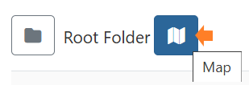

# Configuration of Displays

Once Displays have been connected, they are configured and managed from the **Displays** page inside the CMS.

{nonwhite}

## How-to Video

{video}DsYGiDgiigM|how_to_display_configuration.png{/video}
{/nonwhite}

In order to start showing content, **Displays** must be **Authorised** with the CMS. Check the Displays grid to make sure the right Displays are showing as **Authorised**, as a first step.

- Give the **Display** a friendly name for easier identification within the CMS by using the **Edit** option from the row menu.

Now is a great time to assign your Display a **Default Layout**. 

- Scroll down the form to select a Layout to use as the default .This Layout will be shown when there is no content scheduled or an issue arises that prevents scheduled content from showing on your Display. 

{tip}
When creating your own Default Layouts, keep in mind that designs should be kept simple, avoiding any complex media and web content!
{/tip}

- Click on the **Details** tab to provide further information about your Display. 

- Setting the **Latitude** and **Longitude** of the Display, will show its location on the map view.

The **Displays** map can be viewed by clicking the icon next to the **Folders** toggle from the Displays grid:

- Set **Timezones** to ensure that content is shown at the right time for your Display location.

Each Display is assigned a default profile which will automatically apply its settings to all Displays of the same type. For example, you edit the Collect Interval for your Android Display Profile. Once saved, the new collection time will be applied to all Displays assigned this as a Display Profile.

**Display Setting Profiles** can be customised for automatic management and configuration of your Display Network.

## Further Reading

[What is a Display?](what_is_a_display.html)

## FAQ's

***What happens if I have no content scheduled, and my default layout has an issue with downloading it's content?***

The splash screen will be shown until the issue with the default layout is resolved or content is scheduled to show on the Display.

