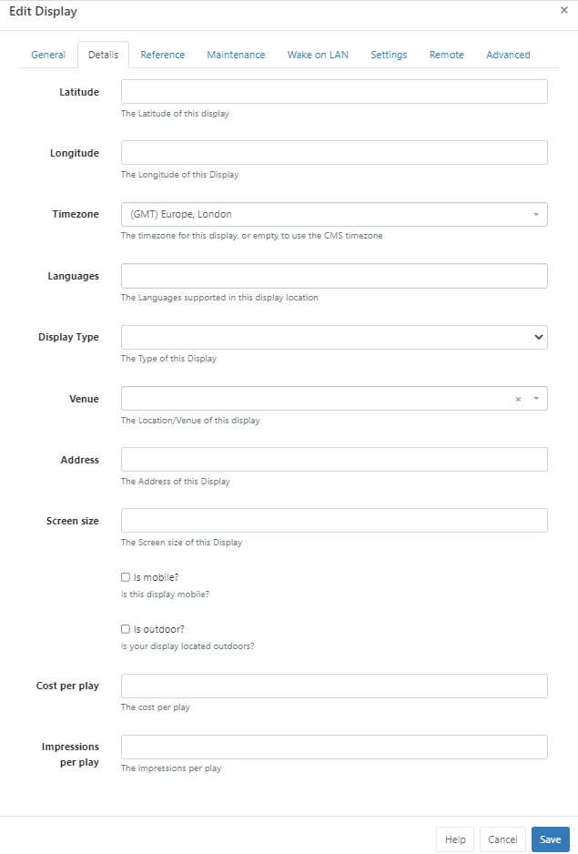
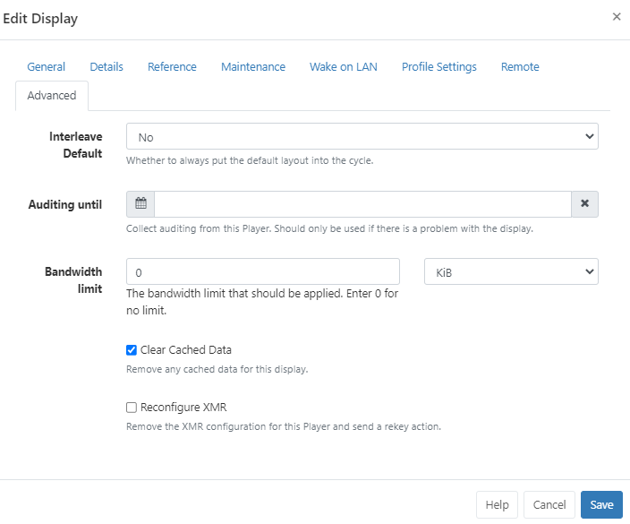

<!--toc=displays-->

# Displays

{version}

- CMS v3.0.0 - v3.2.x click [here](displays_3.html)
- CMS earlier than v3.0.0 click [here](displays_2.html)
  {/version}

The primary purpose of [[PRODUCTNAME]] is to show content on screens with the entire application suite existing for that one purpose. [[PRODUCTNAME]] provides a concept called **Displays** to manage when and how content is shown on a screen.

{tip}
When no other content is Scheduled, or if there is an issue that prevents the scheduled Event from showing, we highly recommend that a **Default Layout** is set so that something is **always** shown on Displays! You can create your own Default Layout to replace the existing one, but keep in mind that designs should be kept simple with no complex media or web content.  Edit a Display to select or use the Row Menu and click on Default Layout to select your designed Layout from the dropdown menu.

**Please note**: If no Default Layout is set or there is an issue with the Default Layout that has been set, the splash screen will be shown on Displays!

{/tip}

Displays are uniquely identified by a **hardware key** which is generated when the Signage Player software is installed. This hardware key is used to create a Display record in the CMS and is unique to that one Display record.

{nonwhite}
Administrator documentation for Player Installation guides can be found [here](/docs/setup/xibo-player-installation)
{/nonwhite}

## Connecting a Display

Displays connect to the CMS over an API called "XMDS" {nonwhite}(Xibo Media Distribution Service){/nonwhite} with most Players only requiring the URL and CMS Key. 

Alternatively, Displays can be added by providing a 6 character ‘Activation Code’ in the **Displays** page of the CMS.

{feat}Connect using Authentication Code|v3{/feat}
New Displays will need to be marked as **Authorised** before they can be sent any content. This can be done by using the Row Menu for the Display and clicking the **Authorise** action.

## Display Administration

Displays are administered in the CMS from clicking on **Displays** under the **Administration** section of the main menu.  The Displays [Grid](tour_grids.html) will open for you to add new and manage exiting Displays.

Click the Folders icon to toggle on/off from view.  

{tip}
When Folders are hidden from view, the file path for the selected folder will be shown!
{/tip}

- Click on a Folder/sub-folder to search the contents and return results based on any filters applied to the grid.

or

- Tick **All Folders** to include searching in the Root Folder and return results based on any filters applied to the grid.

Check out the [Folders](/manual/en/tour_folders.html) page for further information.

Next to the Folders icon is a **Display Map View**:

View locations on the map to easily see the status of selected or all Displays.

From v3.3.3 the status of Displays in marker clusters will be shown as pie charts for easier identification.

{tip}
Logged in Users will only view the status of Displays that they have been given access to
Use the filter fields in the grid from the List View to isolate Displays to view!
{/tip}

Click on a Displays status icon on the map to reveal further information:

Use the blue **List View** button at the top of the map to return to the Display Grid.

**ID** - Used for internal identification of a Display.

**Display** - Name given to the Display for easy identification purposes within the CMS (this is not shown on the Display itself).

**Status** -  *Tick* = Player is up to date (this may also show as green in colour).
				*Cloud Icon* =  Player has not logged in with content waiting to be downloaded (this may also show as amber in colour, as above)
				*Cross* = Player is currently downloading new content and has yet to complete the download (this may also show as red in colour)	

**Authorised** - Tick or cross to indicate whether the Display has been granted a licence with the CMS. This prevents unauthorised Displays being added to the CMS.

{tip}
Include the **Commercial License** column using the **Column Visibility** button to easily identify the Commercial Licence status of your Displays!
{/tip}

**Logged In** - Tick or cross to show if the Display has logged in recently.

**Last Accessed** - Date and time stamp of when the Display was last accessed. 

**MAC Address** - Media Access Control Address of the Display (if the Player software is capable of sending it).

{tip}
Use the **Column visibility** button to select from the available options to show the information you would like to display for your administration purposes. Deselect to remove a column from the Displays grid!
{/tip}

## Row Menu

Each Display has a Row Menu containing a number of actions that can be performed:

{tip}
Selected actions allow for [Forms](tour_forms.html) to be automatically submitted by clicking on the action from the Row Menu, such as **Authorise** and **Check Licence**. Actions that have an auto submit capability will display an option to enable. 
Take a look at [Grids](tour_grids.html) for further information!
{/tip}

### Manage

Each Display has its own **Dashboard** which shows the Displays current status, bandwidth usage, file status and errors.

{tip}
This Dashboard is useful as a first step to look at when troubleshooting issues with a Display!
{/tip}

### Edit

Clicking on **Edit** opens the Edit Display form which contains tabs with available configuration options:

### General

- Displays can be optionally saved to [Folders](tour_folders.html) using the **Edit form** or from the **Select Folder** option on the Row Menu.

{tip}
Displays that are saved in Folders will inherit the View, Edit, Delete Share options that been applied to the destination Folder for the User/User Group!

Assign multiple Displays to a Folder using the **With Selected** option at the bottom of the grid!
{/tip}

- The unique **Displays Hardware Key** generated during installation will be shown here for the selected Display.
- Displays can be tagged for organisation and to make it easier to find a large number of Displays all grouped by [Tags](tour_tags.html).  When entering text into the Tag field on the form, an auto complete helper will show possible matches to make it easier for Users to select from.

- Use the drop down to **Authorise** to use an available Licence Pool slot for the Display.

- Select a Layout to use as the **Default Layout** for the Display which will be shown when no other content is scheduled. If nothing is selected the splash screen will be shown instead.

- Use the drop down to select the **Display Type** 

### Details

Use this tab to provide further Display details:

- If you are using the [Ad Campaign](layouts_campaigns.html) functionality ensure that you complete the **Cost per play** and **Impressions per play** fields on this tab for all selected Displays.

- Additional fields have been included designed to enhance advertising needs such as:

  - The physical address of the display
  - Is the display mobile?
  - Venue type
  - Languages supported

  

### Reference

Optionally use this tab to provide reference information for the selected Displays. Once added, this information can be viewed in the Display grid and via the API.

### Maintenance

Control email alerts and Global Timeout settings.

### Wake on LAN

Enable Wake on LAN

### Profile Settings

Override [Display Profile Settings](display_settings.html) for individual Displays:

Click the edit icon to change selected settings to override the Profile.

### Remote

Enter details for remote access

### Advanced

- Apply a limit to determine the amount of **Bandwidth** a Display can consume.

{tip}
Set bandwidth limits for multiple Displays using the With Selected option at the bottom of the grid!
{/tip}

### Delete

Deleting a **Display** will remove it from the **CMS** entirely - this operation cannot be reversed. A deleted Display can be reconnected to the CMS by repeating the “Register” procedure which will create a new unique Display record.

{tip}
**Deauthorise** a Display instead of deleting so that it can be re-authorised at a later date if needed. Use the row menu for the Display and click on **Authorise** to toggle to **Deauthorise**. This can also be actioned from the **Edit Display** form by selecting **No** for Authorise display.
{/tip}

### Send Command

The **Send Command** functionality is executed via XMR to Players by selecting a predefined command. This is useful for sending Players 'Reboot' commands for example.

{tip}
This type of [Command](displays_command_functionality.html) can also be executed by scheduling a [Command Event](scheduling.html#Events)
{/tip}

### Transfer Display to another CMS

{feat}Transfer Display to another CMS|v3{/feat}
To use this functionality you will first need to activate Google Authenticator using [Two factor Authentication](tour_two_factor_authentication.html), if you have not already set this up.

Once activated, click on **Displays** from the CMS main menu and use the Row Menu to click on  **Transfer to another CMS** for the selected Display you want to transfer.

Ensure all the form fields are completed by:

- Entering the full **CMS URL** you wish to transfer this Display to.
- Providing the **CMS Secret Key** for the CMS Address you wish to transfer to.
- Complete the **Two Factor authentication code**, as displayed on the app.

Once the details provided have been authenticated, the Display will attempt registration with the 'new' CMS. Once the Display has been successfully transferred the Display will stop communicating with the 'old' CMS and will change from a 'tick' to a `X` in the **Authorised** column.

{tip}
Select multiple Displays to transfer using the **With Selected** option at the bottom of the grid!

Certain Actions from the row menu have the option to be 'automatically submitted', see [Grids](tour_grids.html) for further information!
{/tip}

