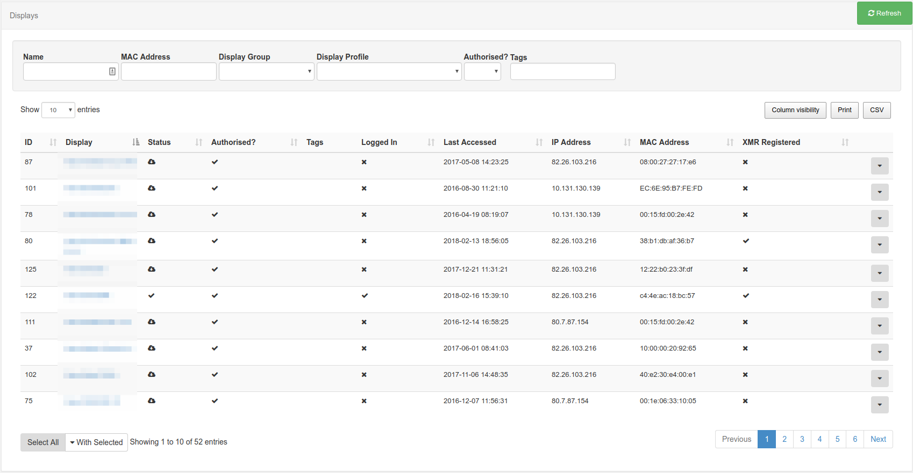
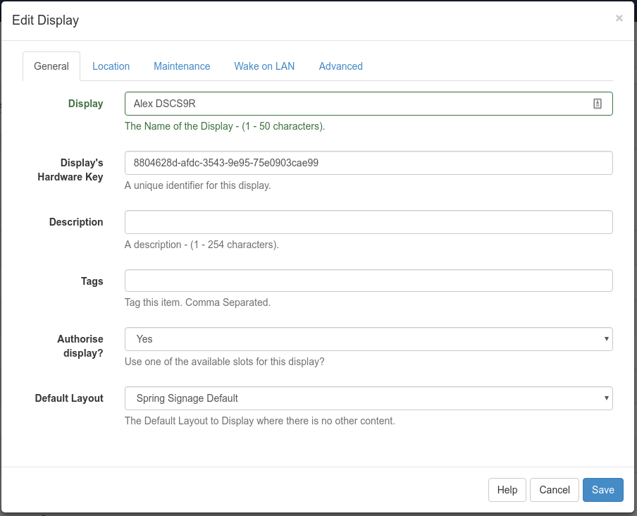

<!--toc=displays-->
#Displays
The most basic purpose of [[PRODUCTNAME]] is to show content on screens and the entire suite of applications exists for that one basic purpose. [[PRODUCTNAME]] provides a concept called **Displays** to manage when and how content is shown on a screen.

Displays are uniquely identified by a "hardware key" which is generated when the signage player software is installed. This hardware key is used to create a Display record in the CMS and is unique to that 1 Display record.

##Connecting a Display
Displays connect to the CMS over an API called "XMDS" (Xibo Media Distribution Service). Each signage player software application will have its own method of registering and connecting to the CMS - most of them only require the `URL` and `CMS Key`.

##Display Administration
The CMS provides a page for Display Administration which is used to show the user the Displays they have permission to view and the status of those Displays.

The display administration table gives an easy to understand overview of each display registered in the CMS. 

The rows and columns have the following meanings:

- **Status**

 The status of the display. 
 Tick (checkmark) = Player is up to date with the content (in older CMS versions, it used to be green), 
 [!] = Player wasn't logged in since the content change (in older CMS versions, it used to be yellow),
 [X] = Player is currently downloading the new content (in older CMS versions, it used to be red)

- **ID**

 The internal ID for the display.

- **Licence**

 A tick or cross showing whether the display has been granted a licence with the CMS. This prevents unauthorised displays being added to the CMS.

- **Display**

 A friendly name for the display. This can be set during the registration process in the display client software.

- **Default Layout**

 The default layout that will play when there are no other layouts / campaigns scheduled or when all scheduled layouts are invalid.

- **Interleave Default**

 A tick or cross showing whether the default layout will play when there are other layouts scheduled.

- **Email Alert**

 A tick or cross showing whether an email alert will be sent by the Maintenance module.

- **Logged In**

 A tick or cross showing whether the display has logged in recently. The time out for the display is set on each display OR in the global settings field `MAINTENANCE_ALERT_TOUT`.

- **Last Accessed**

 The date/time of last access.

- **IP Address**

 The IP address the display had the last time it reported its status through the "Media Inventory" status call.

- **Mac Address**

 The Mac Address of the display (if the client software is capable of sending it).

### Row Menu
Displays can have a number of actions performed against them.

- **Edit**

 The display edit form for adjusting all options available on the display.

- **Delete**

 The display delete form.

- **Schedule Now**

 A quick shortcut to scheduling a layout from the current time for a particular duration.

- **Default Layout**

 A quick shortcut to updating the default layout.

- **Assign Files**

    Allows the assignment of generic files to the Display. Usually for use by an embedded media type or custom module.

- **Request Screen Shot**
    
    Request a screen shot of the display window.

- **Media Inventory**

 View the required media inventory and the current status of each item as reported by the display during the last check in.

- **Recent Log**

    Show the recent log messages from this Display.

- **Display Groups**

 Administration of the display groups this Display belongs to.

- **Permissions**

 Adjust the user / user group permissions on the Display.

- **Version Information**

    Show the version of the signage player software installed on the Display.

- **Wake on LAN**

 Send a Wake on LAN packet to the display - requires the Wake On LAN settings to be configured.

### Display Edit
Before the display will be allowed to download its schedule or required media it must be licensed with the CMS. After a display client is registered a new display record will appear in the Display Administration - it will then need to be edited to grant is access (getting a licence).

Click on the "Edit" button of the Display loads its editing window. You can then proceed to change the settings for the chosen Display.

### Display Delete
Deleting a display will remove it from the CMS entirely and can only be performed if the display is not active.

_A display can be unlicensed without deleting it using the Display Edit form._

Deleting a display cannot be reversed. A display can be reconnected to the CMS by repeating the "register" procedure which will create a new display record.

### Media Inventory

When you schedule new content, or change existing content, it is helpful to know that the displays have updated with the new 
information. In a [[PRODUCTNAME]] CMS and client system, the client applications will connect in to the CMS periodically 
and update itself on the media items that they have stored locally. Media Inventory allows you to look at a glance to check if 
your updates were pulled by the clients yet.

On the display management page, you'll see a column "Status". The status light can be one of either green, amber or red.

When you make a change that affects the output of the CMS to a given client (for example if you modify a layout scheduled 
on that client, schedule a new layout or change the default layout), the status light will immediately goes red. That signifies 
that as far as the CMS is aware there are updates pending for that client and it has not received them yet.

The client will then connect up to the CMS on a schedule and will read the new information that is available. If there 
are new files to download (for example if you modified a layout or scheduled something completely new), the status light will 
turn amber while the files are being downloaded.

Once the client is satisfied that all files have been downloaded, it will send an inventory of all the files it has active 
in it is cache back to the CMS, and the CMS will change the status light to green.

If you are curious to see what files the client is actively monitoring, you can click the "Media Inventory" button and a popup 
will appear showing the status of each file, along with the last time the client checked it was still stored correctly on disk. 
You will also see any files that the client is in the process of downloading.

Note here that what you will not see is files that the client needs to download, but that it is unaware of at the present time. For example. If you schedule a new layout and immediately go to the Media Inventory before the client has connected up to the CMS, you'll see the status light is red, but the content of the media inventory will not show the new files that are required. Once the client connects, those new files will be included in the inventory automatically.