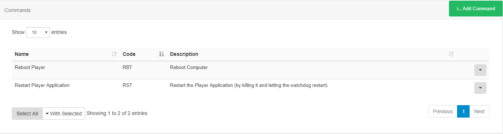
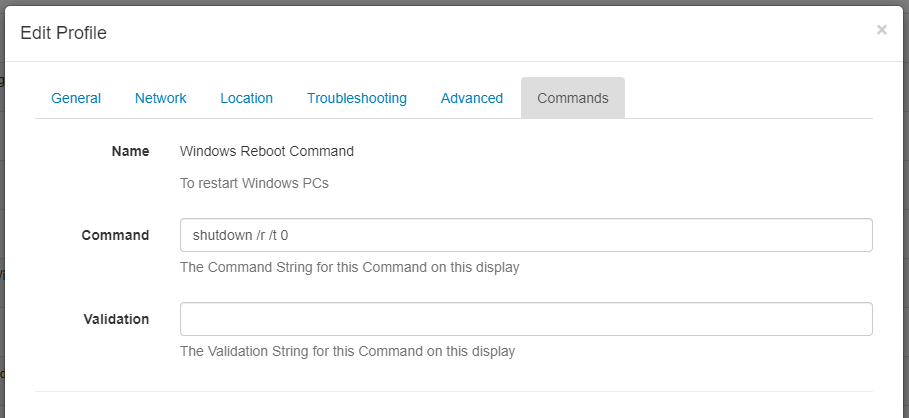

# Command Functionality 1.8 - v2

{tip}
**Please note:** If you are using a v3 CMS, please click [here](displays_command_functionality.html)
{/tip}

The Command Functionality in [[PRODUCTNAME]] can be used to configure a set of predefined Commands that a User can select to execute via **XMR**, in a **Schedule** or include in a **Layout**.

{tip}
Predefined Commands can have a different Command String per Player which is particularly useful if the network of Players is mixed, connected to different Displays or have slightly different Player hardware.
{/tip}

A **Command record** is created with a Name, Description and unique Command Code, which allows for a "generic command" to be created which can be used across **Display Profiles**, **Scheduled Events** and the **Shell Command Widget**.

{tip}
Commands provide easy access to functionality such as RS232, Android Intents, etc.
{/tip}

## Configuring a Command for a Display Profile


**Step 1 Create Command**

Navigate to **Commands** under the Displays section of the menu.



- Click on the **Add Command** button and complete the presented form fields. 
- **Edit**,**Delete** and **Permission** options can be accessed using the row menu for the selected Command. 

{tip}
**Please note:** Permissions can be applied from v2.3 and later!
{/tip}

**Step 2 Configure Command on the Display Profile**
This is administered from **Display Settings** under the Displays section of the menu.

- Click on the row menu for the selected profile and **Edit**.



For each Command, a  **Command** and **Validation** can be specified.

### Command

The Command String represents the final executed Command and can be a direct call to the shell or can have a **helper** specified, see below.

### Validation

The Validation String is used as a comparison to the Command output and if it matches then the Command is considered a success. This string can be a regular expression.

This could be useful for a network of mixed Windows and Android Players with a command called 'Reboot'. The Command String for 'Reboot' on Windows being `shutdown /r /t 0`, and on Android, it is  `reboot`.

{tip}
The same can also be useful with a non-mixed network - imagine a network of Windows players with different monitors connected over HDMI/RS232. A single Command called 'Monitor On' can be created with the different brands of monitor represented by different Display Settings Profiles, each can have a different Command String to turn the monitor on/off.
{/tip}

## Send Command
Commands can be executed via **XMR** from Display/Display Groups.

## Scheduling Commands
Commands can be Scheduled to execute on a specific date/time by using the **Schedule** Page.

- Select the **Command** using the drop-down menu for [Event Type](https://xibo.org.uk/manual/en/scheduling_events.html) when adding/editing a Schedule.

{tip}
Schedule Commands such as 'turn on' to be executed at set times!
{/tip}

Scheduled commands are executed once on the Player and only require a "Start date and time". The Command can be executed up to 10 seconds after the time selected.

## Shell Commands
The [Shell Command Widget](media_module_shellcommand.html) is used to run external Commands based on the Layouts activity.

Commands can be selected by adding the **Shell Command Widget** to a Layout. Shell Commands with a Command as their source act in the same fashion as normal shell commands. The Command is executed when the Widget is shown on the Layout. 

{tip}
They should be used in a Region on their own so they are executed only once each time the Layout is shown!
{/tip}

A Shell Command can also be a Command String with options for Windows and Linux provided. This allows Users to add Commands 'ad-hoc' for one-time use. 

{tip}
We recommend that Administrators create predefined commands where possible.
{/tip}

## Helpers 

Command Helpers are prefixes that can be added to the Command String in order to take a more advanced action. Commands without a prefix are executed in the shell of the operating system which runs the Player.  `cmd.exe`  on Windows and  `shell`  on Android.

#### RS232

RS232 commands can be executed on Players by using the  `rs232`  prefix in the Command String. The format of the command is  `rs232|<connection string>|<command>`.

The connection string should be provided in the following format on Windows:

```
<COM#>,<Baud Rate>,<Data Bits>,<Parity|None,Odd,Even,Mark,Space>,<StopBits|None,One,Two,OnePointFive>,<Handshake|None,XOnXOff,RequestToSend,RequestToSendXOnXOff>,<HexSupport|0,1,default 0>
```

**Please note:** If you need to send your Command in HEX format, you should specify the byte string in the Command String, for example:  `7E 00 00 FF 00 00 00 00 00 00 00 00 00 00 00 00 00 FF` , this will be converted to a byte stream by the player. You will need to set the  `HexSupport`  element of the connection string to  `1`.

The connection string should be provided in the following format on Android:

```
<DeviceName>,<Baud Rate>,<Data Bits>,<Parity>,<StopBits>,<FlowControl>
```

Each setting is represented by a corresponding number:

```
DATA_BITS_5 = 5;
DATA_BITS_6 = 6;
DATA_BITS_7 = 7;
DATA_BITS_8 = 8;
PARITY_NONE = 0;
PARITY_ODD = 1;
PARITY_EVEN = 2;
PARITY_MARK = 3;
PARITY_SPACE = 4;
STOP_BITS_1 = 1;
STOP_BITS_15 = 3;
STOP_BITS_2 = 2;
FLOW_CONTROL_OFF = 0;
FLOW_CONTROL_RTS_CTS = 1;
FLOW_CONTROL_DSR_DTR = 2;
FLOW_CONTROL_XON_XOFF = 3;
```

The Command itself is a string which gets sent over RS232 using the connection details.

#### Android Intents

Android display profiles can use the  `intent`  helper to specify an intent that should be called when the Command executes. The format of the Command is  `intent|<type|activity,service,broadcast>|<activity>|[<extras>]` .

`[<extras>]` is an optional parameter available from **Android v2 R206** used to provide additional data to the Intent. This must be a JSON formatted string containing an array with at least one object. The object format is below and must be on one line.

``` json
{
  "name": "<extra name>",
  "type": "<type|string,int,bool,intArray>",
  "value": <the value of the above type>
}
```

For example, on some devices you can program the firmware to set on/off times.

```
[{
  "name": "timeon",
  "type": "intArray",
  "value": [2018, 7, 28, 8, 40]
}, {
  "name": "timeoff",
  "type": "intArray",
  "value": [2018, 7, 28, 21, 40]
}]
```

This would be set on the command as:

```
intent|broadcast|activity|[{ "name": "timeon", "type": "intArray", "value": [2018, 7, 28, 8, 40] }, { "name": "timeoff", "type": "intArray", "value": [2018, 7, 28, 21, 40] }]
```

{tip}
Commands containing an intent helper are ignored in the Windows Player!
{/tip}

## Monitor ON/OFF 

### HDMI-CEC

HDMI-CEC is a bus that is implemented on nearly all new large-screen TVs that have HDMI connectors. This bus (which is physically connected within normal HDMI cables) supports control signals that can perform power-on, power off, volume adjusts, selection of video source and many of the features that are accessible via the TV's remote control. It can also control most other hardware on the HDMI bus.

[[PRODUCTNAME]] doesn't provide a direct interface to HDMI-CEC as there are many different manufacturer specifications, however, it is possible to control HDMI-CEC via a batch file.

### Serial/RS232

Industry grade monitors often have a serial interface for turning the monitor panel on and off. [[PRODUCTNAME]] can use the RS232 Command helper to send these Commands to the monitor - usually in HEX mode.

The following monitors and Commands have been tested:

#### NEC E464

* Power On -  `rs232|COM1,9600,8,None,One,None,1|01 30 41 30 41 30 43 02 43 32 30 33 44 36 30 30 30 31 03 73 0d`
* Power Off -  `rs232|COM1,9600,8,None,One,None,1|01 30 41 30 41 30 43 02 43 32 30 33 44 36 30 30 30 34 03 76 0d`

#### Sharp LC-42D69U

* Power On -  `rs232|COM1,9600,8,None,One,None,1|50 4F 57 52 31 20 20 20 0D`
* Power Off -  `rs232|COM1,9600,8,None,One,None,1|50 4F 57 52 00 20 20 20 0D`

#### LG 55LK520

* Power On -  `rs232|COM1,9600,8,None,One,None,1|6B 61 20 30 30 20 30 31 0D`
* Power Off -  `rs232|COM1,9600,8,None,One,None,1|6B 61 20 30 30 20 30 30 0D`

{tip}
It should be noted that other models of each brand should also use the same Commands!
{/tip}

### Philips Commercial Displays
Phillips integration is available from Android v2 R200

The following commands can be used to control LED's located on the sides of some commercial Phillips Displays:

`tpv_led|off`
`tpv_led|red`
`tpv_led|green`
`tpv_led|blue`
`tpv_led|white`

From Android v2 R215, integration has been added to power on/off the screen backlight by using the following commands:

`tpv|screenon`
`tpv|screenoff`
`tpv|backlighton`
`tpv|backlightoff`

Mute/unmute commands have also been added from this version:
`tpv|mute`
`tpv|unmute` 

{nonwhite}
{tip}
Take a look at our guide that will take you through [How to set up a Reboot Command on Xibo for Android](https://community.xibo.org.uk/t/how-to-set-up-a-reboot-command-on-xibo-for-android/23072)!
{/tip}
{/nonwhite}