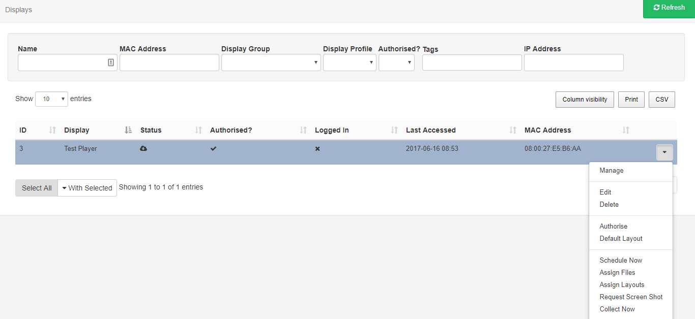

<!--toc=displays-->
# File / Layout Assignments

Library files and Layouts can be assigned directly to a Display or Display Group so that they are always available in the local library of the Player.

**This does NOT mean that assigned files and Layouts will be shown, and will still need to be Scheduled**

<tip>

This is useful for pre-loading a Layout ahead of time when that Layout will be used for some API integration, triggering a Layout change for example.

</tip>

## Assign Files / Layouts

Directly assign by using the row menu for the selected Display or Display Group.

Select which **Library files/Layouts** you wish to directly assign (these will show in the staging area as files are selected) and Save.

Those selected will be downloaded to the **Display** at the next collection interval. If XMR is installed these will be downloaded immediately.

<tip>
Library files and Layouts that have been directly assigned will still need to be **Scheduled** to Displays or Display groups to be shown.
</tip>

Files /Layouts can be removed by following the same steps as above and deselecting the items from the staging area.  These will be 'cleaned up' when the Player needs space or after 30 days of that file/Layout no-longer being required. 