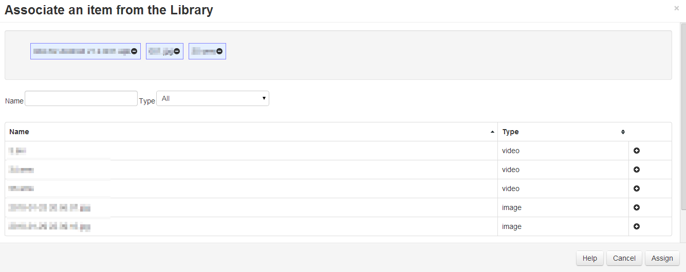

<!--toc=displays-->
# File Assignments
Library files can be assigned directly to a display or display group so that those files are always available in the local
 library of the player.
 
Once assigned the file will be downloaded to the display at the next collection interval or if XMR is installed the file
 will be downloaded immediately.

Files are assigned by selecting the *Assign Files* row menu item on either the Display or Display Group page.

A file can be removed from the same form and will be cleaned up when the player needs space or after 30 days of that file
 no-longer being required.