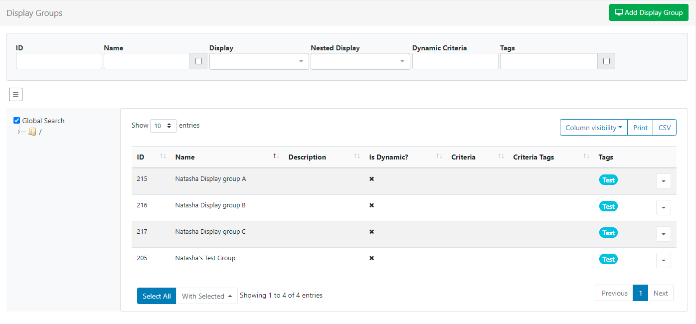
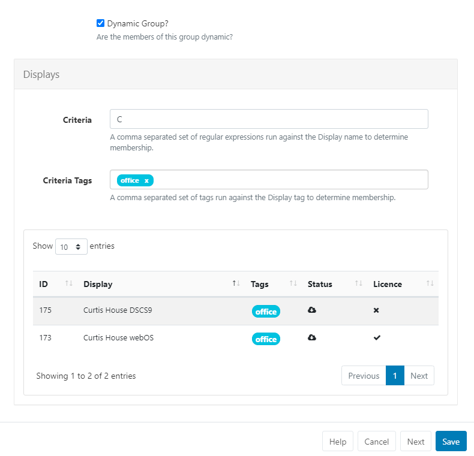

<!--toc=displays-->

# Display Groups

{tip}
If you are using a CMS earlier than v3.0.0 please use the following link: [Display Groups](displays_groups_2.html)
{/tip}

For ease of **Scheduling** and **Media Assignment** create Display Groups and assign Displays to one or multiple Display Groups. 

Display Groups are administered in the CMS by clicking on **Display Settings** under the **Displays** section from the main menu. The Display Group grid will open to Add new and manage existing Display Groups.

Click the Folders icon to toggle on/off from view.  

{tip}
When Folders are hidden from view, the file path for the selected folder will be shown!
{/tip}

- Click on a Folder/sub-folder to search the contents and return results based on any filters applied to the grid.

or

- Tick **All Folders** to include searching in the Root Folder and return results based on any filters applied to the grid.

Check out the [Folders](/manual/en/tour_folders.html) page for further information!

{tip}
Logged in Users will only view the status of Displays that they have been given access to!
{/tip}

## Add/Edit 

Click on the **Add Display Group** button to create a new Display Group or use the Row Menu to **Edit** an existing Display Group.

### Folders

Display Groups can be optionally saved to [Folders](tour_folders.html) using the **Edit form** or from the **Select Folder** option on the Row Menu.

{tip}
Display Groups  that are saved in Folders will inherit the View, Edit, Delete Share options that been applied to the destination Folder for the User/User Group!

Assign multiple Display Groups to a Folder using the **With Selected** option at the bottom of the grid!
{/tip}

### Tags

Display Groups can be optionally tagged.  When entering text into the [Tag](tour_tags.html) field, an auto complete helper will show possible matches to make it easier for Users to select Tags already added in the system.

## Members

The membership of a Display Group is either a **Manual Assignment** or controlled by filter criteria using **Dynamic Groups**. 

### Dynamic Groups

When ticked an additional field will appear to allow for entry of one or more regular expressions to use to select which Displays belong to that Display Group.

Filter criteria for Dynamic Groups is in the format of regular expressions, but can also be simple string comparisons. The expressions should be separated by a comma and can be negated with a `-` prefix.
{tip}
For example, all Displays containing "a" but not "b" would be `a,-b`.
{/tip}

{tip}
From v3.1.0 Criteria Tags can be filtered using addtional OR/AND filters for Displays that have multiple Tags assigned!
{/tip}

### Manual Assignment

After completing and saving the **Add Display Group** form,  assign Displays using the Row Menu and selecting **Members**.

Control membership using the **Member** checkbox for selected Displays/Display Groups.

{tip}
Use the **Relationship Tree** tab to view the ancestors and descendants of the Display Group being edited.
{/tip}

## Nested Groups

Display Groups can be nested to create complex structures and allow for targeted Scheduling.

{tip}
Example Group Structure

- Site 1
- Site 1 - Building A
- Site 1 - Building A - Level 1
- Site 1 - Building A - Level 2
- Site 1 - Building B

The Display membership is set on the lowest level groups and those groups then belong to the next level up, which in turn belong to the highest level parent "Site 1".
The CMS will not allow a circular reference to be created (an assignment that creates a loop i.e. Site 1 has Site 1 - Building A, and Site 1 - Building A has Site 1.)
{/tip}

**Schedules**, **Media file** and **Layout Assignments** set to the Display Group, will apply to all members within the group.

### Reference Tab

From v3.3.0 optionally use this tab to provide reference information for the selected Display Group. Once added, this information can be viewed in the Display Group grid and via the API.
