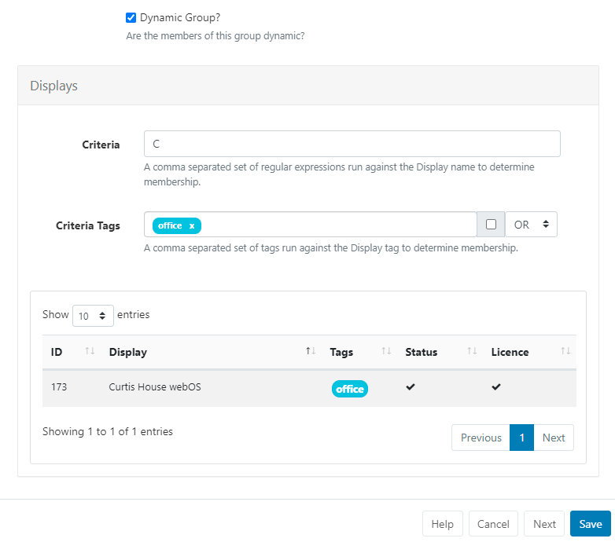

# Display Groups

Create Display Groups to group together specific [Displays](displays.html) for easier Scheduling and management as your [[PRODUCTNAME]] system grows.

Display Groups can contain both singular **Displays** as well as other **Display Groups**. This allows you to target large numbers of Displays with just a simple [Schedule](scheduling_events.html)

## Display Group Administration

Display Groups are managed in the CMS by clicking **Display Groups** under the Displays section of the main CMS menu:

Use the **Add Display Group** button to create a new Display Group and complete the required form fields:

Display Groups can be saved to [Folders](/manual/en/tour_folders.html) to easily control User/User User Group levels of interaction for Display Groups as well as provide an additional way to organise.

{tip}
Display Groups that are saved in Folders will inherit the View, Edit, Delete [Share](users_features_and_sharing.html#content-share) options that been applied to the destination Folder for the User/User Group!
{/tip}

Displays need to be assigned to the Display Group in one of two ways, by manually adding or it can be controlled with filter criteria as a Dynamic Group.

### Dynamic Group Membership

To assign members to this group dynamically:

- Tick the Dynamic Group checkbox on the form to reveal additional form fields.
- Filter criteria for Dynamic Groups is in the format of regular expressions, but can also be simple string comparisons. The expressions should be separated by a comma and can be negated with a `-` prefix.

{tip}
For example, all Displays containing "a" but not "b" would be `a,-b`.
{/tip}

{tip}
Criteria Tags can be filtered using additional OR/AND filters for Displays that have multiple Tags assigned!
{/tip}

- Click to **Save** 

{tip}
If you have more Display Groups to create instead of hitting Save click **Next** to keep the form open and continue creating new Display Groups!
{/tip}

### Manual Group Membership

To manually assign members to this group:

- Leave the Dynamic Group checkbox unticked and click to **Save** the form.
- Use the row menu for the new Display Group record and select **Members**.
- Use the checkbox for each Display to control the membership to the group.

{tip}
Use the **Relationship Tree** tab to view the ancestors and descendants of the Display Group being edited. The current Display Group will be in bold text. Parent Display Groups (above the current one) will pass their schedule down to the current and child Display Groups. Child Display Groups (below the current one) will inherit schedule information from the Parent Display Group and the current Display Group.
{/tip}

- click to **Save**.

## Nested Groups

Display Groups can be nested to create complex structures and targeted Scheduling.

{tip}
Example Group Structure

- Site 1
- Site 1 - Building A
- Site 1 - Building A - Level 1
- Site 1 - Building A - Level 2
- Site 1 - Building B

The Display membership is set on the lowest level groups and those groups then belong to the next level up, which in turn belong to the highest level parent "Site 1".
The CMS will not allow a circular reference to be created (an assignment that creates a loop i.e. Site 1 has Site 1 - Building A, and Site 1 - Building A has Site 1.)
{/tip}

**Schedules**, **Media files** and **Layout Assignments** set to the Display Group, will apply to all members assigned to the group.

## Row Menu

Each Display Group has a row menu containing a number of actions/shortcuts.

- Click on **Members** to manage the membership of Display Groups which have had Displays manually assigned.
- Use **Edit** to view the criteria used for dynamic memberships and to make changes if required.
- Directly [Assign Library files and Layouts](displays.html#content-assign-files--layouts) to a Display Group so that they are always available in the local library of the Player.

{tip}
Use the **With Selected** option at the bottom of the grid to easily perform bulk actions for multiple Display Groups!
{/tip}

#### Next...

[Display Sync Groups](displays_sync_groups.html)

