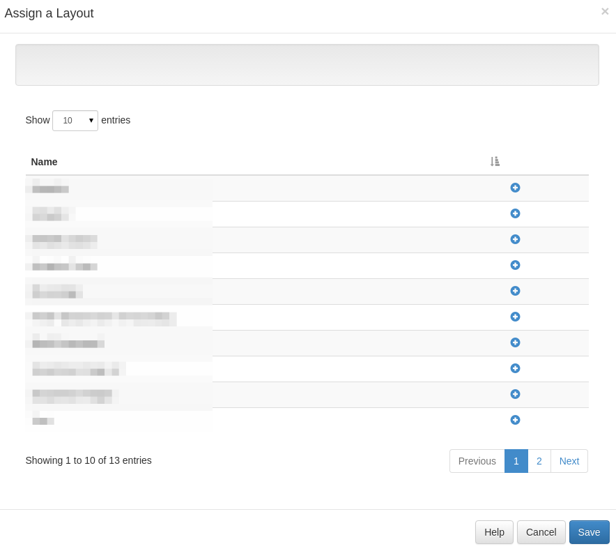

<!--toc=displays-->
## Layout Assignments
Layouts can be assigned directly to a Display or Display Group so that they are always available in the local
library of the player. This does **NOT** schedule the Layout to be shown.

This is useful for pre-loading a Layout ahead of time when that Layout will be used for some API integration (for
example triggering a Layout change). 

Once assigned the layout and its content will be downloaded to the display at the next collection interval or if 
XMR is installed the file will be downloaded immediately.

Layouts are assigned by selecting the *Assign Layouts* row menu item on either the Display or Display Group page.

A layout can be removed from the same form and will be cleaned up when the player needs space or after 30 days 
of that layout no-longer being required.