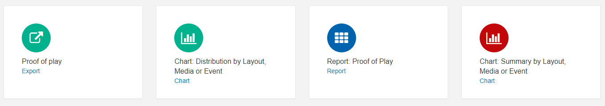
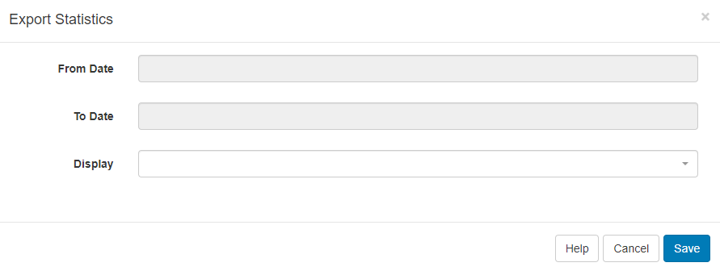

<!--toc=displays-->

# Reporting

[[PRODUCTNAME]] provides useful **metrics** for Users, who have the relevant permissions, to view within the CMS. These are designed to provide a centralised area for analysis into Display performance and usage and are available from the Reporting section on the menu.

# Display Statistics

The CMS records the bandwidth used by each Display when connecting to XMDS for content and when reporting back Display information. 

The default view for the bandwidth chart is a total per Display.

Filter to one Display to see each call that the Player makes to XMDS in isolation.

{tip}
Filtering to just one Display helps to better understand where bandwidth was used.
{/tip}

{tip}
Did you know...you can set a bandwidth limit per [Display](<https://xibo.org.uk/manual/en/displays.html>)!
{/tip}

### Availability

The CMS records all Displays on/offline events to provide further information regarding a Displays availability. 

# Proof of Play

{tip}
If you are using an earlier version than 2.1, please use the following link to the appropriate manual page for your version: [Proof of Play ](displays_proof_of_play_1.8.html)
{/tip}

Each **Display** can collect information to provide Proof of Play Reports on what they have shown.

**Enable Stats Reporting** and set the **Aggregation level** on a [Display Profile Setting](displays_settings.html)

Statistical collection can be enabled as a default by an **Administrator** on the Settings page and set by a User on adding/editing a [Layout](<https://xibo.org.uk/manual/en/layouts.html>), [Playlist](<https://xibo.org.uk/manual/en/media_playlists.html>), from the [Media Library](<https://xibo.org.uk/manual/en/media_library.html>) and adding/editing a **Widget** on a Layout or Playlist Timeline, with **Off** / **On** / **Inherit** selections.

Reports can be provided for Proof of Play statistics recorded by:

- **Layout**
- **Media**
- **Widget**
- **Event**

{tip}
If the Player supports collection from external sensors, Event stats will be recorded and shown in Reports.
{/tip}

Click on **Proof of Play** under the **Reporting** section of the CMS menu to access the available reports.

### Proof of Play: Export

Use **Export** to select from and to dates for a Display to easily see all Proof of Play data exported to a CSV.

### Report: Proof of Play

Select a Range, use the filters and **Apply** to retrieve the Proof of Play information needed. Data can be exported to CSV.

### Chart Reports

Select a predefined timeframe, (Today, Yesterday, This Week etc) and use the filters to populate the data.

### Schedule

Once defined, Reports can be scheduled to run on a **Daily**, **Weekly**, **Monthly** or **Yearly** basis. 

From version 2.2.0, a PDF of a Scheduled Report can also be emailed to Users by clicking in the **Should an email be sent?** tick box. 

{tip}
Scheduled Reports can also be emailed to additional email addresses as entered in the **Email addresses** field.
{/tip}

Click on the **Schedule** button and complete the form fields.

{tip}
Please ensure that your Administrator has entered a **Sending Email** address on the CMS **Settings** page, **Network** tab prior to setting up sending via email.
{/tip} 

### Report Schedules

Use the **Report Schedules** button to view all schedules by Type. Use the row menu for a particular report to open the last saved report, return to the Reports page, edit the existing schedule, re-run a report schedule (available for super administrators only) and delete.

### Saved Reports

Click on **Saved Reports** to view all your run reports. Use the row menu to view your saved report, return to the reports page or schedule, export as a PDF and delete.

{tip}
**Report Schedules** and **Saved Reports** can also be accessed directly from the CMS menu under the **Reporting** section.
{/tip}

# Library Usage

View Library usage for all Users or filter to have an overview of usage by individual User/User Group. 

