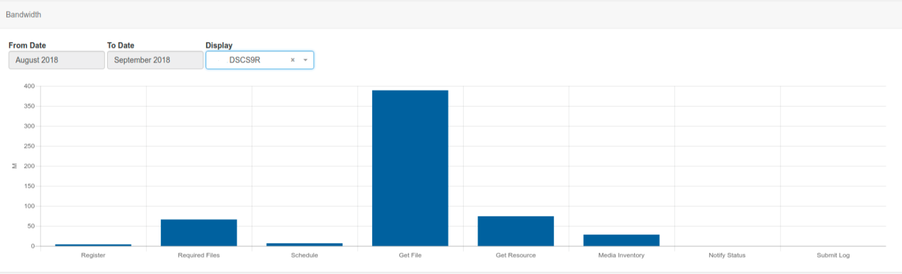
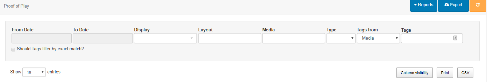
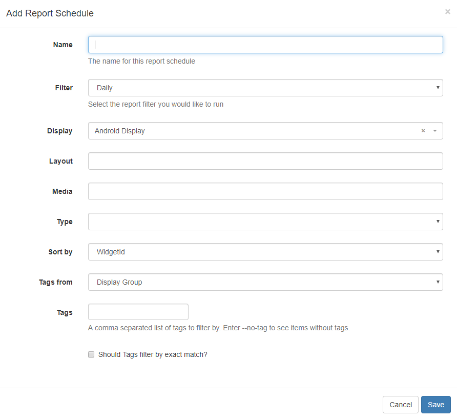

<!--toc=displays-->

# Reporting

[[PRODUCTNAME]] provides useful **metrics** for Users, who have the relevant permissions, to view within the CMS. These are designed to provide a centralised area for analysis into Display performance and usage and are available from the Reporting section on the menu.

## Display Statistics

The CMS records the bandwidth used by each Display when connecting to XMDS for content and when reporting back Display information. 

The default view for the bandwidth chart is a total per Display.

Filter to one Display to see each call that the Player makes to XMDS in isolation.

{tip}
Filtering to just one Display helps to better understand where bandwidth was used.
{/tip}

{tip}
Did you know...you can set a bandwidth limit per [Display](<https://xibo.org.uk/manual/en/displays.html>)!
{/tip}

### Availability

The CMS records all Displays on/offline events to provide further information regarding a Displays availability. 

# Proof of Play

Each **Display** can collect information to provide **Proof of Play** reports on what they have shown.

Reports can be provided for Proof of Play statistics recorded by:

- **Layout**
- **Media**
- **Widget**

Statistical collection can be enabled by an **Administrator** by default as well as set by User's on adding/editing a [Layout](<https://xibo.org.uk/manual/en/layouts.html>), from the [Media Library](<https://xibo.org.uk/manual/en/media_library.html>) and adding/editing a **Widget** on a Layout or Playlist Timeline, with **Off** / **On** / **Inherit** selections.

Click on **Proof of Play** under the **Reporting** section of the CMS menu.

Use the filters on the Proof of Play grid to retrieve the information needed. Information displayed in the table can be printed or exported to CSV.

### Reports

Use the drop-down to select to use the **Chart Summary by Layout or Media file** report.

Select a predefined timeframe, (Today, Yesterday, This Week etc) and use the filters to populate the data.

You can also use the filter to specify a particular date range and schedule it to run on a **Daily**, **Weekly**, **Monthly** or **Yearly** basis.

Complete the **From Date** and **To Date** and use the other filter to collect the data needed. Click on the **Schedule** button and complete the form fields.

Select how often you wish this report to run and give it a name which can be later identified in the **Report Schedule**.

Click on **Saved Reports** to view all your run reports. Use the row menu to view your saved report, return to the Reports page and to delete.

The **Report Schedules** button will show all your saved Reports and schedule information. Use the row menu to open the last saved report, return to the Reports page, edit the existing schedule, re-run a report schedule (available for super administrators only) and delete.

{tip}
**Report Schedules** and **Saved Reports** can also be accessed directly from the CMS menu under the **Reporting** section.
{/tip}

## Library Usage

View Library usage for all Users or filter to have an overview of usage by individual User/User Group. 

