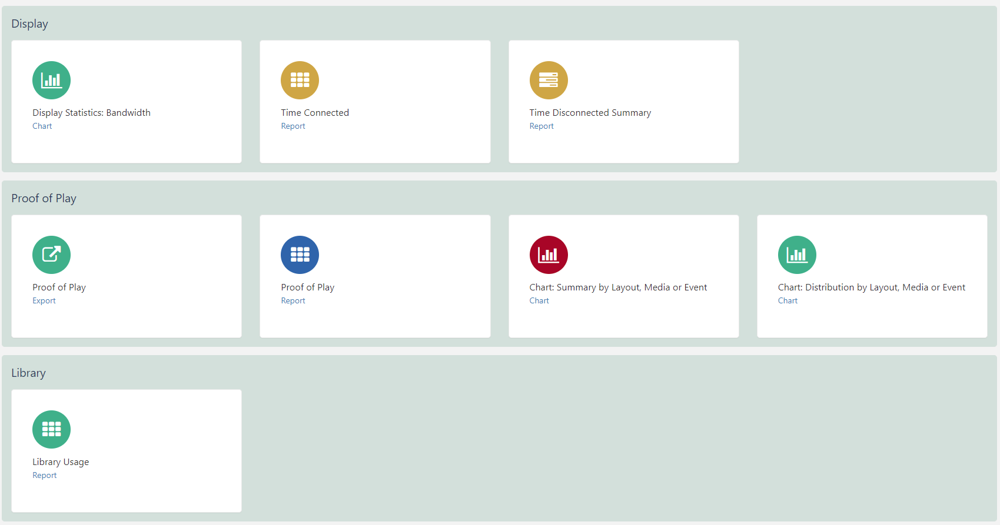
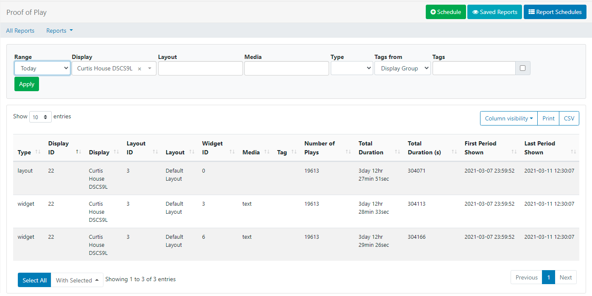
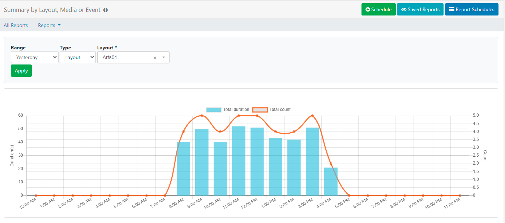

# Reporting

 [[PRODUCTNAME]] provides useful **metrics** which are [Feature](users_features_and_sharing.html ) enabled to allow Users to view a variety of reports within the CMS.

Reports provide a centralised area for analysis into **Display** performance and usage as well as detailed **Proof of Play** and **Library** usage reports. These reports can be viewed from **All Reports** under the **Reporting** section of the main CMS menu:

## Display

**Display** Reports:

### Display Statistics: Bandwidth

The CMS records the **bandwidth** used by each Display when connecting to XMDS for content and when reporting back Display information. 

- Select the range and click on **Apply**. Leaving the Display field empty will show a bandwidth chart total per Display:

- Filter to just one Display and click on **Apply** to see each call that the Player made to XMDS in isolation:

{tip}
Filtering to just one Display helps to better understand where bandwidth has been used.

Did you know...you can set a bandwidth limit per [Display](displays.html)!
{/tip}

Use the **All Reports** button to return to the Reporting dashboard or use the **Reports** drop down menu to select another 'Display' report to view.

### Time Connected/Disconnected

The CMS records all Displays/Display Groups on/offline events to provide a breakdown regarding a Displays availability. 

The Time Connected Report will give a breakdown of % connected (shown in green) and % disconnected (shown in blue)

- Select the **Range** and **Group by** Hour or Day of Month. 

- Leave the Display/Display Group field empty to view all or select  Displays/Display Groups to view.

- Click **Apply**

The **Summary** gives a further breakdown between specified dates for Displays/Display Groups and shows the number of days connected/disconnected:

## Proof of Play

Each **Display** can collect information to provide Proof of Play Reports on what they have shown:

**Layout** - show all instances of a selected Layout being shown.

**Media** - show all instances of a selected Media file being shown.

**Widget** - give a report on a selected Widget contained within a Layout. (This also includes Widgets that do not contain Library media files, such as Text).

**Event** - If the Player supports collection from external sensors, event stats will be recorded and shown in Reports.

To collect Proof of Play reports ensure that **Enable Stats Reporting** has been enabled and the **Aggregation level** has been set on a [Display Profile Setting](displays_settings.html)

- **Individual** - statistics are recorded at the start and finish of each item individually and sent back to the CMS at each collection interval.
- **Hourly** - records each item once, and includes the total number of times played and the length of time played during the hour and is sent back to the CMS on the next collection interval after the hour period has expired.
- **Daily** - records each item once, and includes the total number of times played and the length of time played during the day and is sent back to the CMS on the next collection interval after the day has expired.

{tip}
Players aggregate 'completed records' only, with collection made at the end of the Widgets duration so if a Widget has a duration of 3 hours, the stat will be recorded one the Widget has expired.
{/tip}

{version}
Proof of Play collection can be enabled by default in the [CMS Settings](tour_cms_settings.html#content-proof-of-play-default-settings).
{/version}

**Proof of Play** Reports:

### Proof of Play: Export

View Proof of Play data exported to a CSV for selected Displays and timescales. 

### Proof of Play: Report

- Select a **Range** from the dropdown or specify your own dates and times and use the filter fields as necessary. 
- Click **Apply**

{tip}
Click on **All Reports** to return to the Reports Dashboard or use the **Reports** dropdown to select from the available Proof of Play Reports.
{/tip}

### Chart: Summary/Distribution by Layout, Media or Event

Charts show an aggregate duration and number of plays the selected Layout, Media or Event.

- Select a **Range**.
- Choose the **Type** and use the drop down to further specify the type selected.
- Click **Apply**.

{tip}
Use the tabs to switch between **Chart** and **Tabular** data for each Report.
Tabular data can be exported as a CSV.
{/tip}

## Library

**Library** Reports:

### Library Usage

View Library usage for all Users of the CMS or filter to have an overview of usage by an individual User/User Group. 

## Schedule

Reports can be scheduled to run on a **Daily**, **Weekly**, **Monthly** or **Yearly** basis. 

{tip}
**Chart: Distribution** and **Chart: Summary Reports** must have the **Type** and the named Layout/Media/Event selected to activate the **Schedule** button.
{/tip}

- Click on the **Schedule** button and complete the necessary form fields for the particular report type.

- A PDF of the report can  be emailed to users by ticking the **Should an email be sent?** checkbox.

{version}
Optionally disable the **Logo** shown on exported reports using the **General** tab on the **Settings** page under the **Administration** section of the main menu!
{/version}

{tip}
Scheduled Reports can also be emailed to additional email addresses entered in the **Email addresses** field. Ensure that a **Sending email address** has been set on the [Network](tour_cms_settings.html#content-network) tab in CMS Settings.
{/tip} 

## Report Schedules

- Click on the **Report Schedules** button to view all schedules by Owner/Type. 

{tip}
Each report has a row menu containing shortcuts and further actions!
{/tip}

## Saved Reports

Click on **Saved Reports** to view all run reports. 

{tip}
Use the checkbox to only view your own run reports!
{/tip}

Use the row menu to view a saved report,schedule, export as a PDF or delete.

{tip}
**Report Schedules** and **Saved Reports** can also be accessed directly from the CMS menu under the **Reporting** section.
{/tip} 

