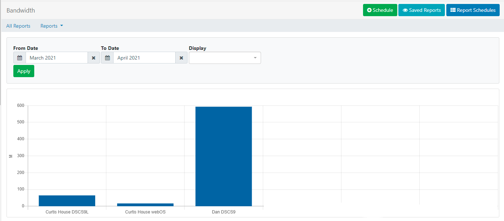
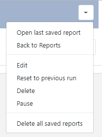

<!--toc=displays-->

# Reporting

{tip}
If you are using a CMS earlier than v3.0.0 please use the following link: [Reporting](displays_metrics_2.html)
{/tip}

[[PRODUCTNAME]] provides useful **metrics** for Users, who have the relevant enabled [Features and Sharing](users_features_and_sharing.html) options, to view reports within the CMS. These are designed to provide a centralised area for analysis into Display performance and usage as well as detailed Proof of Play reports which are all available from **All Reports** under the **Reporting** section on the main menu.

## Display

- ### Display Statistics: Bandwidth

The CMS records the **bandwidth** used by each Display when connecting to XMDS for content and when reporting back Display information. 

- Select the range and click on **Apply**. Leaving the Display field empty will show a bandwidth chart total per Display:

- Filter to just one Display and click on **Apply** to see each call that the Player made to XMDS in isolation:

{tip}
Filtering to just one Display helps to better understand where bandwidth has bee used!
{/tip}

{tip}
Did you know...you can set a bandwidth limit per [Display](displays.html)!
{/tip}

Use the **All Reports** button to return to the Reporting dashboard or use the **Reports** drop down menu to select another 'Display' report to view.

- ### Time Connected/Disconnected

The CMS records all Displays/Display Groups on/offline events to provide a breakdown regarding a Displays availability. 

The Time Connected Report will give a breakdown of % connected (shown in green) and % disconnected (shown in blue)

- Select the **Range** and **Group by** Hour or Day of Month. 

- Leave the Display/Display Group field empty to view all or select  Displays/Display Groups to view.

- Click **Apply**

The **Summary** gives a further breakdown between specified dates for Displays/Display Groups and shows the number of days connected/disconnected:

## Proof of Play

Each **Display** can collect information to provide Proof of Play Reports on what they have shown.

To collect Proof of Play reports **Enable Stats Reporting** and set the **Aggregation level** on a [Display Profile Setting](displays_settings.html)

Statistical collection can be enabled as a default by an **Administrator** on the Settings page and set by a User on adding/editing a [Layout](layouts.html), [Playlist](media_playlists.html), from the [Media Library](media_library.html) and adding/editing a **Widget** on a Layout or Playlist Timeline, with **Off** / **On** / **Inherit** selections.

{nonwhite}
For further information regarding Proof of Play Settings for Administrators please click [here](https://xibo.org.uk/docs/setup/proof-of-play-settings)
{/nonwhite}

Reports can be provided recorded by:

- **Layout**
- **Media**
- **Widget**
- **Event**

{tip}
If the Player supports collection from external sensors, Event stats can be recorded and shown in Reports.
{/tip}

- ### Proof of Play: Export

Use **Export** to select from and to dates for a Display to easily see all Proof of Play data exported to a CSV.

- ### Proof of Play: Report

- Select a **Range** from the dropdown or specify your own dates and times and use the filter fields as necessary. 
- Click **Apply**

{tip}
Returned results can be exported to a CSV!
{/tip}

Click on **All Reports** to return to the Reports Dashboard or use the **Reports** dropdown to select from the available Proof of Play Reports.

- ### Chart: Summary/Distribution by Layout, Media or Event

Charts show an aggregate duration and number of plays the selected Layout, Media or Event.

- Select a **Range**.
- Choose the **Type** and use the drop down to further specify the type selected.
- Click **Apply**.

## Library

- ### Library Usage

View Library usage for all Users of the CMS or filter to have an overview of usage by an individual User/User Group. 

### Schedule

Reports can be scheduled to run on a **Daily**, **Weekly**, **Monthly** or **Yearly** basis. 

{tip}
**Chart: Distribution** and **Chart: Summary Reports** must have the **Type** and the named Layout/Media/Event selected to activate the **Schedule** button.
{/tip}

- Click on the **Schedule** button and complete the necessary form fields for the particular report type.

- A PDF of the report can  be emailed to users by ticking the Should an email be sent? checkbox

{tip}
Scheduled Reports can also be emailed to additional email addresses entered in the **Email addresses** field.

To use this functionality, ensure that your Administrator has set a **Sending email address** on the Network tab of the CMS **Settings** page, which is located under the **Administration** section of the main menu.
{/tip} 

### Report Schedules

- Click on the **Report Schedules** button to view all schedules by Owner/Type. 

- Use the row menu for a report for further options:

  

  

### Saved Reports

Click on **Saved Reports** to view all run reports. 

{tip}
Use the checkbox to only view your own run reports!
{/tip}

Use the row menu to view a saved report,schedule, export as a PDF or delete.

{tip}
**Report Schedules** and **Saved Reports** can also be accessed directly from the CMS menu under the **Reporting** section.
{/tip}

