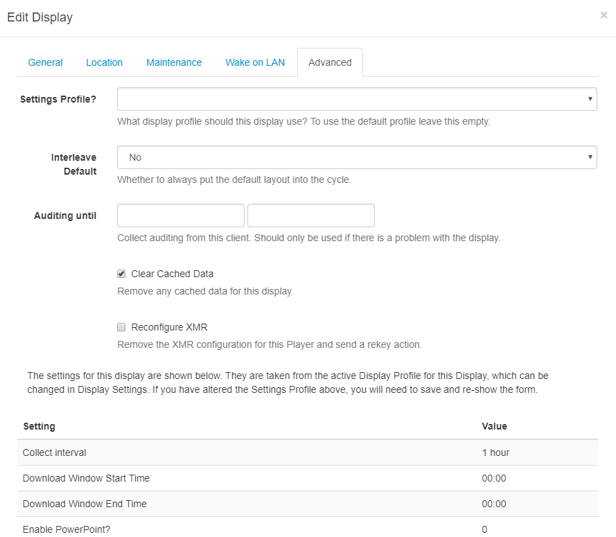

<!--toc=displays-->
# Display Settings 

Display Clients are configured automatically from the CMS once they are connected, this is managed using Display Profiles.

## Display Profiles

Each Display has a default Display Profile which can be customised by an Administrator to suit required preferences or new Display Profiles can be created and assigned directly to a Display.

## Available profiles

A list of available profiles can be viewed from Display Settings under the Display section on the menu.

Each profile has a **Name**, **Type** and a flag indicating if it is the **default** or not. Default profiles are automatically assigned to Displays of the corresponding type.

## Editing Profiles

Use the row menu for the Profile you wish to view and click on **Edit**. Use the Edit Profile form to adjust available settings:

Each setting is explained under each form field for each of the tabs.

### Collect Interval

Using the drop-down menu select how often you would like the Player to check for new content. This means that once a Player has communicated with the CMS, it will check again for any changes by the time  set here.

<tip>

**Scenario:**

A Player has a collect interval set for 24 hours, it will check for any changes, action pending changes and then wait for the next 24-hour collection. If a change is made between this period of time, the Player will not be aware of it until it is time to check again.
</tip>

If a Display Profile for a Player is changed, the Player will only be aware of the change after it has connected according to its prior connection interval. 

<tip>

**Scenario:**

A Player with a collect interval set for 24 hours made a check at 12 pm, it will not check again until 12 pm the following day for any changes that have been made. Once the 24 hour interval has passed, it will update the new changes and from this point will collect changes based on the new Profile.
</tip>

<nonwhite>

XMR is configured by default for **Xibo in the Cloud** customers which allows for changes to be communicated immediately to the Player, regardless of the Collection Interval set. This means that fast and dynamic modifications can be made to your Display, without the need to modify a Display Profile.

For non-cloud customers the CMS can be configured to talk to an XMR instance if player actions are required, please contact your Administrator.

</nonwhite> 

<white>

The CMS can be configured to talk to an XMR instance if player actions are required, please contact your Administrator.

</white>

## Add a Profile

Click on the Add Profile button, and include a name and select **Client type**, Save.

The Edit Profile form will open so that you can complete the necessary form fields for this Profile.

## Deleting Profiles

Display profiles can be deleted by using the row menu options for a selected Profile. 

Please ensure that there is **one default** remaining for each Type.

## Setting on the Display

A default profile will automatically apply to all Displays of the same Type. A Display can be overridden with a Profile other than default by selecting the required Profile on the Display Edit form and using the **Advanced** tab.

