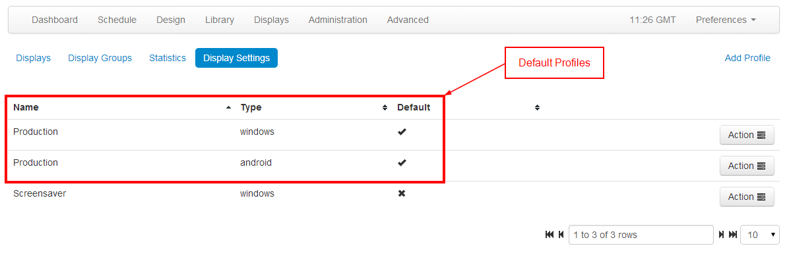
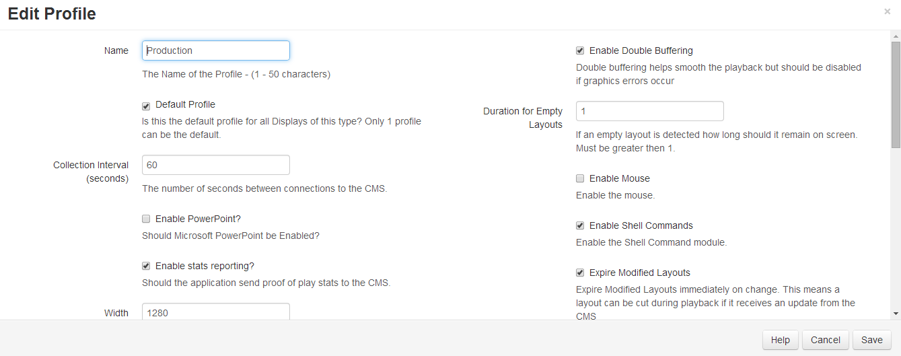

<!--toc=displays-->
# Display Setting Profiles

Display Clients are configured automatically from the CMS once they are connected. This is managed using Display Profiles.

A default display profile for each client type is provided and can be customised to the administrators preferences. It is also possible to create a new display profile and assign it directly to a display.

## Viewing the available profiles

Profiles can be viewed from the "Display Settings" sub-menu on the "Display" menu. A list of profiles (shown below) will be shown when the page loads. Each profile has an action button to bring up the Edit or Delete forms.

Each profile has a name, a type and a flag indicating if it is the default or not. Default profiles are automatically assigned to displays of the corresponding type.

## Editing a profile

Once the Edit action is selected for a profile the below Edit Form is displayed. This form allows all the available settings to be adjusted.

Each setting is explained on the form under each form field.

## Deleting a profile

Display profiles can be deleted, but please ensure there is one default remaining.

## Setting on the display

The default profile will automatically apply to all displays of the same type. If a display should be overridden with a profile then one can be selected on the Display Edit Form on the Display Management page.

