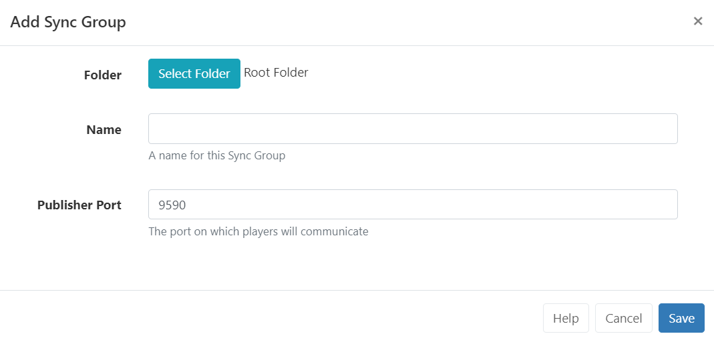

# Sync Groups

Sync Groups contain the Displays that will show synchronised content. Content can be synchronised to play across 2 or more Displays in a mirrored or video wall configuration when scheduling a [Synchronised Event](scheduling_events.html#content-synchronised-events).

{feat}Sync Groups|v4{/feat}

{tip}
Sync [Playlists](layouts_editor_playlists.html) on different Layouts using the **Content Synchronisation Key**.
{/tip}

[Displays](displays.html) first need to be assigned to a **Sync Group**:

- Click on **Sync Groups** under the **Displays** section of the main CMS menu.
- Select the **Add Sync Group** button.

Sync Groups can be saved to [Folders](tour_folders.html) to easily control User/User Group levels of interaction for Displays as well as provide an additional way to organise.

{tip}
All Displays in a Sync Group need to communicate using their LAN IP address over TCP on the publisher port specified. This is defaulted to 9590 but can be changed if that port is reserved.

We recommend using a wired network and high-powered similar devices for the best Synchronisation.
{/tip}

- On saving use the **Manage Membership** form to select which Displays to include in this Group.

{version}
**NOTE:** A Display can only belong to one Sync Group at the same time.
{/version}

- On saving use the Edit form use the drop down to select which Display should be the **Lead Display** for the Sync Group.

- Click to **Save**

{tip}
Content can now be scheduled to the Sync Group by clicking **Schedule** from the main CMS menu and selecting the [Add Synchronised Event button](scheduling_events.html#content-synchronised-events).
{/tip}

## Edit / Manage Membership

Manage a Sync Group by using the row menu:

- Select **Edit** to set an alternative Lead Display
- Select **Members** to manage which Displays are members of the group.

#### Next...

[Scheduling Synchronised Events](scheduling_events.html#content-synchronised-events)

