<!--toc=tour-->
# Setting up a cafe menu sign with [[PRODUCTNAME]]

## 1. Introduction

The combination of the [[PRODUCTNAME]] CMS and the [[PRODUCTNAME]] Player Software operating together is extremely powerful. It has the potential to allow you to control hundreds of different displays running hundreds of different layouts simultaneously.

The price of that power is a certain amount of complexity, and it can be difficult for a new user to know where to start when there are so many options available.

This tutorial will provide you with a soft start by providing a step-by-step introduction to the process of setting up a simple, single screen campaign.

We have tried to provide a realistic scenario for the tutorial. It allows us to take you through the setup procedure and also lets us talk about practical design considerations you should be making while you layout your signs.

## 2. Scenario

The Riverside Cafe is a small cafe near the river which passes through a small town. It is popular with boat owners and canoeists during the daytime, but also does a busy trade during the evening period.

The cafe is open from 7.30 am through to 10.00 pm. It operates three different menus across the day for Breakfast (7.30 to 11.30), Lunch (11.30 to 3.30pm) and Teatime (3.30 to 10.00 pm). The cafe is closed all day on Wednesday and on Sunday evenings.

The cafe owner has decided to install a digital sign to be displayed on a single screen located on a wall close to the Point of Sale (POS). It will be in a position where it can be seen through the window when the cafe is closed. When the cafe is open it will display a menu board which will update to show the current offering. When the cafe is closed it will show a promotional screen with information about the cafe's opening times and useful local information (bus times, taxi numbers, etc).

This is an easy task for you using the [[PRODUCTNAME]] CMS. It will need you to create four different layouts – one for each menu and a default layout to be shown when the Cafe is closed. You will then need to schedule each layout so that it displays at the correct time of day. Once these have been scheduled you can turn your attention to the visual appearance of each of the layouts.
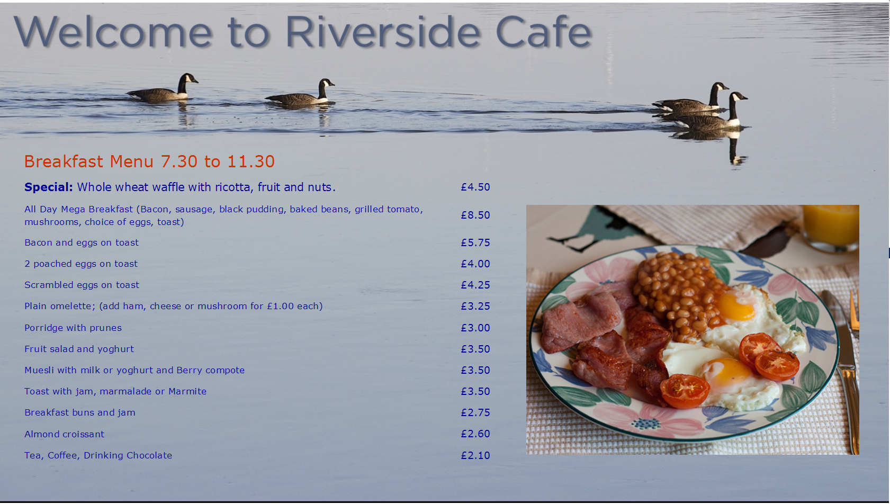

## 3. Before you begin

Our tutorial assumes that you already have a [[PRODUCTNAME]] digital signage system set and running for you. If not, you can find instruction on how to do that [here]([[PRODUCTHOME]]).

There are an enormous range of options to choose from. You need to make choices about screens, display player hardware, and the configuration of the [[PRODUCTNAME]] CMS. All of this is beyond the scope of this tutorial.

<nonwhite>
However, we can tell you that, if you are simply looking to evaluate [[PRODUCTNAME]] using the tutorial, the fastest, simplest option is to:

1. Download and install the free [[PRODUCTNAME]] [Player Software](http://xibo.org.uk/get-xibo) on your PC or laptop.
2. Take advantage of the 14 day free trial [CMS Cloud Hosting](http://springsignage.com/hosting) offer provided by our sponsor, Spring Signage Ltd.

This will allow you to get your Digital Signage system up and running quickly without the complication and bother of installing the [[PRODUCTNAME]] CMS and a MySQL database on a server.

Alternatively, if you prefer to use your Android phone or tablet as a display, you can install Spring Signage's Xibo for Android app. Like the CMS Cloud Hosting this is a commercial offering , but it has a 15 day free trial period which should give you plenty of time to complete the tutorial.  
</nonwhite>

You can download an archive containing all the graphics file and other materials used in the tutorial [here](img/guide_getting_started_cafe_menu.zip). The archive also includes the completed layouts we have produced so that you can import them for comparison.

## 4. Setting up the display in the CMS

Once your display software has been set up and registered with the CMS you can make a number of adjustments from the DISPLAYS menu in the CMS Dashboard. The Displays screen can be used to adjust many individual characteristics of the screen to suit your system.

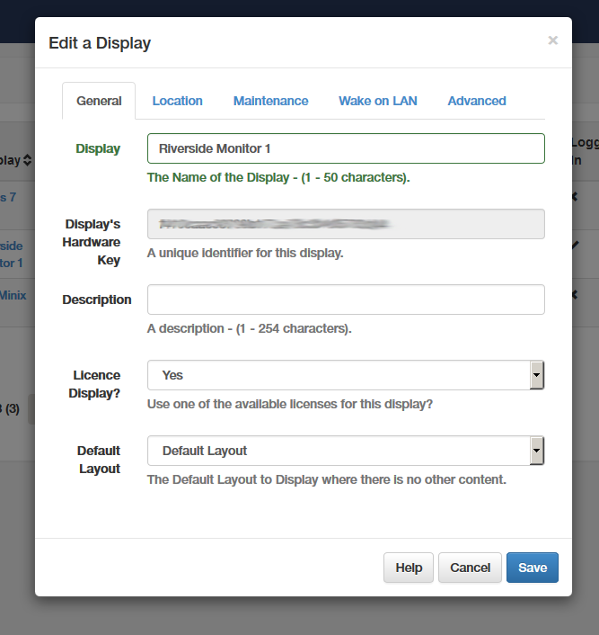

We won't cover them here, but you can find more information on the various settings you can make from the DISPLAYS dashboard [here](displays.html).

## 5. Creating basic layouts

You will need to create four different screen layouts – one for each of the three menus, and a default layout to be shown when the Cafe is closed. These will then need to be scheduled so that each layout displays at the correct time of day.

Think of layouts as containers for the images, videos and other media that will be displayed. Layouts allow you to control where and when they will appear on the screen. 

For now, we are going to keep things simple and set up basic layouts containing a single Region containing a simple text message. Once these have been scheduled to display at the correct times we will return and focus on the visual appearance of each of the layouts.

We will start by editing the existing Default layout. Once configured this will become a template for the creation of the other layouts

1. Select DESIGN/Layouts from the Dashboard.
2. Select Design from the Default layout's drop down menu.

	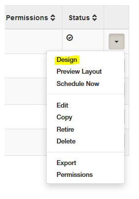

3. The Layout Designer will open.

	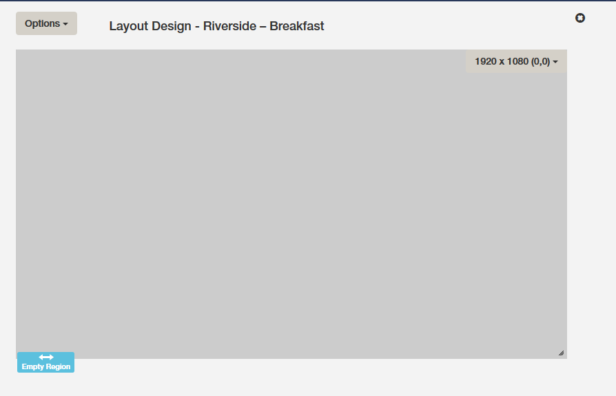	

The [[PRODUCTNAME]] CMS's Layout Designer will allow you to set up basic characteristics of the layout and specify a number of screen Regions where media can be added and controlled. We will start by setting up a plain white background:

1. Click the Options menu button and select Background.
 
 	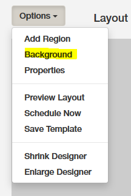

2. Pick white from the colour picker or enter "#ffffff" in the Background Colour box. Click Save.

The layout is created with a single Region that covers the full screen. We will edit that and use it for our text message display.

1. Hover your mouse over the Region and then select Options from the drop down menu.
2. Ensure that the Loop? check box is selected. Click Save.
3. Select Edit Timeline from the drop down menu. The Region Timeline dialog will open.
4. Select Text from the Add Media list to the left of the dialog. The [[PRODUCTNAME]] CMS's HTML text editor will open.

[[PRODUCTNAME]] uses CKEditor for text input. CKEditor is a powerful WYSIWYG HTML editor that will allow you to add and style both text and graphics to be displayed within the Region. Its button based user interface will provide access to many of the typographical features of HTML and CSS. Complete documentation is available over at CKEditor's website.
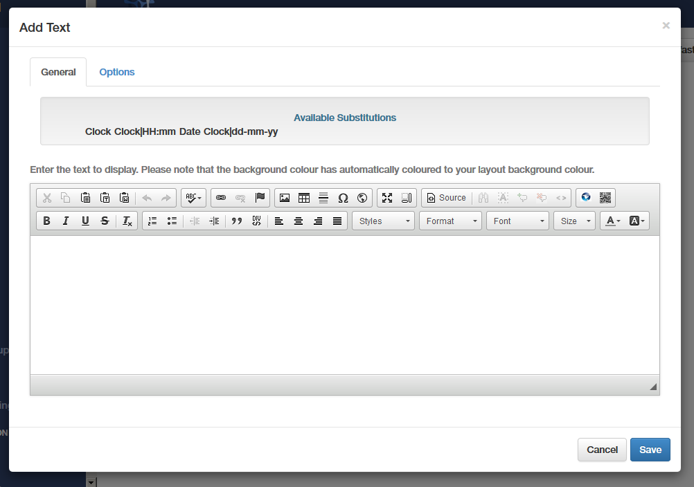

For now, we will add and format a simple text message:

1. Place the cursor in the text area and press Enter to create a new line.
2. Type "Welcome to Riverside Cafe". Press Enter to create a new line.
3. Type "Open from 7.30 am through to 10.30 pm".
4. Drag the mouse to highlight all three lines. Select "Verdana" from the font menu and select the "Center" from the text alignment group.
5. Highlight "Welcome to Riverside Cafe" and select a font size of 72.
6. Highlight "Open from 7.30 am through to 10.30 am" and select a font size of 48    .
7. The result should look something like the screenshot here:
8. Finally, click the Options tab and enter 600 in the duration field . This will cause the layout to run for 5 minutes before it is updated.
9. Click Save and close the Timeline editor to return to the Layout Designer screen.

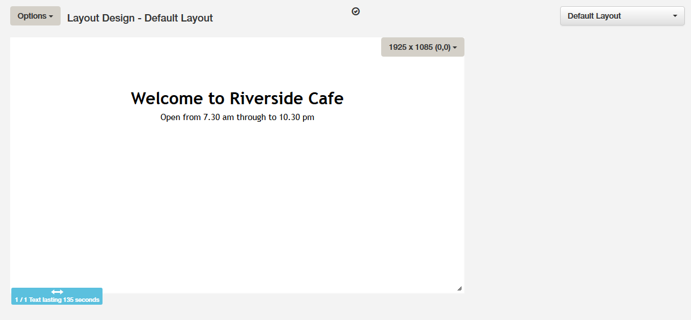

We can now use this Layout as a template to speed up the process of creating the three additional Layouts. Start by saving the template:

1. Select Save Template from the drop down menu. Type "Riverside Basic" in to the Name field. Click Save.
 
	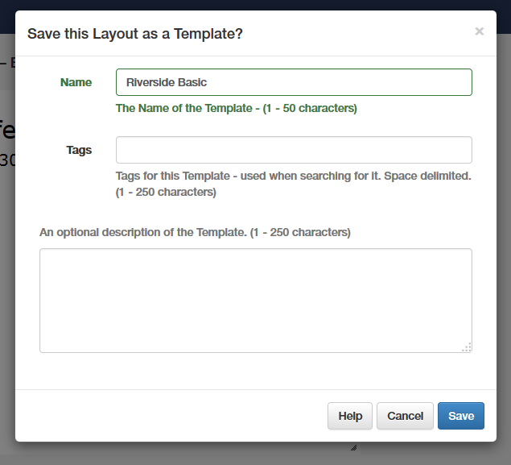

2. We can use the template to create a new layout for the Breakfast menu:

1. Select DESIGN/Layout from the Dashboard. Select Add Layout. The Add Layout dialog will open.

	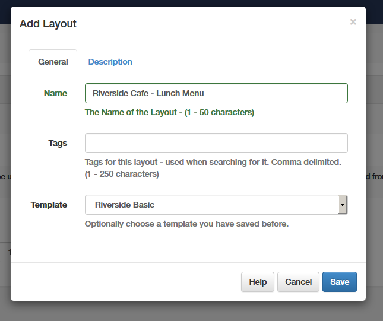

2. In the Name field enter "Riverside Cafe - Breakfast", and then select Riverside Basic from the list of available templates. Click Save. The Layout Designer will open with the new Layout.
3. Use the Region timeline text editor to edit the text. The main headline should read "Riverside Cafe - Breakfast Menu" and the second line should read "7.30 to 11.30 am". Click save.

## Exercise 

Try it out for yourself. Use the above method to create the Riverside Cafe Lunch (11.30 to 3.00 pm) and Teatime (3.30 to 10.00 pm) menu Layouts.

## 6. Scheduling repeated events

If you test the results of your work so far by running [[PRODUCTNAME]] Player Software you should see that the default layout is now displayed continuously. This is because the default layout acts as a fallback screen that will display in the absence of any scheduled layout. We now need to schedule the three menu layouts so that that will be displayed on the correct days and at the correct times.

The [[PRODUCTNAME]] CMS's scheduler is extremely powerful and will allow you to schedule a specific layout to be shown on a specific monitor at a specific time years in advance of the current date. It will also allow recurring events to be set up to repeat with minute by minute accuracy if required. Individual events can be overridden by giving alternative events priority and this will allow you to build up a complex schedule which can be easily adapted to account for variations and special occasions such as holidays.

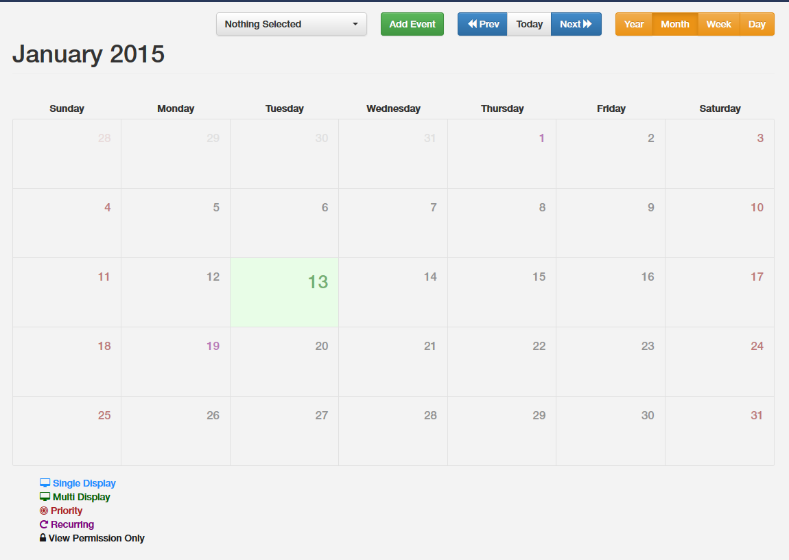

We will begin by setting up the Breakfast Menu layout so that it displays at the correct time of day:

1. Select Schedule from the Dashboard. 
2. By default the CMS Scheduler opens in Month view with the current day selected. You can use the buttons to the right to switch between Year, Month, Week and Day view. For now, we will continue using the Month view.
3. Select Riverside Monitor 1 from the drop down list of available Displays.

	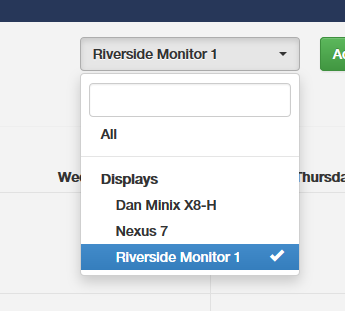

4. Click on today's date to make sure it is selected and then click Add Event. The Schedule Event dialogue will open.

	

5. Click in the Start Time box and select today's date and a start time of 7.30.
6. Set the End Time to today at 11.30.
7. Finally, select the Riverside-Breakfast layout from the Layout/Campaign drop down list.
8. Click Save.

The newly scheduled event will be shown as a blue (single display) monitor icon on the CMS Schedulers display. We now need to set it up so that it repeats on a daily basis:

1. Click on the monitor icon to open the Edit Event dialogue will open.
2. Select the Repeats tab.

	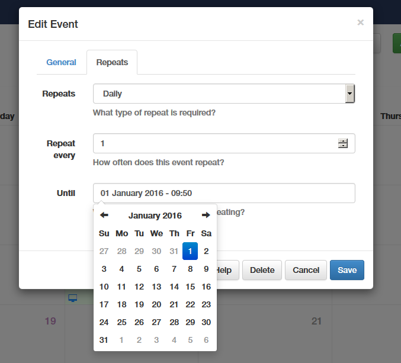
3. From the drop down list select Daily.
4. Set Repeat every to a value of 1.
5. Finally, set the Until value to a date a year or so in to the future.\*
6. Click Save.

The event will now be shown in the scheduler with the recurring event symbol for every day going forward.

\* The choice of date here in this application is not significant – it simply ensures that the layout will continue to display on a daily basis in to the future. The scheduler will allow you to set a date up to five years in advance, and currently does not offer a continuous display option.

We will now set up the Lunch menu events and then, to save time, we will set up the Teatime menu events using the Next (event) button in the Edit Event dialogue:

1. Click on today's date to make sure it is selected and then click Add Event. The Schedule Event dialogue will open.
2. Click in the Start Time box and select 11.30.
3. Set the End Time to today at 15.00.
4. Select the Riverside Cafe Lunch Menu layout from the Layout/Campaign drop down list.
5. Select the Repeats tab.
6. From the drop down list select Daily.
7. Set Repeat every to a value of 1.
8. Set the Until value to a date a year or so in to the future.
9. We can now save this event and create a new one by clicking Next. The Lunch Menu event will be scheduled and the Schedule event dialogue will remain open with all of the settings of the previous event in place.
10. Edit the Start time to 15.00 and the end time to 22.30
11. Select Riverside – Teatime from the Layout/Campaign drop down list.
12. Click Save and check that all three events are now shown as recurring events on each page.

	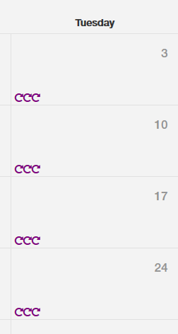

## 7. Scheduling exceptional events

The result of all this activity should be that the Breakfast, Lunch and Teatime Layouts will now be displayed at the correct times every day of the week. The default layout will display at all times where an event has not been scheduled, i.e from 22.30 through until 7.30 the following morning. 

However, the cafe does not open all day on every day of the year. As we have already mentioned , the cafe is closed all day on Wednesday and on Sunday evenings, and it is also closed on Christmas and New Years day. In addition, there may be occasions when the cafe needs to close temporarily for unexpected reasons, such as illness, extreme weather, etc., or there may be times when the menu needs to change to reflect a shortage of an ingredient, or a special offer.

Although the solution may seem obvious, it is not possible to delete an individual repeat of an event within the scheduler without deleting all of the programmed repeats. This is by design. To adapt the scheduling of the display to accommodate these exceptional events we need to first add additional events and then give those events priority so that they override the existing event.

For this tutorial we will use the default layout for those times when the cafe is closed. However, it would easily be possible to create special layouts for particular occasions like Christmas Day to give a seasonal feel.

We will start by setting up the regular Wednesday closing display.

1. Click Add Event. 
2. Set the Start Time to 7.30 on the next available Wednesday and the End Time to 22.30 on the same day.
3. Set Layout/Campaign to Default layout. 
4. Check the Priority box 

	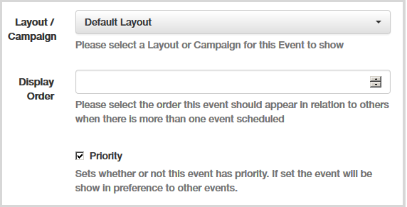

5. Select the Repeats tab.
6. Set Repeats to Weekly.
7. Set Until to a date a year or so in to the future.
8. Click Save.

 	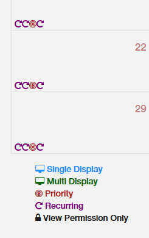

The new scheduler will show a new event occurring every Wednesday, indicated with the Priority symbol. This event will override the existing daily event and the Default layout will be displayed.

### Exercise:

Set up the Sunday early closing priority event, so that the default screen is shown from 15.00 onward.

## 8. Layout design – creating the Default layout

Now that we have all three layouts scheduled so that they are displayed at the correct times, we can now turn our attention to their visual design. This part of the tutorial will cover the design of the Default and Breakfast Menu layouts.

We will start with the Default layout, which will be displayed whenever the cafe is closed, and will be viewable by passersby through the cafe window. This last point is an important practical consideration when planning the design. Whatever text and visual elements are included, they must be visible, and readable, from a viewing distance of 3 metres. Text, in particular, must be of a sufficient size to be read at a distance.

In this process we will add a background image, a text area, a clock, and an image sideshow to the layout. 

The choice of background image is important for any project like this. If you main aim is to provide information, avoid busy backgrounds that may make the text difficult to read. Ensure that it provides clear areas where you can add the content regions to the page.

We have used a custom background for our tutorial, which has allowed us to make use of fonts and other graphic elements that may not be available on the display player equipment.

We have provided a Resource archive of graphics for use in this section of the tutorial, which can be downloaded [here](img/guide_getting_started_cafe_menu.zip). Once downloaded, extract all the files to a convenient location on your computer.

There are many alternative background images available for free download in the [Layout Exchange](http://xibo.org.uk/layouts/).

### Adding media to the Library

The images to be used in the layout must first be added to the Library so that they will be available for insertion in the layouts. You can do this individually as you insert them into the layout, but its perhaps faster and more convenient to add them in bulk at the beginning.

1. Select LIBRARY/Media from the Dashboard.
2. Click "Add Media". 

	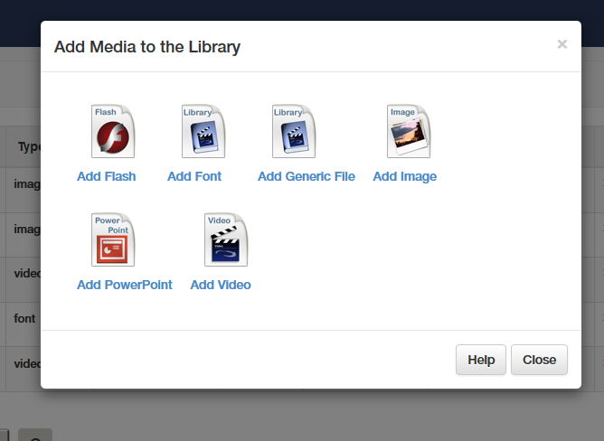

3. Select "Add Image".

	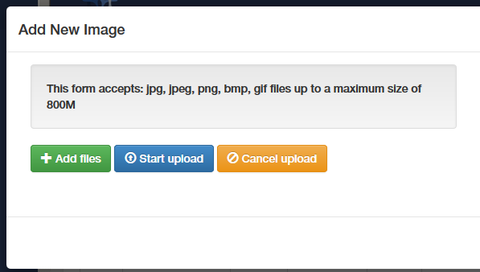

The Add New Image dialogue will allow you to upload jpg, jpeg, png, bmp, gif files up to the maximum size configured by your CMS administrator.

1. Click "+ Add files". 
2. Navigate to the tutorial resource file folder on your computer.
3. Hold down the Control key (to allow the selection of multiple files)and select the following files: "Riverside\_Cafe\_Background.png", "Coffee.png", "Full English.png", Wholewheat waffle.png, "strawberry waffle.png".

	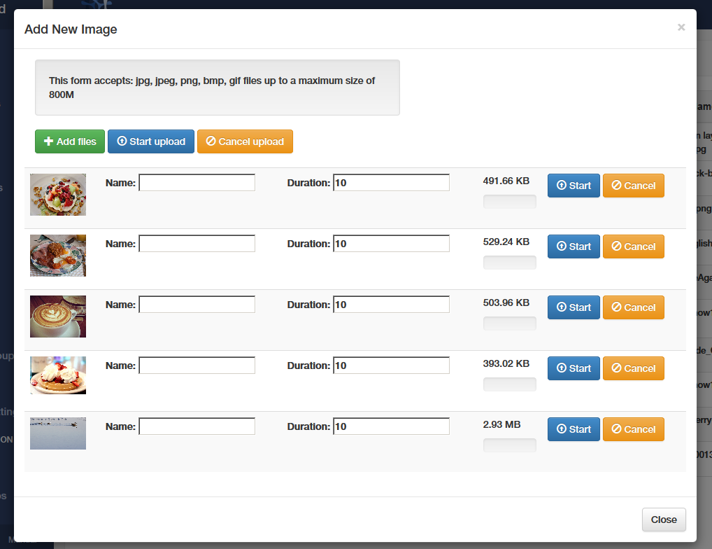

4. Click Open and then "Start upload".

Your Library file list should now include the uploaded files and they will be available to insert immediately in to your layouts.

First we will add the background image.

1. Navigate to the Default layout Design screen (DESIGN/Layouts - Default Layout/ Design).
2. Select Background from the drop down menu.
3. In the dialogue that opens, select "Riverside\_Cafe\_Background.png" from the Background Image drop down menu.

	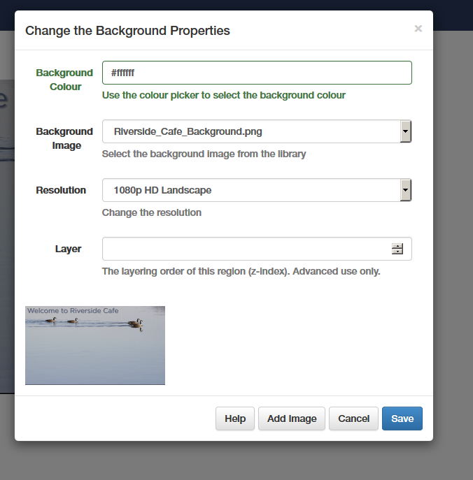

4. Click Save and the background image should now completely fill the layout. It will look a little faded, because the temporary text region we added earlier will be sitting in front of it. 

Now we will edit the text region.

1. Hover the mouse pointer over the region and select Options from the top right drop down menu.
2. Edit the fields in the dialogue as follows: Name = Opening Times ,Top = 340, Left 55, Width = 914, Height = 698.

	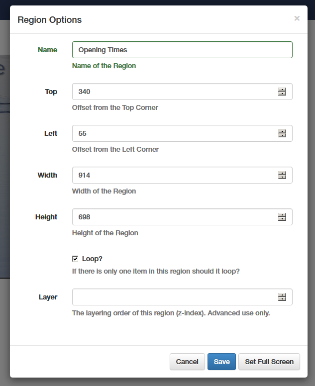
3. Select Save and the region will resize accordingly.

To edit the text:

1. Select Edit Timeline from the drop down menu.

	 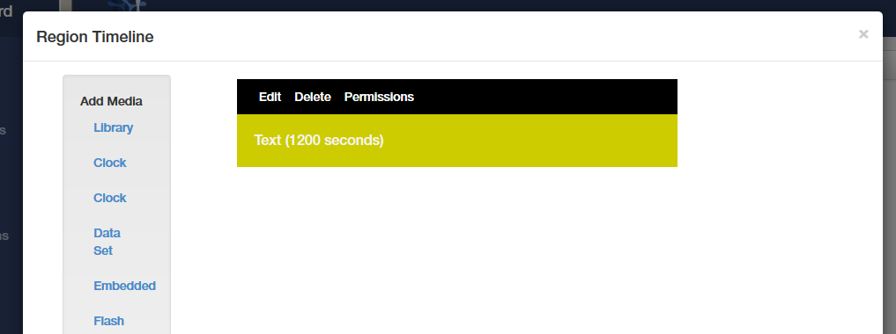

2. Select Edit for the Text item in the Region Timeline dialogue. 
3. Begin by deleting all of the existing text so you start with a blank document.
4. Copy and paste the following in to the text editor screen:

    > Opening Times:-
    > 
    > Monday: 7.30 am to 10.00 pm
    > 
    > Tuesday: 7.30 am to 10.00 pm
    > 
    > Wednesday: Closed all day
    > 
    > Thursday: 7.30 am to 10.00 pm
    > 
    > Friday: 7.30 am to 10.00 pm
    > 
    > Saturday: 7.30 am to 10.00 pm
    > 
    > Sunday: 7.30 am to 3.30 pm

5. Drag the mouse to select all of the text and, from the text editors toolbar, select Align Left, Font = Verdana, Size = 48px and Text Colour = #cc3300 (you will find this in the "More Colors" section of the colour selector).
6. Select the top line of the text ("Opening Times:-") and select Bold and set the Size as 72 px.

	 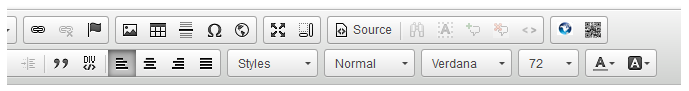

The text editor toolbar provides a number of tools to allow you to easily format the text, but the editor will also allow you to edit the HTML source code. This will allow you to fine tune that formatting or add more advanced code. In this case we would like to select a font size other than that provided by the toolbar's drop down list:

1. Select "Source" from the toolbar to view the HTML source code for the current layout.
2. Use the search tool to highlight all instances of "48px", the current size of the main body text. Change these all to 52px then click Save.
3. Double check that everything is as it should be by choosing "Preview layout" from the Options drop down menu. A browser tab should open, providing a full screen sized preview of the layout.

To add the slideshow:

1. From the Options menu, select Add Region. A new region will appear at the top left of the display.
2. Drag the region over to the clear area to the right of the display and click Save Position. 
3. Select Options from the region's drop down menu and edit the settings as follows: Top =456, Left =1132, Width = 640, Height = 480. Make sure that the Loop box is ticked and click Save.
4. Select Edit TimeLine from the region's menu to open the Region Timeline editor.
5. From the Add Media list to the left select "Image" and then click View Library.
6. From the list of available media select: coffee.png, Full English.png, strawberry waffle.png and wholewheat waffle.png (by clicking the + symbol to the right of the entry). 
 
	 

7. Click assign.

	 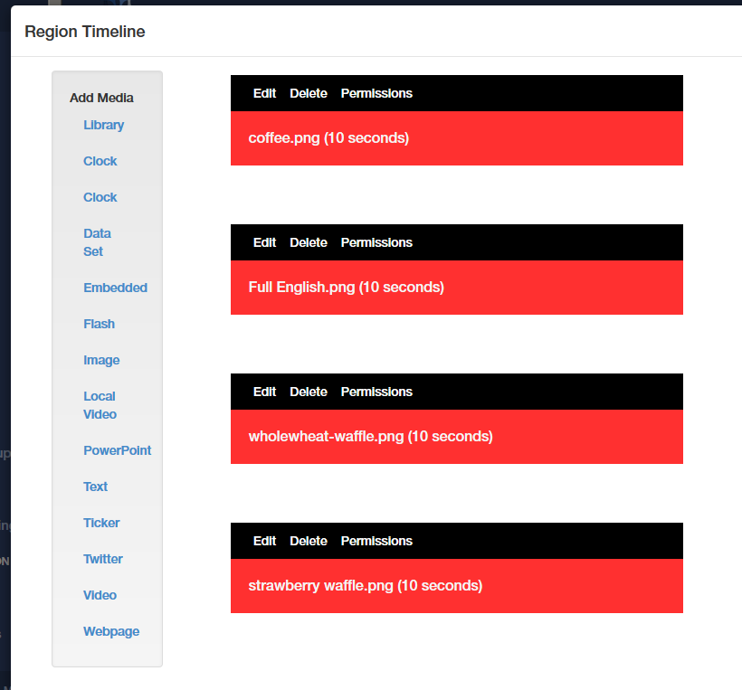

The region timeline editor will now be populated with the four images shown in the sequence that they will be displayed. To change the order of display, simply drag the images to their new position in the list. By default the images will be set to display for 10 seconds. You can change this, and edit various other aspects of how they will display, by clicking the edit button for each image.

1. When you are happy with the timeline setting, click Save Order and then Close.
2. From the Options menu, select Preview Layout and check that the slideshow images show as intended, and that they loop continuously.  

To add the clock to the display:

1. From the Options menu, select Add Region. A new region will appear at the top left of the display.
2. Drag the region over to the clear area to the right of the display and click Save Position. 
3. Select Options from the region's drop down menu and edit the settings as follows: Top =952, Left =1194, Width = 504, Height = 110. Make sure that the Loop box is ticked and click Save.
4. Select Edit TimeLine from the region's menu to open the Region Timeline editor.
5. From the Add Media list to the left select "Clock" and then select Digital from the Clock Type menu.
6. Set the duration to 30 seconds.
7. In the text editor window, type [HH:mm:ss]. This will provide a 6 digit display showing the current hours, minutes and seconds.

 	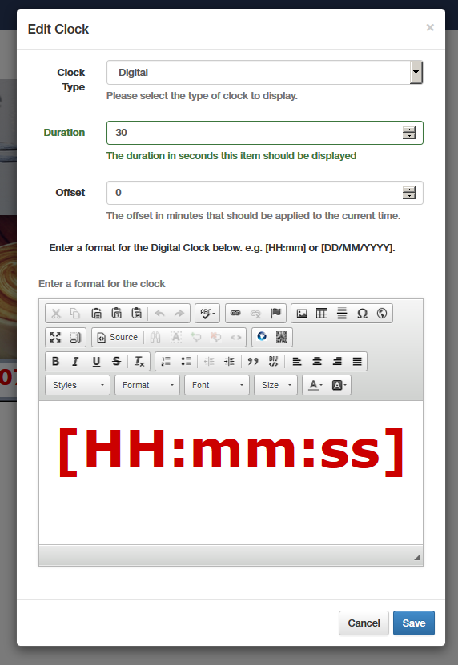

8. Drag the mouse to highlight all the text and from the toolbar set; Bold, Align Centre, Font =Verdana, Font Size = 72px. Click Save.
9. From the Timeline editor, select Save Order and then Close.
10. From the Options menu, select Preview Layout and check that the clock displays as intended, and that it loops continuously. 
11. To check that the layout is working correctly on the actual display, select Schedule Now from the Options menu. Set a duration of 10 minutes, select the monitor and make sure the Priority box is ticked to override the scheduled layouts. Click Save. The layout will be displayed at the end of the monitor's current collection interval.

This should complete the creation of the Default layout, which will now show at all times that the Cafe is closed.

## 9. Layout design – creating the Breakfast Menu layout

We can now move on to create the Breakfast menu layout. This will make use of the same background image that we used for the Default screen and will contain a single text region for the actual menu, alongside a slideshow of breakfast menu items.

The design requirements for this layout are different to those of the Default layout , because this is intended to be read by customers as they place their order at the Point Of Sale. This means we can make use of smaller text, and because of this the information density of the display can be much higher.

### Exercise:

Open the Riverside – Breakfast layout and add the background image. Resize and reposition the text region as follows: Name = Breakfast Menu Top =319, Left = 53, Width = 1010 and Height = 672 Loop = ticked.

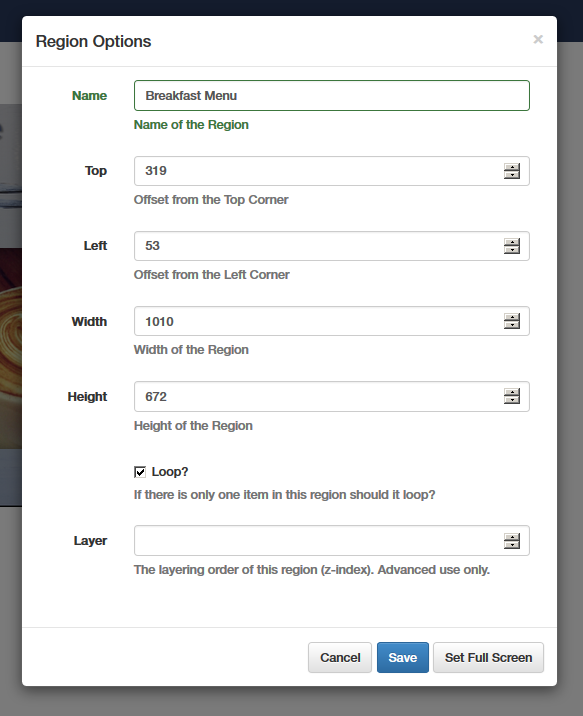

### Importing HTML Formatted Text

The big advantage of using HTML based text regions, apart from providing access to unlimited formatting options, is that there are many third party applications that can be used to produce HTML code which can be easily added using the text editor.

This means that the display content can be created and edited by a third party, who does not need to have access to the [[PRODUCTNAME]] CMS. They can edit the information in office applications such as MS Word or any one of a number of dedicated HTML editors.

Once the editing is complete all the author needs do is email the file to you so that you can insert it in the appropriate place using the [[PRODUCTNAME]] CMS.

To demonstrate this we have provided a text file called "Riverside\_Breafast\_Menu\_Source.txt", which can be found in the tutorial Resources folder.

Note. To do this reliably you need to open the source file in a pure text editor such as, on Windows machine, Notepad. Don't use a word processor such as Word, which may attempt to add additional formatting code to the document.

To edit the Breakfast menu text region:

1. Select Edit Timeline from the region's drop down menu.
2. Select Edit for the Text item in the Region Timeline dialogue. 
3. Begin by deleting all of the existing text so you start with a blank screen.
4. Open Riverside\_Breafast\_Menu\_Source.txt in a text editor application (such as Notepad).
5. Select all of the text in the document and then select Copy (usually in the Edit menu, or use the Ctrl C keyboard shortcut). 
6. Go back to the timeline text editor screen and click the Source button in the toolbar.
7. Place the cursor in the editor window, hold the Ctrl key down and press V. The source code for the menu should fill the window.

	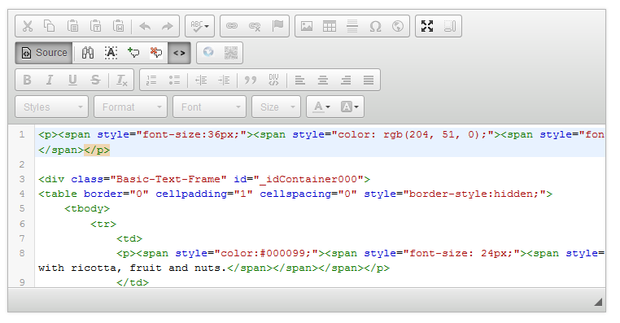

8. Press the Source button once more to return to the preview window. It should now contain a fully formatted menu containing a table of breakfast items and their prices. 
9. If you want to adjust any aspect of the menu layout you can do that using the toolbar tools. When you are happy with the appearance click Save.
	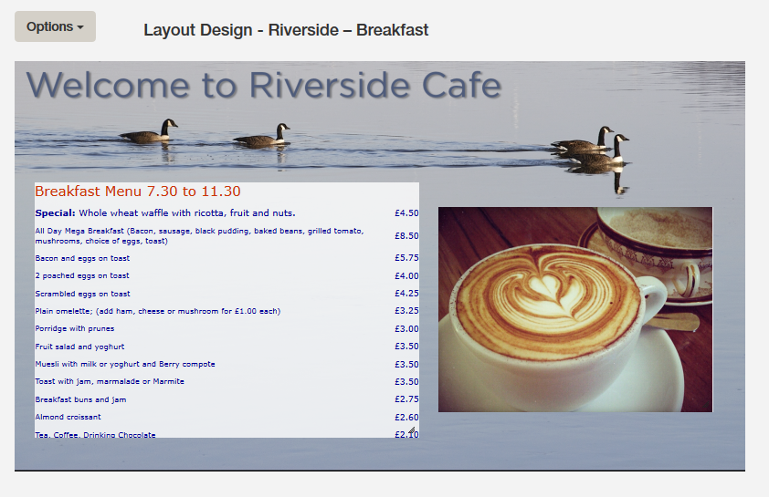

It is a worthwhile exercise to study the source code for the menu listing to see how it is formatted. You will notice that the list of items and prices is comprised of a table. This is a very convenient way of formatting this kind of information, particularly because it makes it very easy to easy to align the columns.

### Exercise:

The final touch is to add the slideshow to the layout .

To do this create a new region in the layout and resize and reposition it as follows: Name = Breakfast Slideshow, Top =384, Left = 1113, Width = 722 and Height = 540 Loop = ticked. Add the breakfast item images to create a slideshow similar to the one used in the Default menu.

## 10. Next steps

If you have followed the tutorial right the way through from the beginning you should now have a fairly good grasp of how to use the [[PRODUCTNAME]] CMS to create and schedule dynamically changing signs. However, it is important to realise that we have only touched on a small part of the software's capabilities here. There are many other aspects to explore.

Also, please remember that there are many different ways of achieving these results and what we have shown you is by no means the only or best way of doing this. We encourage you to experiment with both the methods and workflow to find your optimum way of working.

### Coming soon

You may have noticed that this project is not yet completed. The visual layout of the Lunch and Teatime menus for Riverside Cafe remains to be done. Part two of this tutorial will complete these and show how to use advanced features of the [[PRODUCTNAME]] CMS including datasets, tickers and embedded HTML.

### Additional help available now:

[[[PRODUCTHOME]]]([[PRODUCTHOME]])

[Troubleshooting](troubleshooting.html)

[[[PRODUCTSUPPORTURL]]]([[PRODUCTSUPPORTURL]])

### Photo Credits

Images used for this tutorial:

Photo: Riverside Cafe by Graham Wyatt CC (www.gpwyatt.co.uk)

Photo: Breakfast at Keys by JFXie CC flickr.com – Converted to PNG format

https://www.flickr.com/photos/jfxie/8664928657

Photo: The Full English by Neil Conway CC flickr.com – Converted to PNG format

https://www.flickr.com /photos/neilconway/4460785994

Photo: breakfast by Meg Lessard CC flickr.com – Converted to PNG format

https://www.flickr.com/photos/megleo/5334218936/