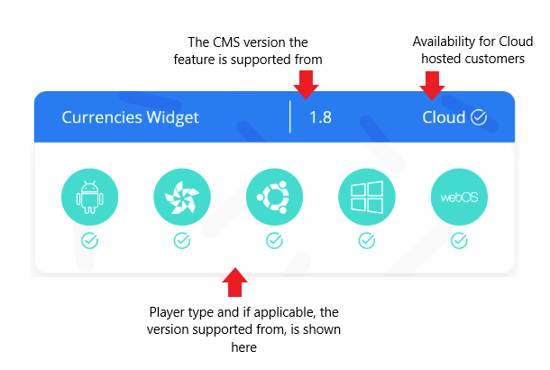

<!--toc=tour-->

# [[PRODUCTNAME]] User Manual

**Revision: [[PRODUCTVERSION]]**

Management of a solution as flexible as [[PRODUCTNAME]] requires a powerful CMS (Content Management System) to control the core concepts. The [[PRODUCTNAME]] CMS is packed full of features to help you get the very best out of the [[PRODUCTNAME]] solution.

This User Manual covers the core concepts and CMS features and starts with a "Tour" to further explain what [[PRODUCTNAME]] can actually do...

{tip}
**Please note:** The User Manual gives a complete overview of the CMS as a Super Administrator with full access to all [Features and Sharing](users_features_and_sharing.html) options within the CMS.

If you have any questions regarding your User access, then please contact your Administrator.
{/tip}

{nonwhite}

If you are an Administrator and require information regarding the Installation and Set up of the system, please refer to the [Administration Documentation](/docs/setup)

If you are not a [Xibo Cloud Hosting](/hosting) User and need to install a CMS then please refer to the [Installation Guides](/docs/setup/cms-installation-guides) to get up and running with Xibo!
{/nonwhite}

## Welcome to the Tour!

[[PRODUCTNAME]] is a flexible and powerful application with a core ethos in Digital Signage for all, regardless of skill level or technological knowledge. 

The software itself center's on 5 core concepts:

1. Users
2. Displays
3. Layouts
4. Media
5. Scheduling

Using these 5 concepts we can sum up what [[PRODUCTNAME]] can do in a simple sentence;

**"[[PRODUCTNAME]] enables a User to upload Media and arrange it in a Layout which is then Scheduled to one or more authorised Displays".**

[[PRODUCTNAME]] has many more features to take advantage of which are covered within this User Manual, but to get started let's take a quick look at the main 5.

### 1. Users

Users are the people that are granted access to the CMS and are identified by a **Username** and **Password** to securely log in.

[[PRODUCTNAME]] supports 3 User Types, User Groups as well as multi-level [Feature and Sharing](users_features_and_sharing.html) access to all parts and items stored within the CMS.

{tip}
For a corporate environment [[PRODUCTNAME]] can also integrate with SAML identity providers such as Active Directory via ADFS. 
{/tip}

### 2. Displays

Displays represent the hardware connected to the TV/Projector/Tablet that is displaying the **Scheduled** end content. Each Display is uniquely identified in the CMS so that every Display can have its own content, Layout designs and Schedules set with uniquely identified reporting statistics available.

### 3. Layouts

Layouts are the complete design that is seen on the screen. Layouts are made up of **Regions** which allows you to split the screen/position how you choose, with each Region containing its own **Playlist/Timeline** to which **Media Widgets** are assigned.  A Layout will remain on screen until all Regions have finished playing their assigned content through once, then an entirely fresh Scheduled Layout can be loaded that has different positioning/sizing of Regions and different Playlists/Timelines. 

This flexibility drives the dynamic nature of a [[PRODUCTNAME]] display screen.

### 4. Media

Media content is at the core of the [[PRODUCTNAME]] solution and has many different types which can be generally split into two categories:

**File-based media** -  uploaded and stored in the Library, for example, image and video files.

**Layout based media** - does not have an associated file and is configured directly on a Layout; RSS feeds and free Text

[[PRODUCTNAME]] uses powerful **Widgets** which allow you to show your content as well as integrating dynamic third-party information from a variety of sources.

### 5. Scheduling

Scheduling is highly flexible and supports Schedules to single **Displays** as well as to **Display Groups**. Each Display will check for new Scheduled content periodically, and download Scheduled Items in advance of playback. **Default Layouts** are shown on Displays when nothing else is Scheduled.

{nonwhite}

{tip}
Throughout the documentation we have included a helpful table to show **Player** and **CMS** version support for features and functionality:

{/tip}

### Open Source

The heart of the software is open source, including the entire **CMS** platform,**Windows** and **Ubuntu Players**, and has been for many years! We're committed to keeping it that way. The code can be downloaded and used in accordance with our AGPLv3 licence.

### Content Licensing

Please ensure that any content you wish to use complies with Copyright law and is used in the manner as described within its own license. Xibo takes no measures to regulate what is put on displays, beyond what is described in these Manual pages.

### Support

If you would like further help with the information contained in the User Manual please take a look at the [Troubleshooting](troubleshooting.html) section or our [Xibo Community Forum](https://community.xibo.org.uk/).

Customers on a Professional, Business or Enterprise Plan have access to our experts on our Help Desk. Please open a ticket via [My Account](https://xibosignage.com/my-account/tickets?open=true) if you need assistance.

{/nonwhite}

