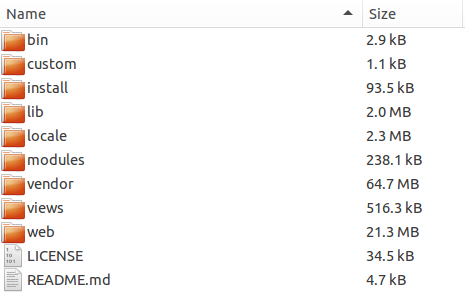
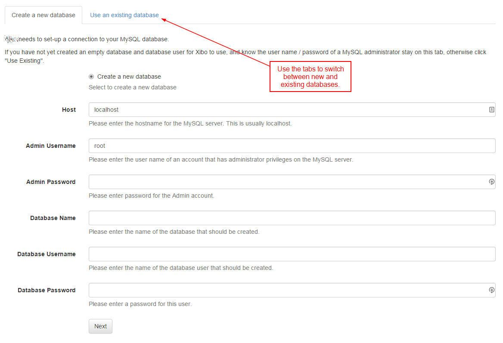
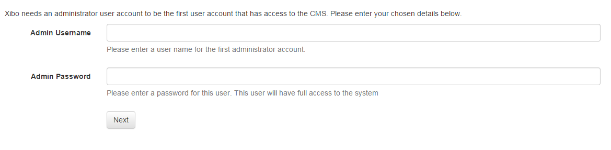
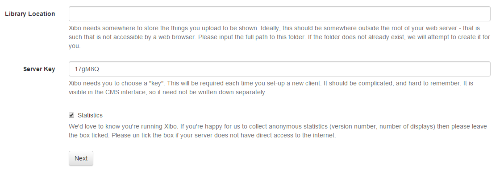

<!--toc=getting_started-->
# CMS Installation
The [[PRODUCTNAME]] CMS is a PHP web application and MySQL database. The PHP / MySQL combination is very popular as a web platform and can be run on Linux or Windows servers.

It is strongly encouraged to use a web server that allows you to copy files outside the web root and ideally modify the `DocumentRoot`.

It is strongly encouraged to use a web server that supports URL rewriting which will allow the CMS to use clean, human-friendly URLs. Rewriting is enabled on the web server, we've provided some basic information on the [environment](install_environment.html). 

## What if I don't have a web server?
We have provided some basic instructions for installing your own web server [here](install_environment.html). There are a number of service providers that will install [[PRODUCTNAME]] for you, or even run [[PRODUCTNAME]] on their architecture. If you are unfamiliar with web servers and just want to use the application, then a service provider solution may be preferable.

## Installation
Beyond this point it is assumed that a web server running with PHP and MySQL is available and that the compressed archive (ZIP or Tarball) of the CMS installation package has been transferred to the server.

The installation process is:

1. Download and extract the archive
2. Starting the Installation
3. Pre-requisites
4. Creating the database
5. Database details
6. Starting the Installation
7. Final Configuration
8. Complete

### Download and extract the archive
The CMS archive contains a sub folder called [[PRODUCTNAME]]-server-[[PRODUCTVERSION]], the contents of this folder should be copied into an appropriate location on your web server. It is **strongly recommended** that the folder is extracted in a non-webservable location. On a dedicated server the `DocumentRoot` should point to `/path/to/xibo-folder/web`. Other configurations are discussed on the [environment](install_environment.html) page.

The extracted archive should look like the below screen shot:

A folder is provided for the [[PRODUCTNAME]] library which will be used to store images, videos and other files. This folder can be moved to another location and changed during the install process.

### Starting the Installation
Navigating to `http://localhost/[[PRODUCTNAME]]` will automatically start the installation.

The installation is in a _wizard_ format that contains 6 steps in total. The wizard will guide the installer through the process of installing [[PRODUCTNAME]].

### Step 1 - Pre-requisites
The installer contains a detailed check list of all the items required for a successful installation. Each item will have either:

* A tick - the item is present and correct
* An exclamation mark - the item is present but may not be configured correctly.
* A cross - the item is missing.

Any items with an exclamation mark or a cross should be addressed and the retest button used to run this step again.

The most common problems here are missing PHP modules, configuration of PHP settings and file permissions issues to the library.

Once all the items are ticked press next to advance.

###Creating the database
The CMS can install into a new database, or an existing one. We recommend a new database.

[[PRODUCTNAME]] does not prefix its table names and may conflict with content in an existing database.

The choice for a new or existing database can be made by switching between the two available tabs.

###Database Details
Whether you chose an existing database or a new one, the installer will need to collect some information about that database to allow the CMS to connect, read and write.

The installer will need the following information:

**Host**
The host name for your MySQL installation - in the majority of cases this will be "localhost".

**Admin Username**
The "root" user name for your MySQL installation. This is only used for the installation and is only required if you have asked the installer to create a new database.

**Admin Password**
The "root" password. This is only used for the installation and is only required if you have asked the installer to create a new database.

**Database Name**
The name for the CMS database.

**Database User name**
The user name for the CMS to use to connect to the database - usually this can be the same.

**Database Password**
The password to use to connect to the database.

###Start the Installation
The installer will now create / populate database for [[PRODUCTNAME]]. You should see a series of dots appear on the screen as this happens. It can take a few moments to complete. Assuming everything went well, click "Next".

_If there are errors at this point, please see the troubleshooting section of this manual._

###Admin Password
Each installation will require at least one "Super User" level Administrator to manage the system, apply upgrades and configure the advanced settings. The installer will prompt for the creation of this user at Step 3.

**This user name and password should be kept safe as it will be required when the installation is complete.**

###Settings
The next screen deals with configuring [[PRODUCTNAME]]. The first box asks for the location that [[PRODUCTNAME]] should store the media you upload. We created a folder for this earlier, so enter that folder here e.g `/home/[[PRODUCTNAME]]/library`.

The next box asks for a CMS key - this key is used to authenticate Displays with the CMS and should be something obscure. 

The final tick box asks if it's OK to send anonymous statistics back to the [[PRODUCTNAME]] project. We would be very happy if you did!

###Complete
The installation is now complete and the system is ready to log in.

