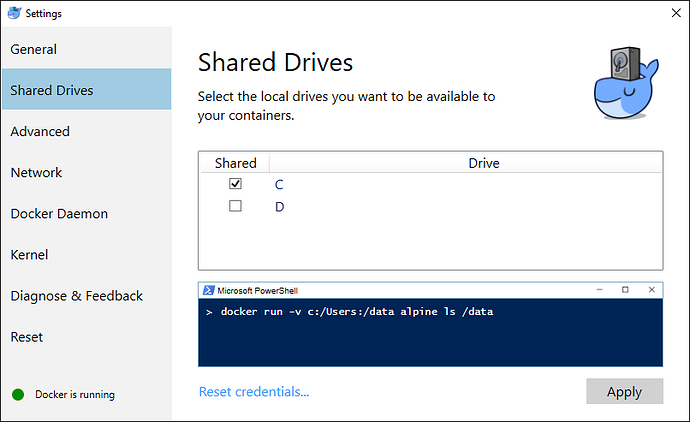

<!--toc=getting_started-->
# Docker

[Docker](https://docker.com/) is an application to package and run any
application in a pre-configured container making it much easier to deploy a [[PRODUCTNAME]]
CMS with recommended configuration.

## Install Docker
Docker installation documents can be found on the
[Docker website](https://docs.docker.com/installation/).

[[PRODUCTNAME]] can be run on any Docker version that supports Linux containers. The latest stable Community Edition 
version is suggested, unless you have a pre-existing "Enterprise" install of Docker you want to use.

Specifically, Docker for Windows Server 2016 (for Windows Containers) is not suitable for running [[PRODUCTNAME]].

When using Docker, the CMS provides its own webserver and MySQL server. If you have a webserver installed already, you 
will either need to remove it (so [[PRODUCTNAME]] can use port 80), or run [[PRODUCTNAME]] on a different port number 
(see [using different ports](install_cms.html#using_different_ports)).

### Linux
Docker can be installed on 64 bit Linux based systems by following the instructions for your particular Linux 
distribution. You should install the Stable build, and install Docker CE (Community Edition) unless you have a 
pre-existing Docker EE (Enterprise Edition) install, or wish to explore that option.

[Docker Install for Linux Distributions](https://docs.docker.com/engine/installation/)

On Linux is it also necessary to install Docker Compose as it is not shipped with the above
package. To do so visit [Docker Releases](https://github.com/docker/compose/releases/latest) and
run the commands indicated on the latest release.

### Windows
There are 2 Docker products for 64 bit Windows, For Windows and Toolbox. Either of these options come with Docker 
Compose and are compatible with [[PRODUCTNAME]].

#### Docker for Windows
Docker for Windows requires Windows 10 Professional 64 bit to run. It leverages Microsoft HyperV to run your Docker 
containers.

If you have Windows 10 Professional 64 bit, then Docker for Windows is the version of Docker you should install.

You can download the Docker for Windows installer from the Docker website, and follow their guide to getting Docker 
installed. You should install the latest Stable build of Docker CE (Community Edition).

[Docker for Windows Install](https://docs.docker.com/docker-for-windows/install/)

Docker for Windows comes with Docker Compose, so all the requirements are met installing that single package.

Once Docker is installed, you will need to share the local hard drive on which you will install the [[PRODUCTNAME]] CMS.

To do so, find the Docker icon in the Windows system tray, right click on it, and select `Settings`.



Click on the `Shared Drives` tab, and then put a tick against the local drive on which you will install the CMS. 
Click `Apply` to save your changes.

You can then follow the [CMS install guide](install_cms.html), using the PowerShell command prompt.

Please note, that at the time of writing, there is a bug with Docker for Windows which means that when your Windows 
computer is restarted, the CMS will appear to lose all your Media, Layouts and Configuration. Your content is safe! 
Until this issue is resolved, after a reboot, you will need to manually restart the CMS containers to restore the 
content. To do so, you would run the following from the PowerShell command prompt:

```
cd \[[PRODUCTNAME]]-docker
docker-compose stop
docker-compose start
```

where `\[[PRODUCTNAME]]-docker` is the directory you've installed the CMS in.

#### Docker Toolbox
If you are running a 64 bit version of Windows other than Windows 10 Professional, then you can instead install Docker 
Toolbox to run the [[PRODUCTNAME]] CMS.

This leverages Oracle VirtualBox to run your Docker containers.

You can download the Docker Toolbox installer from the Docker website, and follow their guide to geting Docker 
installed.

[Docker Toolbox Install](https://www.docker.com/products/docker-toolbox)

Once Docker Toolbox comes with Docker Compose, so all the requirements are met installing that single package.

Using the default settings, you must install the [[PRODUCTNAME]] CMS inside the `C:\Users` directory for correct 
operation. Using an alternative location will cause your uploaded content and layouts to be lost.

You can then follow the [CMS install guide](install_cms.html), using the `Docker Toolbox Quickstart Terminal` command 
prompt. You cannot use the Windows Command prompt or PowerShell. You'll find a link to the Quickstart Terminal on your 
Desktop.

The Docker system will be running in a VirtualBox virtual machine, which will be created in NAT mode. The resulting 
Docker containers will therefore be accessible from the IP address assigned to the Docker Toolbox VM, rather than your 
local machine (localhost as given in the install guide).

You can discover this IP address by running `docker-machine ip`.

Once your CMS is installed, you will likely want to make the CMS available to other systems on your network. To do so:

1. Open VirtualBox
2. Find the Docker Virtual Machine (often called `default`)
3. Right click on it, and select `Settings`
4. Move to the `Network` tab, and on `Adapter 1`, click on `Advanced`

 

5. Click on `Port Forwarding`
6. Add rules for HTTP on Port 80, and XMR on port 9505. (The ssh rule is pre-existing and should be left intact)

 

7. Click `OK`, then `OK` again to close the `Settings` diaglog.


### Mac
Docker can be installed on a Mac - see https://docs.docker.com/docker-for-mac/
