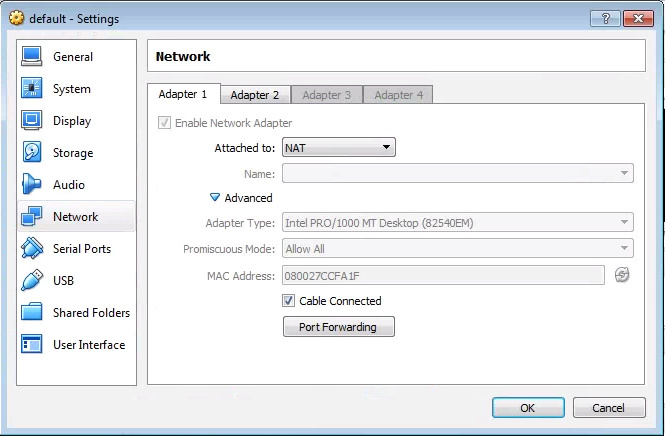
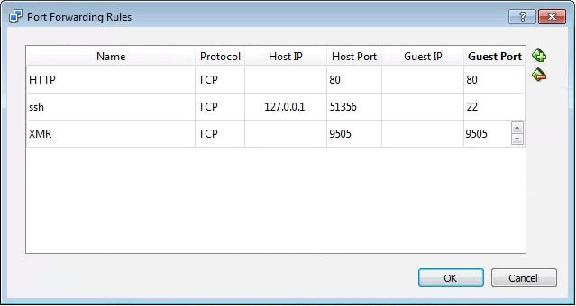

<!--toc=cms_installation-->
# Docker on Windows 64 bit, other than Windows 10.
[Docker](https://docker.com/) is an application to package and run any
application in a pre-configured container making it much easier to deploy
a [[PRODUCTNAME]] CMS with recommended configuration.

## Install Docker
There are 2 Docker products for 64 bit Windows, "Docker for Windows" and "Docker
Toolbox". If you are running a 64 bit version of Windows other than Windows 10
Professional, then Docker Toolbox is the version of Docker you should
install.

You can download the Docker Toolbox installer from the Docker website, and
follow their guide to getting Docker installed. See - [docs.docker.com - Docker
Toolbox Install](https://www.docker.com/products/docker-toolbox). Docker Toolbox
comes with Docker Compose, so all the requirements are met installing that
single package.

Using the default settings, you must extract/install the [[PRODUCTNAME]] CMS
inside the `C:\Users` directory for correct operation. Using an alternative
location will cause your uploaded content and layouts to be lost.

The Docker system will be running in a VirtualBox virtual machine, which will be
created in NAT mode. The resulting Docker containers will therefore be
accessible from the IP address assigned to the Docker Toolbox VM, rather than
your local machine (localhost as given in the install guide).

You can discover this IP address by running `docker-machine ip`.

Once your CMS is installed, you will likely want to make the CMS available to
other systems on your network. To do so:

1. Open VirtualBox
2. Find the Docker Virtual Machine (often called `default`)
3. Right click on it, and select `Settings`
4. Move to the `Network` tab, and on `Adapter 1`, click on `Advanced`

 

5. Click on `Port Forwarding`
6. Add rules for HTTP on Port 80, and XMR on port `9505`. (The ssh rule is
  pre-existing and should be left intact)

 

7. Click `OK`, then `OK` again to close the `Settings` dialog.

For the rest of this guide you will need to use the `Docker Toolbox Quickstart
Terminal` command prompt. You cannot use the Windows Command prompt or
PowerShell. You'll find a link to the Quickstart Terminal on your Desktop.

## Download and extract the [[PRODUCTNAME]] Docker archive
<nonwhite>
The latest [[PRODUCTNAME]] Docker installation files can be [downloaded
from our website](https://github.com/xibosignage/xibo-cms/releases/download/[[PRODUCTVERSION]]/xibo-docker.zip).
</nonwhite>

<white>
Ask your service provider for the [[PRODUCTNAME]] Docker installation files.
</white>

The archive should be extracted in a suitable location on your host machine we'd
suggest `c:\Users\[[PRODUCTNAME]]`. Your library content and database will be written under this
folder.

Please note that the archive already contains a sub-folder called [[PRODUCTNAME]]-docker, which is best practice for archives! For the subsequent instructions please make sure you are *inside* the sub-folder contained in the archive.

## Check and edit configuration
The first time [[PRODUCTNAME]] is installed a configuration file is needed to
tell Docker how the environment is configured. This file is called `config.env`.
This file covers where you want files to be stored, email config, etc.

A template file with detailed instructions is provided in the release archive
and is called `config.env.template`. Take a copy of this file, renaming to
`config.env` and then edit the file in a text editor, e.g. notepad, atom, etc.

If you don't want [[PRODUCTNAME]] to be able to send email messages, then you
can omit to configure those options.

Docker will map data folders to contain database data and any custom files for
the CMS. These will default appear in the folder containing the release archive
in a `shared` sub-folder.

### Using different ports
By default, [[PRODUCTNAME]] will start a web server listening on port 80. If you
already have a web server listening on port 80 of your host machine, or would
prefer to use an alternative port number, then you need to copy the
`cms_custom-ports.yml.template` file and change the `ports` section for
`cms-web`. The file should be saved as `cms_custom-ports.yml`.

Similarly, [[PRODUCTNAME]]'s XMR server will be started listening on port 9505.
If you would prefer to use an alternative port number, then you'll need to do so
by copying the `cms_custom-ports.yml.template` file and changing the `ports`
section for `cms-xmr`.

The ports section of a Docker Compose YML file lists ports in the format
`<host>:<container>` - to move to port 8080 the declaration would be `8080:80`.

To use this file replace any `docker-compose up -d` commands in the below
instructions with `docker-compose -f cms_custom-ports.yml up -d`.

### Remote MySQL
The default `docker-compose.yml` file includes a container for MySQL, however it
is possible to run with an external / remote MySQL instance as the database for
[[PRODUCTNAME]].

To do this base the `config.env` file on the template
`config.evn.template-remote-mysql` and replace any `docker-compose up -d`
commands in the below instructions with `docker-compose -f cms_remote-mysql.yml
up -d`.


### HTTPS/SSL
[[PRODUCTNAME]] should be run over SSL if running on anything other than a
secure private network. The Docker containers do not provide SSL and this must
be provided by an external web server which handles SSL termination and reverse
proxy into the `cms-web` container.

There are many good resources for achieving this architecture - for example a
[nginx-proxy container](https://github.com/jwilder/nginx-proxy) could be used.

If you already have a web server running on your Host machine, configuring a
reverse proxy should be straightforward, an example `VirtualHost` for Apache is
below, it assumes you've configured your custom ports for port 8080:

```
Listen 443

NameVirtualHost *:443
<VirtualHost *:443>

    SSLEngine On
    ProxyPreserveHost On
	RequestHeader set X-Forwarded-Proto "https"

    # Set the path to SSL certificate
    # Usage: SSLCertificateFile /path/to/cert.pem
    SSLCertificateFile /etc/apache2/ssl/file.pem


    # Servers to proxy the connection, or;
    # List of application servers:
    # Usage:
    # ProxyPass / http://[IP Addr.]:[port]/
    # ProxyPassReverse / http://[IP Addr.]:[port]/
    # Example:
    ProxyPass / http://0.0.0.0:8080/
    ProxyPassReverse / http://0.0.0.0:8080/

</VirtualHost>
```

<nonwhite>
A worked example for setting up an Apache reverse proxy for SSL with LetsEncrypt
SSL certificates can be found
[here](https://community.xibo.org.uk/t/xibo-1-8-0-with-docker-on-ubuntu-16-04/9392).
</nonwhite>

## Installing the CMS containers
Once you've made your changes to `config.env` and have saved the file, Open a
terminal/command window in the folder where you extracted the archive. As a user
who has permissions to run the `docker` command, simply run the following
command in PowerShell.

```
docker-compose up -d
```

This will bootstrap and start your [[PRODUCTNAME]] CMS. The CMS will be fully
installed with the default credentials.

```
Username: [[PRODUCTNAME]]_admin
Password: password
```

You should log on to the CMS straight away and change the password on that
account.

Find the IP address of the Docker Toolbox Virtual Machine. You can discover this
IP address by running `docker-machine ip` from the `Docker Toolbox Quickstart
Terminal`. If you configured an alternative port number then be sure to add that
to the URL, for example `http://192.168.1.3:8080`.

## Configuration adjustments
If you are running a the Windows or a 3rd party firewall on your computer you
will need to allow the ports you've configured the CMS to run on inbound. If you
haven't specifically configured alternative ports, then the following is
required:

- Inbound TCP Port 9505 (for XMR Push Messaging)
- Inbound TCP Port 80 (for HTTP Traffic) AND/OR
- Inbound TCP Port 443 (for HTTPS Traffic - if you are using SSL)

### Configuration of XMR public address
Docker cannot reasonably know the DNS name or IP address of your host machine,
and therefore it is necessary to configure the XMR Public Address in CMS
Settings when first logged in. **This only needs to be done on the first
bootstrap**.

This can be found on the CMS Settings page under Administration, on the Display
tab.

The format of the address is:

```
tcp://<ip_address>:<port>
```

The default `<port>` is 9505 and should be set to that unless you have specified
a custom port in your docker-compose configuration.

## Starting and Stopping [[PRODUCTNAME]]
Once the CMS containers have been initialised with `docker-compose up -d`, it
is possible to start and stop them without removing the underlying container.

The `stop` command will stop the [[PRODUCTNAME]] CMS services running. If you
want to start them up again, issue the `start` command.

```
docker-compose stop
docker-compose start
```

## Uninstalling / removing
The CMS installation and its associated containers can be completely removed by
issuing the `down` command.

** Before running docker-compose down**, please be sure that your media and
database files are being correctly written to the `shared` directory. To do so,
upload for example an image in to the CMS, and check that the same image
appears in the `shared/cms/library` directory. Another good check is to make
sure that `shared/backup/db/latest.tar.gz` was created within the last 24
hours. If either of those checks fail, please do not run `docker-compose
down` as this will lead to data loss. Seek support to resolve the situation.

If your intention is to remove all traces of [[PRODUCTNAME]] you may delete
the `c:\[[PRODUCTNAME]]` folder **after** running the `down` command.

```
docker-compose down
```

