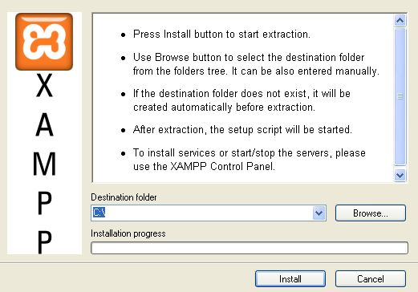
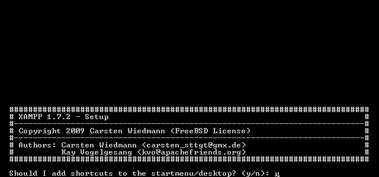
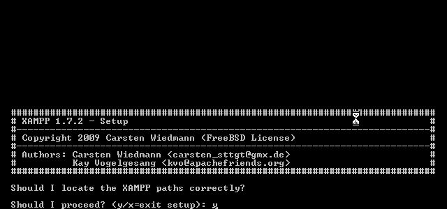
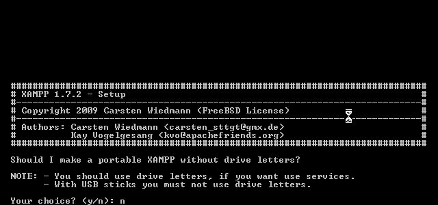
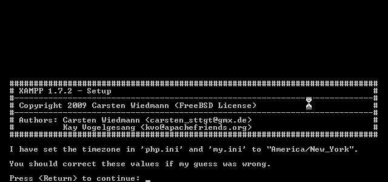
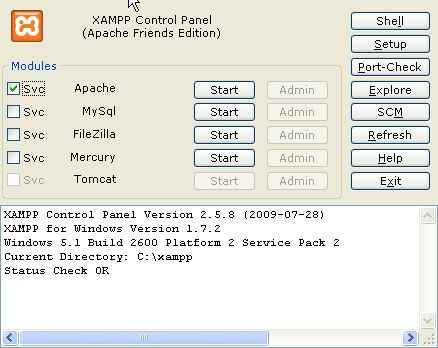
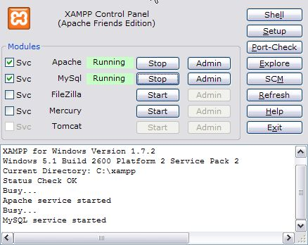
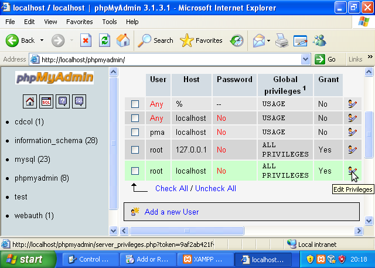
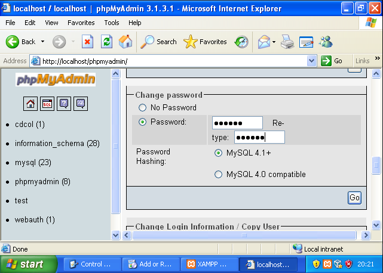

<!--toc=getting_started-->
# Install on Windows

> This is intended as a getting started guide only - the documentation provided by the software vendor
 should always be used in preference.

This Windows install guide is focused mainly on someone who wants to use a Windows PC to be the server as well as the client, or perhaps has a spare Windows XP machine to use as a server. The instructions should work equally well on Windows Server operating systems.

Xibo should also run under IIS, however it's not a platform the Xibo development team currently tests with. If you know your way around IIS, then the latter half of this guide plus the "What you need to know!" section should get you going.

###   Install the Webserver (XAMPP) 

We'll be using XAMPP to install Apache, MySQL, PHP (amongst other things) to support Xibo. This is convenient as it provides the whole system in a single installer, and can be un-installed via Add/Remove Programs at a later date if required. If you already have XAMPP installed, you can skip to the next section.

You can download XAMPP from [Apache Friends](http://www.apachefriends.org/en/xampp.html). You need to download the full XAMPP Installer package for Windows systems. Save it to the Desktop.

Once XAMPP Installer has downloaded, double click on it to run it. You may be prompted to allow the installer to run as the publisher could not be verified. Click "Run".

You should get to the start of the install wizard.

By default, XAMPP installs to "c:\xampp". Unless you need to move it somewhere else, then that's a good choice. If you do select a different directory, remember it for the next step when we install Xibo.  Click Install.
The installer will now run, and extract a number of files.  When it finishes, it will bring you to a command prompt.

You'll now be asked a few questions about how XAMPP should install itself.  At the following prompts, you may select all default options.

Once the installation scripts complete, you should choose option 1 to load the XAMPP Control Panel. It should open up, and if everything went to plan, look like the screen shot.

At this point, you need to check the boxes next to "Svc" for both Apache and MySql.  As you click each, it will prompt you to install the service for that item.  Click OK.  Then click the "Start" button on each of these items as well.
Your screen should now look like the below:

Before we install Xibo, we need to configure a few things on XAMPP to make it a bit more secure. From the XAMPP Control Panel, click the "Admin" button next to MySQL. This will load a web browser and take you to an application called PHPMyAdmin that was installed along with XAMPP. It will let us setup a password for the "root" MySQL account. The "root" account on MySQL has privileges to add new users, create databases etc so needs to have a strong password.

From the PHPMyAdmin screen, click "Privileges" at the top of the screen. You'll see the database users that exist already listed. We're interested in the one called "root" that has "localhost" in the "Host" column. Click the blue "Edit Privileges" symbol to the right of the word "Yes".

Scroll down the page until you find the "Change Password" box. Enter a new password in both the password boxes and click "Go". On a piece of paper, write down "MySQL Admin User details. Username: root Password:" followed by the password you just chose. We'll need these later!

