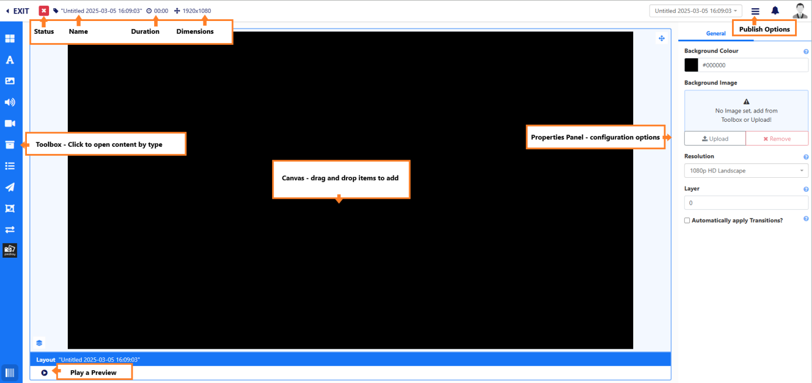

# Layout Editor Overview

The Layout Editor is used to create new Layout designs and when an existing Layout needs a Design change.

A Layout presents content to be shown on Displays and are made up of just 1 or multiple content items. Designs can include a combination of **Elements**, **Widgets** and **Library Media** and can be added to be shown in different sections of the Layout to show simultaneously.

The [[PRODUCTNAME]] Layout Editor gives Users a range of tools to add and arrange a variety of content, regardless of skill level, to easily create eye catching Layouts to capture attention on Displays.

{nonwhite} 

## How-to Video

{video}Sh-5b8OJycE|how_to_create_a_layout.png{/video}
{/nonwhite}

## Creating Layouts

Layouts are created from the **Layouts** page under the **Design** section of the main CMS menu.

Clicking the **Add Layout** button will open the **Layout Editor** used to add content to design Layouts.

## Navigating the Layout Editor

To **Rename** the Layout, click the "Untitled" text at the top of the Layout Editor.

From here, also view the **Status** and total **Duration** of the Layout as you build your design. The total Layout duration is always based on the item added to the Layout with the highest set duration.

Layouts will function best when shown on a Display with a matching resolution. To change the **Dimensions** of a Layout, select the **Resolution** to use from the drop down menu in the **Properties Panel**.

Using the **Properties Panel**, select a **Colour** or add a static **Image** from the **Toolbox** or upload a new file to use as a **Background** for the Layout.

All content is added to the canvas from the **Toolbox**.

### Adding and Arranging Content

The **Toolbox** contains a variety of content types, which when selected will open the items to add.

Content is added to the canvas using the flexibility of drag and drop, along with rotation and resizing tools to enable Users to position items exactly where they are needed. 

On adding an item to the Canvas, "Snap to" buttons are available from the bottom right under the canvas, which allow for easier positioning when moving items around the canvas.

### Properties Panel

As items are added, the **Properties Panel** will show the configuration options available for the selected item.

The **Advanced** tab can be used to override the duration of an item.

- Click in **Set a duration** and provide the new **Duration** in seconds.

If this item now has the longest duration on the Layout, it will also update the total Layout duration shown at the top of the Layout Editor.

### Layout Preview

The full Layout can be played to preview how your design will look when showing on Displays.

- Click out of any selected items by clicking on the background.
- Select the **Play** button icon at the bottom left under the canvas.

{tip}
Play a preview in full screen by using the icon in the top right of the canvas before selecting the Play button!
{/tip}

### Publishing Layouts

Layouts need to be **Published** in order to be shown correctly on Displays when included in Schedules. 

Use the 3 line menu located in the top right of the Layout Editor to select the **Publish** option.

Layouts can be Published straight away or a **Publish Date** can be set, by unticking the **Publish Now** option to determine a specified date and time in the future to Publish.

Once Published or after setting a Publish Date, the Layout can now be Scheduled to Displays.

## Further Reading

[Using Global Elements on Layouts](using_global_elements.html)

[Using the Library Search Functions](using_library_searches.html)

## FAQ's

***When should a User create a new Layout?***

The recommended usage for a Layout is for it to only contain the design and media required for a set of related content that should be shown at the same time. Keeping your content concise will make it easier for your audience to understand your messaging!

***Are there any restrictions to the amount of Layouts I can have?***

There are no limits to the number of Layouts in the system or the number a User can have.

***My Layout status is always showing as an orange exclamation mark, I how do I make it a green tick?***

The orange exclamation mark is an expected status to have if your Layout contains online content, such as a Webpage. In this situation, the CMS cannot determine what the Display will play as this type of content is not sent directly from the CMS and is instead assessed Player side. The Layout should still be Published and Scheduled to Displays, which will need to have a reliable internet connection in order to successfully show this content.

***I want to divide my Layout and have static content on one side and a carousel of content fill the other side, how do I achieve that?***

Add and position a Playlist to the side you want to show a rotation of items and resize to fit the area as needed.

***How do I make design changes to an existing Layout?***

Use the row menu for the Layout you need to make changes to and select Design to open the Layout Editor. If the Layout has been Published you will need to first Checkout the Layout which will create a draft copy of the Layout so as to not disrupt any current schedules the Layout is in.

