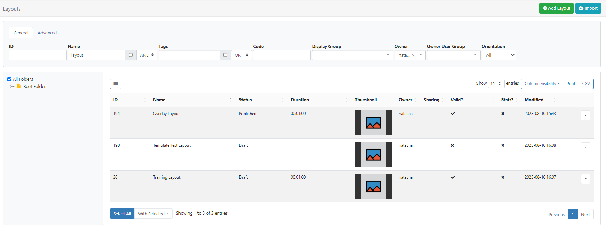

# Layouts

A Layout is a complete screen design made up of content, which is then scheduled to one or multiple Displays. A Layout can contain 1 or more items of content to show using a combination of Elements, Widgets and Library Media.

To show a sequence of multiple items (such as an image slideshow) on Layouts, a [Playlist](media_playlists.html) is used.

[[PRODUCTNAME]] has no limit to the number of Layouts you can have in the system or the number a User can have.

- Layouts are managed by clicking on **Layouts** under the **Design** section of the main CMS menu:

[Folders](https://test.xibo.org.uk/manual/en/tour_folders.html) are used to organise, search and easily [Share](https://test.xibo.org.uk/manual/en/users_features_and_sharing.html#content-share) User objects with other Users/User Groups. Layouts saved to a Folder will inherit the access options applied to that Folder.

{tip}
If Users should also have access to the content of the Layout (image media files for example), ensure that these are also saved to the same Folder!
{/tip}

- Click on a Folder/sub-folder to search the contents or tick **All Folders** to include searching in the **Root Folder** and return results based on any filters applied to the grid.

## Adding Layouts

**When should a User create a new Layout? When should a User add to an existing Layout?**
Layouts provide vast flexibility in the system, but can also cause confusion. The recommended usage for a Layout is to only contain the design and media required for a set of related content that should be scheduled at the same time.

{tip}
**Scenario**:
You have a video showing a fire safety demonstration and a video showing an advert for an upcoming production - it would be natural to have separate Layouts for these.
{/tip}

Click on the **Add Layout** button at the top of the grid to start creating new designs using the [Layout Editor.](layouts_editor.html)

 ## Using Templates

[Templates](layouts_templates.html) are an easy way to speed up the design process and a great way to maintain a corporate image/standard.

Templates can be selected from the [Toolbar](layouts_editor.html#content-toolbar) inside the Layout Editor on adding a Layout.

{nonwhite}

### Xibo Exchange

Select from one of our templates available from the Xibo Exchange.

{cloud}

Xibo Exchange templates are enabled by default for new Xibo Cloud Hosting customers.

Administrators, if you are upgrading from an earlier version you will need to enable the Xibo Exchange:

- Select **Applications** under the **Administration** section of the main CMS menu.
- Scroll down to the Connectors section of the page.
- Click Configure for the Xibo Exchange and tick to enable.
- Save.

{/cloud}

{noncloud}

For On-prem installations, Administrators can enable templates to be shown from the Xibo Exchange:

- Select **Applications** under the **Administration** section of the main CMS menu.
- Scroll down to the Connectors section of the page.
- Click Configure for the Xibo Exchange and tick to enable.
- Save.

{/noncloud}

{/nonwhite}

## Resolutions

Layouts are designed for an intended display resolution and will function best when shown on a **Player** with a matching resolution. If they are shown on a display that has a different resolution it will dynamically resize which may result in unused screen space.  

{tip}
Sending a Player a Layout that has been designed with a 4:3 resolution which is connected to a 16:9 TV screen would result in two empty bars either side of your content. 
{/tip}

Resolutions are selected for a Layout from the properties panel in the [Layout Editor](layouts_editor.html).

[[PRODUCTNAME]] comes with a selection of default resolutions that cater for most digital signage applications.  

Resolutions can be added/edited and enabled/disabled by an Administrator from the **Resolutions** page under the **Design** section of the main CMS menu.

## Row menu

All Layouts have a row menu where Users can access a list of actions/shortcuts.

### Notable settings are listed below for a **Published** Layout:

#### Design

Select to make design changes to the Layout in the Layout Editor.

{tip}

When in a Published status, the Layout Editor will open in a **Read Only Mode**. You will need to 'Checkout' the Layout to enable editing.

To prevent two Users editing the same Layout concurrently, the Layout will lock for a User whilst editing.

{/tip} 

#### Checkout

To make edits to a Published Layout click to Checkout and create a draft. Once edited the Layout can be published to make the changes permanent overwriting the existing Layout. Discard will revert the Layout back to its original published state.

{tip}
Users can select the 'auto submit' check box so that this form is [automatically sent](tour_cms_navigation.html#content-automatic-submission-of-forms) each time that **Checkout** is selected. 
{/tip}

{tip}
Take your time with any edits you need to make as using **Checkout** ensures that no changes are made to your published version or shown on scheduled **Displays** until you choose to do so. **Publish** confirms changes have been made and will overwrite your published version. **Discard** will delete the draft with the published version remaining untouched.
{/tip}

#### Preview Layout

The Published **Layout** will play from start to finish to allow you to see how it will play once scheduled. 

{tip}
Before the Layout can start all **Media** must be downloaded to your browser and verified so you may experience a slight delay whilst this is in process.
{/tip}

#### Assign to Campaign

Select to add the selected Layout to an existing [Campaign](layouts_campaigns.html).

#### Copy

Create copies of designed Layouts to easily make modifications. Choose to include all contained **Media** items, to use as a base for creating new Layouts to save time.

{tip}
Copying a Layout will create an exact copy at the last point the Layout was Published so ensure that you Publish a Layout before making a copy to preserve any changes!
{/tip}

#### Retire

Retire a Layout so it does not affect existing **Schedules**. A retired Layout will be hidden from new Scheduling options but will remain unaffected in existing Schedules and continue to show on Displays.

#### Export

Export the Layout including all associated Widgets/Media/DataSet structures to a ZIP file, so it can be easily shared. 

{tip}
When exporting a Layout, all assigned **Layout**, **Playlist** and **Media Tags** will be exported. Select the **Import Tags** option to add these Tags on Layout Import.
Add the 'Export' [Feature](users_features_and_sharing.html) to allow a User/User Group to export regardless of the Share options that have been set for the Layout and its contents!
{/tip}

### Notable settings are listed below for a **Draft** Layout:

#### Publish

Select to **Publish Now** or select a date and time to set the Layout to Publish at a future date/time.

{tip}
Administrators can use the default setting on the CMS **Settings** page to automatically **Publish** draft Layouts 30 minutes after the last edit!
{/tip}

#### Discard

Discard all changes made to a draft and revert back to the previous Published version.

#### Preview Draft Layout

Play a Preview of your Layout in its current **Draft** status. Make any necessary adjustments before committing any changes by Publishing.

{tip}
Did you know…**.Layouts** and **Library files** can be [Assigned](displays.html#content-assign-files--layouts) directly to a **Display** or **Display Group** so that they are always available in the local library of the Player. Useful for pre-loading a Layout ahead of time ready to be scheduled.
{/tip}

{tip}
Use the **With Selected** option at the bottom of the Layout [grid](tour_cms_navigation.html#content-grids) to edit Tag assignments in bulk!
{/tip}