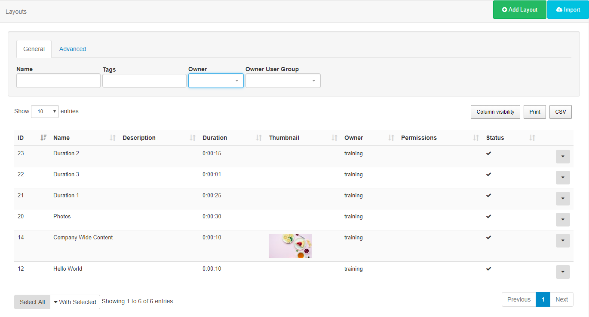
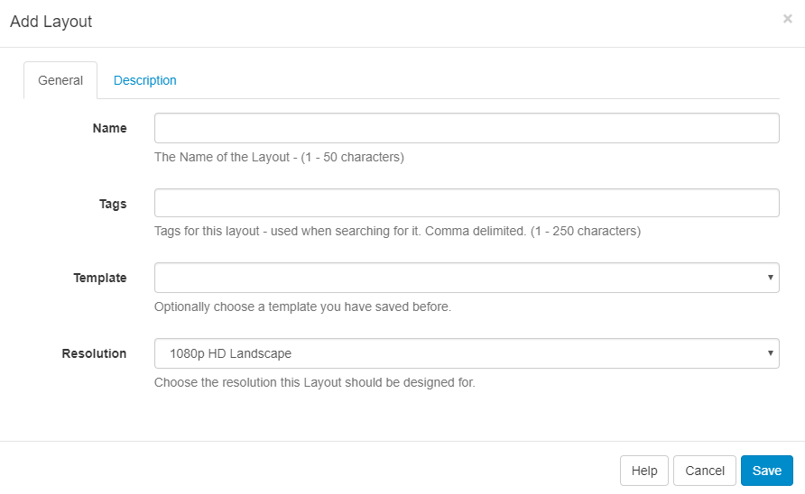

<!--toc=layouts-->

# Layouts

A Layout is a complete screen design including content and background, which is then scheduled to a Display or multiple displays in a Display Group. A Layout is made up of 1 or more Regions which hold content and contain a timeline of Media to show. Media is assigned to the Layout Timeline using Widgets which provide the actions for the selected Module. 

{tip}
Take a look at the [Modules](media_modules.html) page to see the variety of content available by simply adding a Widget to a Layout.
{/tip}

[[PRODUCTNAME]] has no limit to the number of Layouts you can have in the system or the number a User can have.

Layouts are administered from the Design section of the menu. Click on **Layouts** to open the Layouts grid to view all existing Layouts and to create new from the **Add Layout** button.

## Add Layout

Click on the action button to open the Add Layout form to complete the appropriate fields.

{tip}

**When should a User create a new Layout? When should a User add to an existing Layout?**
Layouts provide vast flexibility in the system, but can also cause confusion. The recommended usage for a layout is to only contain the design and media required for a set of related content that should be scheduled at the same time.

**Scenario**:
You have a video showing a fire safety demonstration and a video showing an advert for an upcoming production - it would be natural to have separate Layouts for these.

{/tip}

### Tags

Layouts can be tagged which allows for ordering and makes it easier to find and view a large number of Layouts if grouped by a certain Tag. This is particularly useful with a growing number of Layouts.

### Templates

Create Layouts and save your design to use as a [Template](layouts_templates.html), great for maintaining a corporate image or style.

### Resolution

Layouts are designed for an intended display resolution and will function best when shown on a Player with a matching resolution. If they are shown on a display that has a different resolution it will dynamically resize which may result in unused screen space.  

{tip}
Sending a Player a Layout that has been designed with a 4:3 resolution which is connected to a 16:9 TV screen would result in two empty bars either side of your content. 
{/tip}

**If you require an alternative resolution to the available options listed, contact your Administrator**

## Row menu

Use the row menu for a selected Layout to access more options:

### Design

Click to open in a **Read Only Mode**, which is viewed in the Layout Designer window. **Checkout** the Layout to enable editing.

{tip}
If you are using 1.8, clicking on **Design** will return you to the Layout Designer screen to edit.
{/tip}

### Checkout

Checkout from the row menu to put the Layout into a **draft** mode so that changes can be made later. Once edited, the Layout can be **Published** to make changes permanent and send the edited Layout to Displays. **Discard** will revert the Layout back to the original published state.

{tip}
Take your time with any edits you need to make as using **Checkout** ensures that no changes are made to your published version or shown on scheduled **Displays** until you choose to do so. **Publish** confirms changes that have been made and will overwrite your published version. **Discard** will delete the draft with the published version remaining untouched.
{/tip}

### Preview Layout

The **Layout** will play from start to finish which allows you to see how your layout will play. Make important adjustments to ensure that layout designs play as intended before scheduling to Displays. 

{tip}
Before the Layout can start all **Media** must be downloaded to your browser and verified so you may experience a slight delay whilst this is in process.
{/tip}

### Schedule Now

To save time, **Layouts** can be scheduled for a specified amount of time, which can be very useful for important notices / promotions.

{tip}
Layouts must have a **Published** status before being scheduled.
{/tip}

### Assign to Campaign

Select Layouts to include in created Campaigns.

### Edit

Make changes to the naming and Tags used for the **Layout** as well as making changes to the background image/colour.

### Copy

Create copies of designed layouts. Choose to include all contained **Media** items, to use as a base for creating new layouts to save time.

### Retire

Retire a Layout so it does not affect existing **Schedules**. A retired Layout will be hidden from new Scheduling options but will remain unaffected in existing Schedules and continue to show on Displays.

### Delete

Remove a Layout and all its associated media completely from all existing Schedules. **Please note:** This action is irreversible!

### Export

Export the Layout including all associated Widgets/Media/DataSet structures to a ZIP file, so it can be easily shared.

### Permissions

Assign Permissions for **Users/User Groups** to define who should have access to **View**, **Edit** and **Delete** the Layout.

{tip}
Did you know…**.Layouts** and **Library files** can be [Assigned](displays_fileassociations.html) directly to a **Display** or **Display Group** so that they are always available in the local library of the Player. Useful for pre-loading a Layout ahead of time ready to be scheduled.
{/tip}