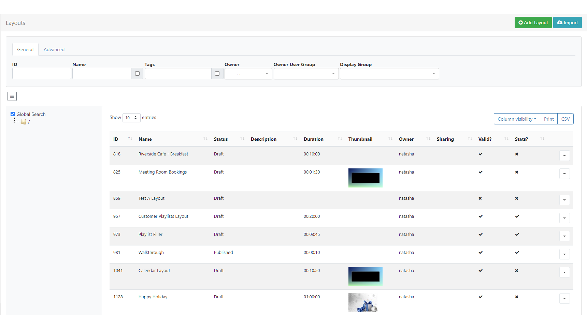
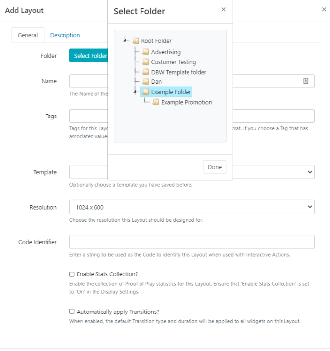

<!--toc=layouts-->

# Layouts

If you are using a CMS earlier than 3.0.0, please use the following link: [Layouts](layouts_2.html)

A Layout is a complete screen design including content and background, which is then scheduled to a Display or multiple displays and Display Groups. A **Layout** is made up of 1 or more **Regions** which hold content and contain a **Timeline** of **Media** to show. Media is assigned to the Layout Timeline using Widgets which provide the actions for the selected Module. 

{tip}
Take a look at the [Modules](media_modules.html) page to see the variety of content available by simply adding a **Widget** to a Layout.
{/tip}

[[PRODUCTNAME]] has no limit to the number of Layouts you can have in the system or the number a User can have.

Layouts are administered by clicking on **Layouts** under the **Design** section of the main menu, to open the Layouts [Grid](tour_grids.html).

{tip}
**Thumbnails** will only show in Columns for Layouts that have a set background image
{/tip} 

## Add Layout

Click on the **Add Layout** button at the top of the grid and complete the appropriate form fields:

{tip}

**When should a User create a new Layout? When should a User add to an existing Layout?**
Layouts provide vast flexibility in the system, but can also cause confusion. The recommended usage for a Layout is to only contain the design and media required for a set of related content that should be scheduled at the same time.

**Scenario**:
You have a video showing a fire safety demonstration and a video showing an advert for an upcoming production - it would be natural to have separate Layouts for these.

{/tip}

### Folder

Layouts can be optionally saved to **Folders**.

{tip}
Layouts that are saved in Folders will inherit the View, Edit, Delete **Share** options that have been applied to the destination Folder for User / User Group access!
{/tip}

- Click on the **Select Folder** button and expand to select the Folder to save in.

The selected folder file path will be shown next to the Folder field on the form.

Users can also right click a folder to create a new folder to save in and access further options:

{tip}
Available options are based on enabled [Feature and Sharing](users_features_and_sharing.html) options for a User/User Group.
{/tip}

{nonwhite}
Further information for Administrators regarding Folder access and set-up can be found [here](https://xibo.org.uk/docs/setup/folders-administration)
{/nonwhite}

{white}
For further information regarding Folder access and set-up, please speak to your Administrator.
{/white}

### Name

Give the Layout a **Name** for easy identification purposes within the CMS.

### Tags

Layouts can be tagged for organisation and to make it easier to find a large number of Layouts grouped by Tags.  When entering text into the Tag field on the form, an auto complete helper will show possible matches to make it easier for Users to select from.

Predefined  Values will be shown by using the **Tag value** drop down, if the Value is already known it can be typed directly into the field using the following format: `Colour|Red`

{tip}
If a Value has been set as 'Required' by an Administrator, then the Value must be entered in order to save the form!
{/tip}

Users can add an associated Value to a Tag that does not already have a predefined value by using the **Tag value** field. If a Tag value is not needed, this field can be left blank.

{tip}
Tags can also be assigned to multiple Layouts using the [With Selected](https://xibo.org.uk/manual/en/tour_grids.html#multi-select) option at the bottom of the Layout grid!
{/tip}

For further information on what **Tag **and **Tag Values** to use, please speak with your Administrator.

{nonwhite}
Tag management information for Administrators can be found [here](https://xibo.org.uk/docs/setup/tags-adding-editing-assigning)
{/nonwhite}

### Template

Use the drop down to select a **Template** to use for this Layout.

{tip}
Created Layout designs can be saved as a [Template](layouts_templates.html), great for maintaining a corporate image or style.
{/tip}

### Resolution

Layouts are designed for an intended display resolution and will function best when shown on a **Player** with a matching resolution. If they are shown on a display that has a different resolution it will dynamically resize which may result in unused screen space.  

{tip}
Sending a Player a Layout that has been designed with a 4:3 resolution which is connected to a 16:9 TV screen would result in two empty bars either side of your content. 
{/tip}

**If you require an alternative resolution to the available options listed, contact your Administrator**

{nonwhite}
Resolution management for Administrators can be found [here](https://xibo.org.uk/docs/setup/resolutions-administration)
{/nonwhite}

### Code Identifier

A string can be entered in this field, which will be used as a code to identify this Layout when used with [Interactive Actions](layouts_interactive_actions.html)

### Enable Stats collection

Tick/untick the box to enable/disable the collection of statistics for **Proof of Play Reports** for the newly added **Layout**.

{tip}
Ensure that the **Enable Stats Collection** check box has been enabled for the **Display** this Layout will be scheduled to, in the [Display Profile Settings](displays_settings.html).
{/tip}

{nonwhite}
Proof of Play Settings for Administrators can be found [here](https://xibo.org.uk/docs/setup/proof-of-play-settings)
{/nonwhite}

### Automatically apply Transitions

{tip}
Transitions are supported on Android, webOS and Tizen Players and Windows Players from v2R252
Transitions are currently not supported on Linux Players.
{/tip}

Default Transition settings will be applied to all Widgets on the Layout if this box is ticked. Untick to disable defaults for all Widgets on the Layout. 

{tip}
Transitions can be applied from the [Tools](layouts_tools.html) menu on the Layout Designer.
{/tip}

{nonwhite}
Transitions management for Administrators can be found [here](https://xibo.org.uk/docs/setup/transitions-administration)
{/nonwhite}

{tip}
Use the **Description Tab** to complete useful information/instructions for other users of the Layout!
{/tip}

### Save

On saving the form, the [Layout Designer](layouts_designer.html) will automatically open.

## Row menu

Each Layout has additional actions / shortcuts that can be accessed from the **Row Menu**.

### Design

Select **Design** to open the [Layout Designer](layouts_designer.html) to make edits to the content/design of the Layout.

{tip}
To prevent two Users editing the same Layout concurrently, the Layout will lock for a User whilst editing.
{/tip} 

If your Layout has a Published status, the Layout Designer will open in a **Read Only Mode**. You will need to 'Checkout' the Layout to enable editing.

### Checkout

Checkout from the Row Menu to put the Layout into a **draft** mode so that changes can be made later. Once edited, the Layout can be **Published** to make changes permanent and to overwrite the existing Layout.  **Discard** will revert the Layout back to the original published state.

{tip}
Users can select the 'auto submit' check box so that this form is automatically sent each time that **Checkout** is selected. Further information can be found on the [Grids](tour_grids.html) page.
{/tip}

{tip}
Take your time with any edits you need to make as using **Checkout** ensures that no changes are made to your published version or shown on scheduled **Displays** until you choose to do so. **Publish** confirms changes have been made and will overwrite your published version. **Discard** will delete the draft with the published version remaining untouched.
{/tip}

### Preview Layout

The **Layout** will play from start to finish which allows you to see how your layout will play. Make important adjustments to ensure that layout designs play as intended before scheduling to Displays. 

{tip}
Before the Layout can start all **Media** must be downloaded to your browser and verified so you may experience a slight delay whilst this is in process.
{/tip}

### Schedule Now

To save time, **Layouts** can be scheduled for a specified amount of time, which can be very useful for important notices / promotions.

{tip}
Layouts must have a **Published** status before being scheduled.
{/tip}

### Assign to Campaign

Click to add the selected Layout to an existing [Campaign](layouts_campaigns.html).

### Edit

Make changes to the Layout record such as, Folder location, Name and Tags etc. 

### Select Folder

Move the Layout to a selected Folder.

### Copy

Create copies of designed Layouts to easily make modifications. Choose to include all contained **Media** items, to use as a base for creating new layouts to save time.

### Retire

Retire a Layout so it does not affect existing **Schedules**. A retired Layout will be hidden from new Scheduling options but will remain unaffected in existing Schedules and continue to show on Displays.

### Delete

Remove a Layout and all its associated media completely from all existing Schedules. **Please note:** This action is irreversible!

### Enable Stats collection

Enable the collection of Proof of Play statistics.

### Export

Export the Layout including all associated Widgets/Media/DataSet structures to a ZIP file, so it can be easily shared. 

{tip}
When exporting a Layout, all assigned **Layout**, **Playlist** and **Media Tags** will be exported. Select the **Import Tags** option to add these Tags on Layout Import.
{/tip}

{tip}
Add the 'Export' [Feature](users_features_and_sharing.html) to allow a User/User Group to export regardless of the Share options that have been set for the Layout and its contents!
{/tip}

### Share

Enable [Share](users_features_and_sharing.html) options for selected Users/User Groups.

## Draft Status

Selecting a Layout that is in a **Draft** status will present the following additional Row Menu options:

{tip}
Administrators can use the default setting on the CMS **Settings** page to automatically **Publish** draft Layouts 30 minutes after the last edit!
{/tip}

### Publish

Select to **Publish Now** or select a date and time to set the Layout to Publish in the future.

### Discard

Click to ignore any changes that have been made and revert to the previous Published version of the Layout.

{tip}
Did you know…**.Layouts** and **Library files** can be [Assigned](displays_fileassociations.html) directly to a **Display** or **Display Group** so that they are always available in the local library of the Player. Useful for pre-loading a Layout ahead of time ready to be scheduled.
{/tip}