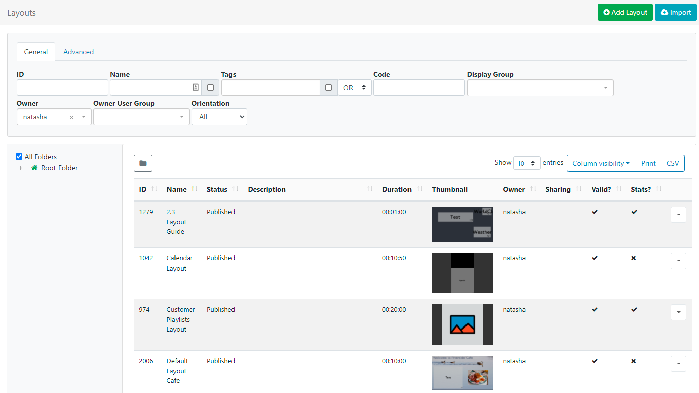
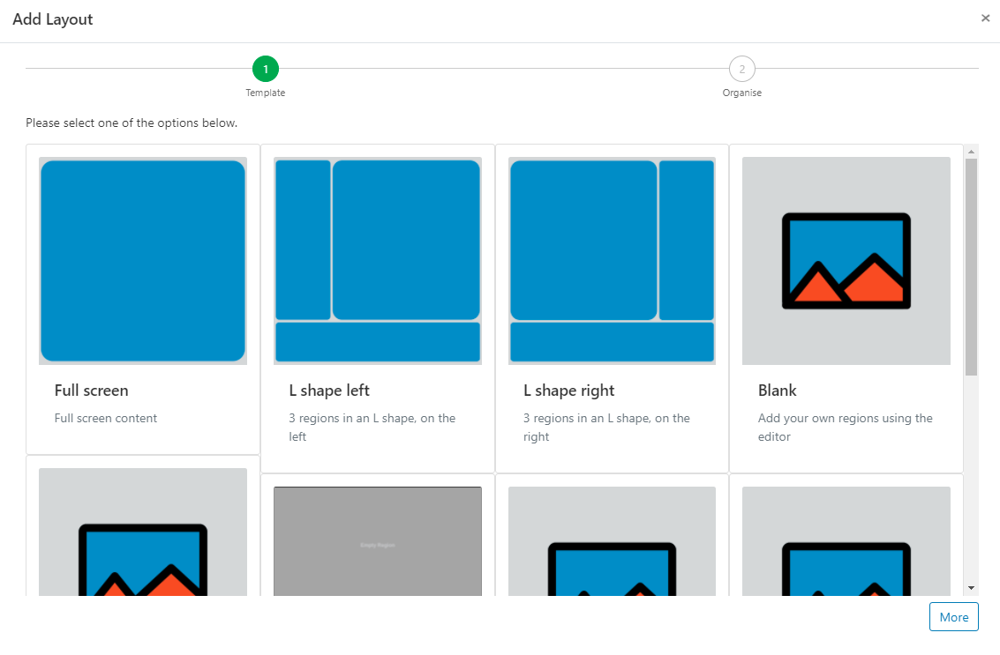
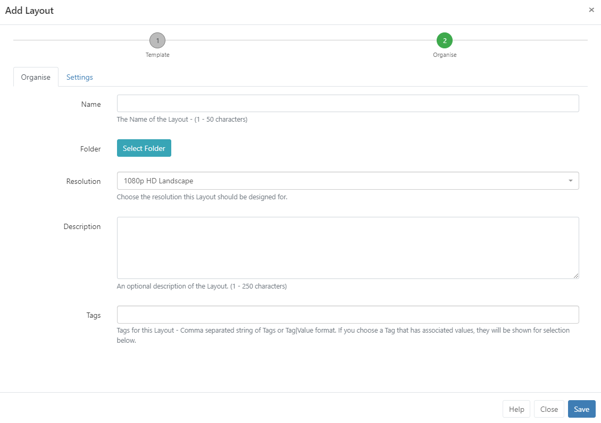
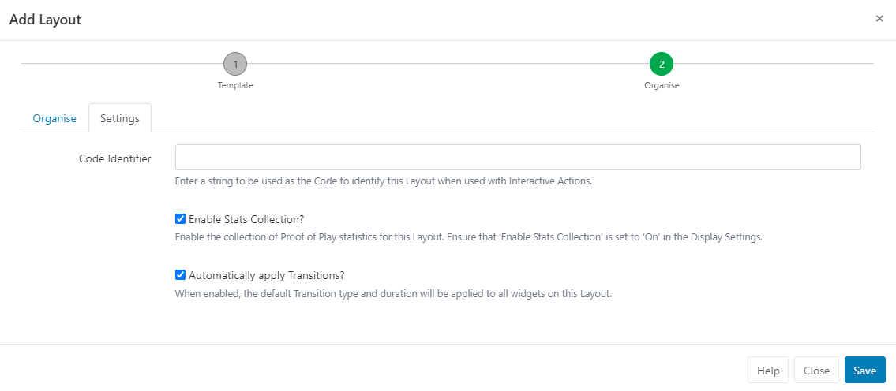
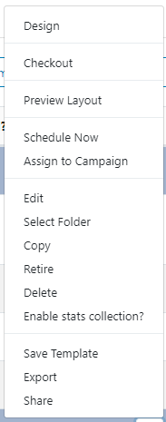

# Layouts

{version}

**Note:** If you are using a CMS earlier than v3.1.0 please select from the options below:

- CMS v3.0.x click [here](layouts_3.html)
- CMS earlier than v3.0.0 click [here](layouts_2.html)

{/version}

A Layout is a complete screen design made up of content, which is then scheduled to a Display/multiple Displays / Display Groups. A **Layout** is made up of 1 or more **Regions** which act as placeholders for content which each contain a **Timeline** of **Media** to show. Media is assigned to a Timeline using a wide range of Widgets. 

{tip}
Take a look at the [Modules](https://xibosignage.com/manual/en/media_modules#content-player-support-table-for-widgets-and-modules---v3-cms) page to see the variety of Widgets available!
{/tip}

[[PRODUCTNAME]] has no limit to the number of Layouts you can have in the system or the number a User/User Group can have.

Layouts are administered by clicking on **Layouts** under the **Design** section of the main menu:

{tip}
Thumbnails will show for Published Layouts. If you have upgraded from an earlier version, you will need to checkout and Publish existing Layouts to update the Thumbnail!
{/tip}

Click the Folders icon to toggle on/off from view.  

{tip}
When Folders are hidden from view, the file path for the selected folder will be shown!
{/tip}

- Click on a Folder/sub-folder to search the contents and return results based on any filters applied to the grid.

or

- Tick **All Folders** to include searching in the Root Folder and return results based on any filters applied to the grid.

Check out the [Folders](/manual/en/tour_folders.html) page for further information!

The Layout [Grid](tour_grid.html) allows users to create new and edit existing. 

## Add Layout

{tip}

**When should a User create a new Layout? When should a User add to an existing Layout?**
Layouts provide vast flexibility in the system, but can also cause confusion. The recommended usage for a Layout is to only contain the design and media required for a set of related content that should be scheduled at the same time.

**Scenario**:
You have a video showing a fire safety demonstration and a video showing an advert for an upcoming production - it would be natural to have separate Layouts for these.

{/tip}

Click on the **Add Layout** button at the top of the grid:

 

Select a Template to use from the available options:

- Default pre-defined templates
- Blank to add your own Regions
- Choose from your own published [Templates](layouts_templates.html)

{nonwhite}

### Xibo Exchange

- Select one of our templates from the Xibo Exchange

{cloud}

Xibo Exchange templates are enabled by default for new Xibo Cloud Hosting customers.

If you are upgrading from an earlier version you will need to enable by navigating to the **Administration** section of the CMS and click **Applications**. Scroll down the page to the **Connectors** section. Click to **Configure** and tick to enable, **Save** changes.

{/cloud}

{noncloud}
On-prem installations can enable templates from the Xibo Exchange by navigating to the Administration section of the CMS by clicking on **Applications** and scrolling down the page to the **Connectors** section. Click to **Configure** and tick to enable, **Save** changes.

{/noncloud}

{/nonwhite}

- On making a selection click the **Next** button at the very bottom of the form:

- Provide a **Name** for easy identification purposes within the CMS.
- Layouts can be optionally saved to [Folders](tour_folders.html) for easier searches, organisation and to easily set [Share](users_features_and_sharing.html) options for Users/User Groups.

{tip}
Layouts that are saved in Folders will inherit the View, Edit, Delete **Share** options that have been applied to the destination Folder for User/User Group access. 

If users should also have access to the content of the Layout, ensure that this is also saved to the same Folder!
{/tip}

## Resolutions

Layouts are designed for an intended display Resolution and will function best when shown on a **Player** with a matching resolution. If they are shown on a display that has a different resolution it will dynamically resize which may result in unused screen space.  

{tip}
Sending a Player a Layout that has been designed with a 4:3 resolution which is connected to a 16:9 TV screen would result in two empty bars either side of your content. 
{/tip}

[[PRODUCTNAME]] comes with a selection of default resolutions that cater for most digital signage applications.  Add/edit and enable from the **Resolutions** page under the **Design** section of the main CMS menu.

- Include an optional Description to give more detail/instructions to other potential users of the Layout.

- Include optional [Tags](tour_tags.html) to organise and make it easier to search for.

{tip}
Use the **With Selected** option at the bottom of the Layout [grid](tour_grids.html) to edit Tag assignments in bulk!
{/tip}

Click on the **Settings** tab for further options:

- Enter a string to be used as the **Code Identifier** to identify this Layout when used with [Interactive Actions](layouts_interactive_actions.html)

- Tick/untick the box to enable/disable the collection of statistics for [Proof of Play Reports](displays_metrics.html) for the newly added **Layout**.

  {tip}
  Ensure that the **Enable Stats Collection** check box has been enabled for the **Display** this Layout will be scheduled to, in the [Display Profile Settings](displays_settings.html).
  {/tip}

- Default [Transition](tour_transitions.html) settings can be applied to all Widgets on the Layout by ticking the box.

- **Save** the Add Layout form to automatically open the [Layout Designer](layouts_designer.html).

## Row menu

Each Layout has additional actions/shortcuts that can be accessed using the **Row Menu** in the grid:

{tip}
The following options are available from the row menu of a **Published** Layout!
{/tip}

### Design

Select **Design** to open the [Layout Designer](layouts_designer.html) to make edits to the content/design of the Layout.

{tip}
To prevent two Users editing the same Layout concurrently, the Layout will lock for a User whilst editing.
{/tip} 

If your Layout has a Published status, the Layout Designer will open in a **Read Only Mode**. You will need to 'Checkout' the Layout to enable editing.

### Checkout

Checkout from the Row Menu to put the Layout into a **draft** mode so that changes can be made later. Once edited, the Layout can be **Published** to make changes permanent and to overwrite the existing Layout.  **Discard** will revert the Layout back to the original published state.

{tip}
Users can select the 'auto submit' check box so that this form is automatically sent each time that **Checkout** is selected. Further information can be found on the [Grids](tour_grids.html) page.
{/tip}

{tip}
Take your time with any edits you need to make as using **Checkout** ensures that no changes are made to your published version or shown on scheduled **Displays** until you choose to do so. **Publish** confirms changes have been made and will overwrite your published version. **Discard** will delete the draft with the published version remaining untouched.
{/tip}

### Preview Layout

The Published **Layout** will play from start to finish to allow you to see how it will play. Make important adjustments to ensure that layout designs play as intended before scheduling to Displays. 

{tip}
Before the Layout can start all **Media** must be downloaded to your browser and verified so you may experience a slight delay whilst this is in process.
{/tip}

### Schedule Now

To save time, **Layouts** can be scheduled for a specified amount of time, which can be very useful for important notices / promotions.

{tip}
Layouts must have a **Published** status before being scheduled.
{/tip}

### Assign to Campaign

Click to add the selected Layout to an existing [Campaign](layouts_campaigns.html).

### Jump Lists

Select to 'jump' to Playlists, Campaigns and Media associated for the selected Layout.

### Edit

Make changes to the Layout record such as, Folder location, Name and Tags etc. 

### Select Folder

Move the Layout to a selected Folder.

### Copy

Create copies of designed Layouts to easily make modifications. Choose to include all contained **Media** items, to use as a base for creating new layouts to save time.

{tip}
Copying a Layout will create an exact copy of the last time the Layout was Published. Make sure that you Publish a Layout before making a copy to preserve any changes!
{/tip}

### Retire

Retire a Layout so it does not affect existing **Schedules**. A retired Layout will be hidden from new Scheduling options but will remain unaffected in existing Schedules and continue to show on Displays.

### Delete

Remove a Layout and all its associated media completely from all existing Schedules. **Please note:** This action is irreversible!

### Enable Stats collection

Enable the collection of Proof of Play statistics.

### Export

Export the Layout including all associated Widgets/Media/DataSet structures to a ZIP file, so it can be easily shared. 

{tip}
When exporting a Layout, all assigned **Layout**, **Playlist** and **Media Tags** will be exported. Select the **Import Tags** option to add these Tags on Layout Import.
Add the 'Export' [Feature](users_features_and_sharing.html) to allow a User/User Group to export regardless of the Share options that have been set for the Layout and its contents!
{/tip}

### Share

Enable [Share](users_features_and_sharing.html) options for selected Users/User Groups.

## Draft Status

Selecting a Layout that is in a **Draft** status will present the following additional Row Menu options:

{tip}
Administrators can use the default setting on the CMS **Settings** page to automatically **Publish** draft Layouts 30 minutes after the last edit!
{/tip}

### Publish

Select to **Publish Now** or select a date and time to set the Layout to Publish in the future.

### Discard

Click to ignore any changes that have been made and revert to the previous Published version of the Layout.

## Preview Draft Layout

Play a Preview of your Layout in its current **Draft** status. Make any necessary adjustments before commiting any changes by Publishing.

{tip}
Did you know…**.Layouts** and **Library files** can be [Assigned](displays_fileassociations.html) directly to a **Display** or **Display Group** so that they are always available in the local library of the Player. Useful for pre-loading a Layout ahead of time ready to be scheduled.
{/tip}

{tip}
{nonwhite}

Take a look at the [How to create a simple Layout guide](https://community.xibo.org.uk/t/how-to-create-a-simple-layout/13108)

{/nonwhite}
{/tip}