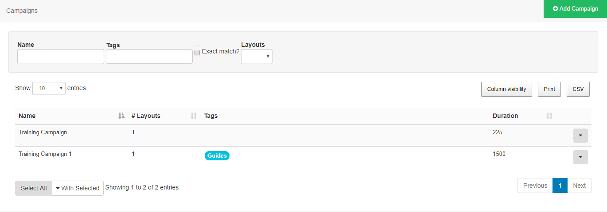
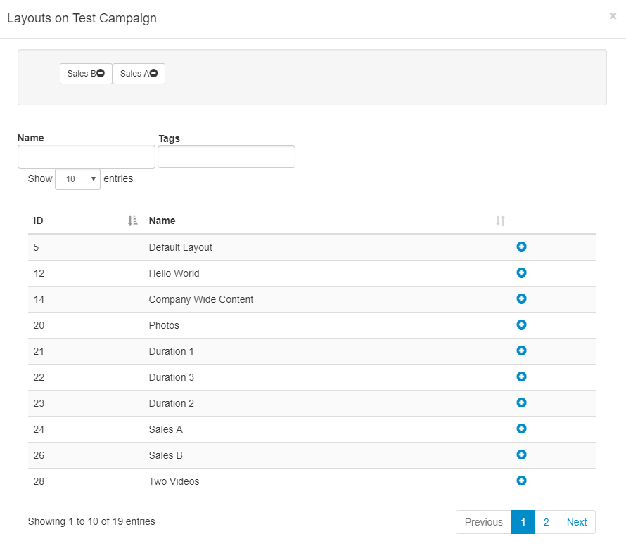

<!--toc=layouts-->

# Campaigns

Layouts can be grouped together into an ordered list. A Campaign can then be Scheduled and the Display will play the grouped Layouts in sequence.

**Campaigns** are administered from the **Design** section of the CMS Menu. 

## Create a Campaign

Click on the **Add Campaign** button and give the Campaign a name and optional **Tag’s**. The Campaign will be listed in the Campaigns grid ready for Layouts to be assigned.

{tip}
Campaigns can be tagged which allows for ordering and makes it easier to find and view a large number of Campaigns if grouped by a certain Tag. Administrators can set certain **Tag's** to have a **Value** associated to them.   Tags that have a **Tag Value** will show the selections available from an additional field -  **Tag value** drop down.

From v2.3.6, you can add an associated value for Tags without an existing predefined value .Enter the Value you wish to associate with the Tag in the **Tag value** field and click enter. If you do not wish to enter a Tag value, then this field can be left blank.

For further information on what Tag and Tag Values to use, please speak with your Administrator.
{/tip}

## Assigning Layouts

{tip}
In earlier versions, use the row menu for a Campaign and select **Layouts** to open the form to assign.
{/tip}

Layouts are assigned using the plus icon, once pressed Layouts will show in the staging area. Layouts can be removed from here by using the minus icon.

Re-order Layouts in the staging area by drag and drop to ensure that Layouts play in your designed sequence, ensuring that you press Save to keep changes.

{tip}
Did you know that using **Display Order** when [Scheduling Events](scheduling_events.html) you can further control how your Campaigns will play on your Displays…
{/tip}

{tip}
Use the **Copy** button located on the row menu to easily make a copy of an existing Campaign!
{/tip}

{tip}
Layouts can be directly assigned to Campaigns using the row menu, **Assign to Campaign**, on the Layouts grid. Layouts will be assigned to the end of the selected Campaign by default.
{/tip}