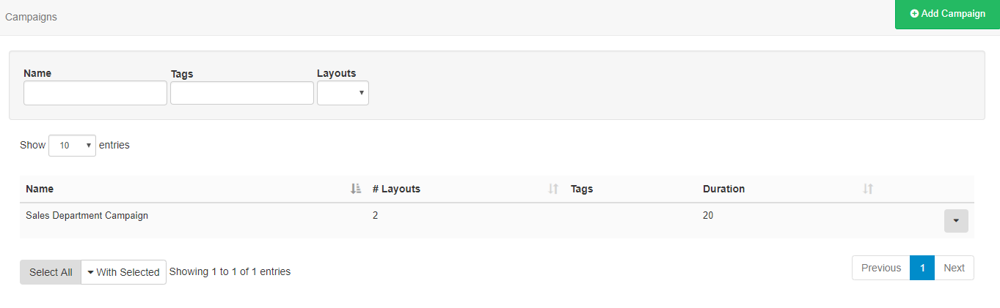
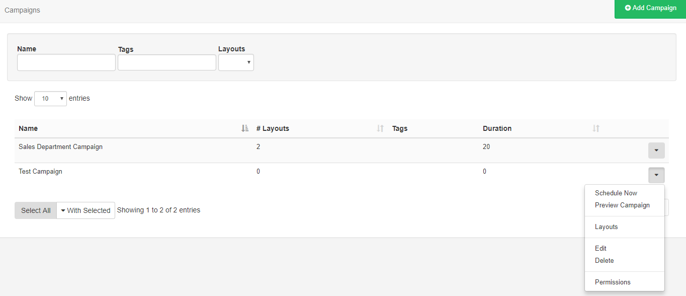

<!--toc=layouts-->

# Campaigns

Layouts can be grouped together into an ordered list. A Campaign can then be Scheduled and the Display will play the grouped Layouts in sequence.

Campaigns are administered from the Design section of the Menu. 

## Create a Campaign

Click on the **Add Campaign** button and give the Campaign a name and optional **Tag’s**. The Campaign will be listed in the Campaigns grid ready for Layouts to be assigned.

Campaigns can be tagged which allows for ordering and makes it easier to find and view a large number of Campaigns if grouped by a certain Tag. Administrators can set certain **Tag's** to have a **Value** associated to them.   Tags that have a **Tag Value** will show the selections available from an additional field -  **Tag value** drop down.

{tip}
For further information on what Tag and Tag Values to use, please speak with your Administrator.
{/tip}

## Assigning Layouts

Use the row menu for the selected Campaign and click on **Layouts**.

Layouts are assigned using the plus icon, once pressed Layouts will show in the staging area. Layouts can be removed from here by using the minus icon.

Re-order Layouts in the staging area by drag and drop to ensure that Layouts play out in your designed sequence, ensuring that you press Save to keep changes.

{tip}
Layouts can be directly assigned to Campaigns using the row menu on the Layouts grid. Layouts will be assigned to the end of the selected Campaign by default.
{/tip}