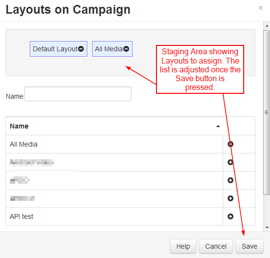

<!--toc=layouts-->
#Campaigns
Layouts can be grouped together into an ordered list, called a Campaign. Campaigns can then be scheduled as whole units and the Display will play them in sequence.

Campaigns are managed in the Campaign Administration page which is accessible from the "Design" navigation item, Campaigns sub menu. Campaigns are simple entities with a Name and a list of assigned Layouts.

## Scheduling
Campaigns can be scheduled interchangeably with Layouts and can also be used with the [Schedule Now](scheduling_now.html) feature.

## Assigning Layouts
Layouts are assigned to a Campaign in a particular order using the "Layouts" row menu item.

Layouts are assigned using the plus icon, once pressed the Layouts are automatically moved to the staging area. Layouts can be removed from the staging area using the minus icon.