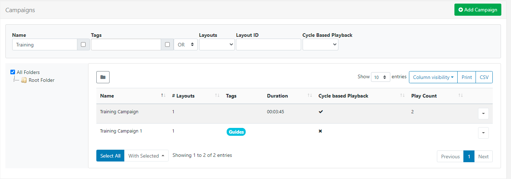
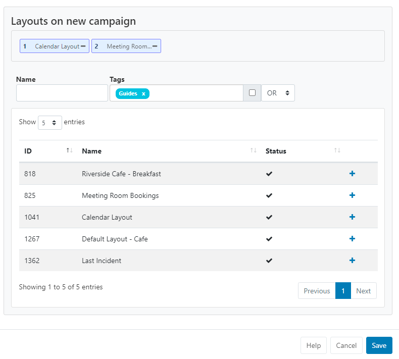

<!--toc=layouts-->

# Campaigns

{tip}
**Please note:** 

- If you are using a v3.3.0 or later CMS, please click [here](layouts_campaigns.html)
- If you are using a CMS with a version earlier than v3.1.0, please click [here](layouts_campaigns_3.html)
  {/tip}

Layouts can be grouped together into an ordered list to create Campaigns. A Campaign can then be **Scheduled** to play the grouped Layouts in a set sequence.

**Campaigns** are administered from the **Design** section of the CMS Menu:

{tip}
Take a look at the [Layouts](layouts.html) page to see how to first add and create Layouts that can then be grouped into Campaigns!
{/tip}

## Create a Campaign

Click on the **Add Campaign** button at the top of the grid and complete the appropriate form fields:

### Folders

Campaigns can be optionally saved to [Folders](tour_folders.html).

{tip}
Campaigns that are saved in Folders will inherit the View, Edit, Delete **Share** options that have been applied to the destination Folder for User/User Group access. 

If users should also have access to the Layouts/Layout content, ensure that this is also saved to the same Folder!
{/tip}

- Provide a **Name** for easy identification purposes within the CMS.

- Include optional [Tags](tour_tags.html) to organise and make it easier to search for.

{tip}
Tags and Folders can also be assigned to multiple Campaigns using the [With Selected](tour_grids.html#multi-select) option at the bottom of the Campaign grid!
{/tip}

-  From v3.1.0 tick to enable **cycle based playback** for this Campaign.
- Provide a **Play Count** to determine how many 'plays' a Layout should have before moving onto the next Layout in the Campaign.

When you schedule a Campaign with cycle playback enabled, each time the scheduled event appears only 1 Layout will be shown for the set count from the Campaign.

{tip}
**Please note:** Cycle based playback is available from Windows v3 R302. 
We are currently working to support this on other Players.
{/tip}

## Assigning Layouts to a Campaign

- Layouts are assigned using the plus icon. Once pressed Layouts will show in the staging area. 

- Layouts can be removed by clicking on the minus icon next to a Layout in the staging area.
- Re-order Layouts in the staging area by drag and drop to ensure that Layouts play in your designed sequence.
- Click **Save** to keep changes.

{tip}
Use the **Copy** button located on the row menu to easily make a copy of an existing Campaign as well as enabling [Share](users_features_and_sharing.html) options for selected Users/User Groups!
{/tip}

{tip}
Layouts can be directly assigned to Campaigns from the Layouts grid. Use the row menu for the Layout to add and click **Assign to Campaign**. Layouts will be assigned to the end of the selected Campaign by default!
{/tip}

{tip}
Did you know that using **Display Order** when [Scheduling Events](scheduling_events.html) you can further control how your Campaigns will play on your Displays.
{/tip}