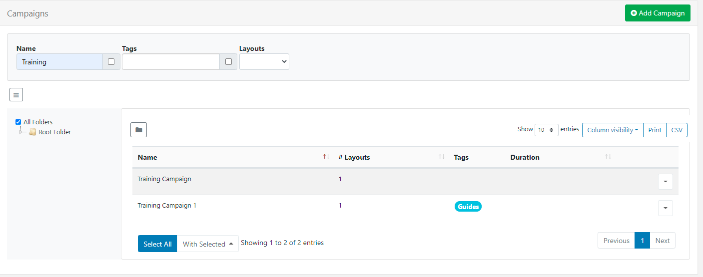
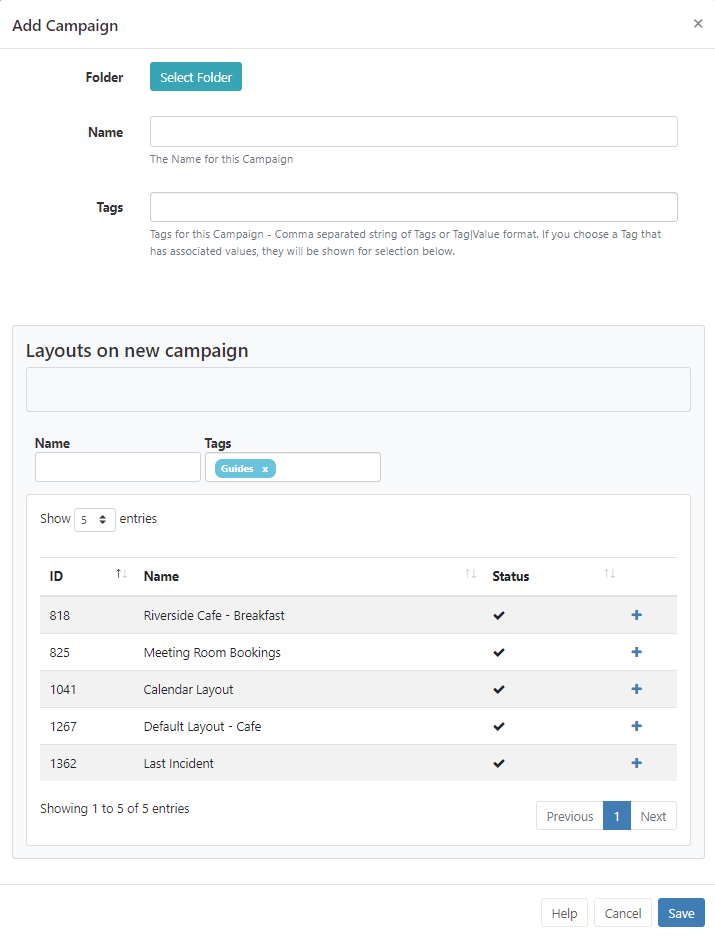
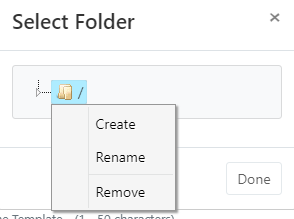
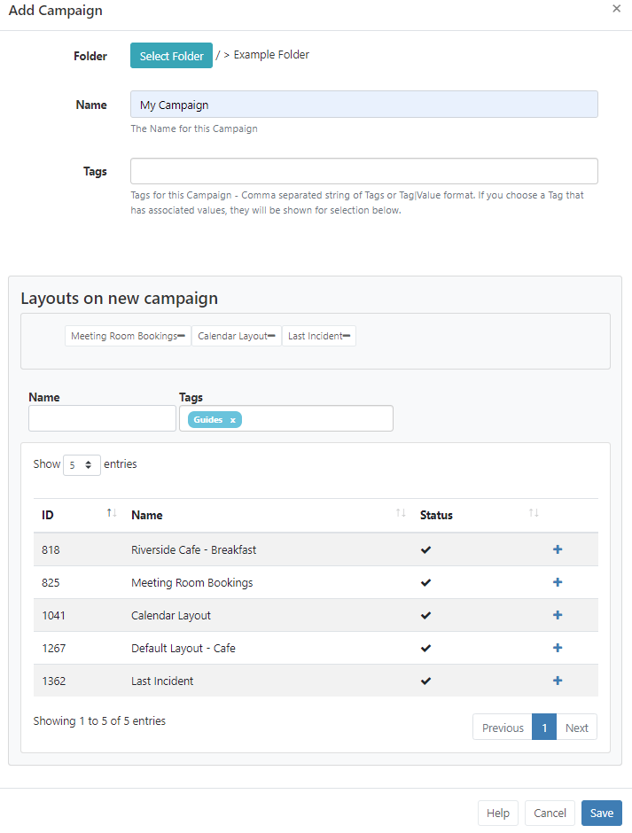

# Campaigns

{tip}
Please note: If you are using a 3.1.x CMS, please click [here](layouts_campaigns.html)
{/tip}

Layouts can be grouped together into an ordered list. A Campaign can then be **Scheduled** to play the grouped Layouts in a set sequence.

**Campaigns** are administered from the **Design** section of the CMS Menu. 

{tip}
Take a look at the [Layouts](layouts.html) page to see how to first add and create Layouts that can then be grouped into Campaigns!
{/tip}

## Create a Campaign

Click on the **Add Campaign** button at the top of the grid and complete the appropriate form fields.

### Folders

{tip}
Folder options are available from v3.0.0! (Speak to your Administrator to upgrade the CMS to benefit from this feature!)
{/tip}

Campaigns can be optionally saved to **Folders** to organise, search and easily set **Share** access permissions.

- Click on the **Select Folder** button, expand to save to an existing folder or right click create a new location and access further options. 

{tip}
Once selected, the Folder file path will be shown next to the Folder field on the form.
{/tip}

### Name

Give the Campaign a **Name** for easy identification purposes within the CMS.

### Tags

Campaigns can be tagged to further organise and make it easier to find a large number of Campaigns if grouped by Tags. Administrators can set certain **Tag's** to have a **Value** associated to them.  Tags that have been set a Value will show the selections available from an additional **Tag value** drop down field.

{tip}
From v2.3.6, **Tag Values** can be added to **Tags** that do not have an existing predefined value. Enter the Value you wish to associate with the Tag in the **Tag value** field and click enter. If you do not wish to enter a Tag value then this field can be left blank.

For further information on what **Tag **and **Tag Values** to use, please speak with your Administrator.
{/tip}

{tip}
From v3.0.0, use the **With Selected** option at the bottom of the Campaign grid to edit Tag assignments in bulk. Take a look at [Grids](tour_grids.html) for further information!
{/tip}

{nonwhite}
Tag management for Administrators can be found [here](https://xibo.org.uk/docs/setup/tags-adding-editing-assigning)
{/nonwhite}

## Assigning Layouts

{tip}
In earlier versions, use the Row Menu for a **Campaign** and select **Layouts** to open the form to assign.
{/tip}

- Layouts are assigned using the plus icon. Once pressed Layouts will show in the staging area. 

- Layouts can be removed by clicking on the minus icon next to a Layout in the staging area.
- Re-order Layouts in the staging area by drag and drop to ensure that Layouts play in your designed sequence.
- Click **Save** to keep changes.

{tip}
Did you know that using **Display Order** when [Scheduling Events](scheduling_events.html) you can further control how your Campaigns will play on your Displays…
{/tip}

{tip}
Use the **Copy** button located on the row menu to easily make a copy of an existing Campaign!
{/tip}

{tip}
Layouts can be directly assigned to Campaigns using the Row Menu, **Assign to Campaign**, on the Layouts grid. Layouts will be assigned to the end of the selected Campaign by default!
{/tip}

{tip}
Use the Row Menu to assign User/User Group access to selected Campaigns:

- Users of a 3.x CMS refer to the [Features and Sharing](users_features_and_sharing.html) page for further information.
- Users of a CMS earlier than 3.x refer to the [Permissions](users_permissions.html) page for further information.

{/tip}