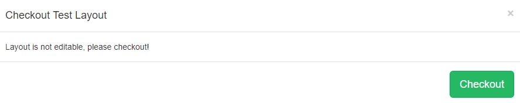

<!--toc=layouts-->

# Layout Designer (New Features for v2)

The Layout Designer is the heart of **content creation** in [[PRODUCTNAME]]. Each time a new Layout is added, or an existing one needs a design change, the Layout Designer is used.

{tip}
If you are using the **1.8** series CMS, please use the following link: [Layout Designer 1.8](layouts_designer_1.8.html)
{/tip}

[[PRODUCTNAME]] makes layout design simple through the use of **drag and drop**,**interactive previewing** and **design flexibility**. On adding a new Layout the Layout Designer will open in **Read Only Mode**.

{tip}
All newly created Layouts have a '**Published**' status by default. This allows for quick and easy creation to scheduling if creating from a **Template** or importing a designed layout. Layouts with a **valid** status can be scheduled straight away!
{/tip}

To enable editing click on the **Actions** menu located at the bottom right of the toolbar, and click on **Checkout**. A confirmation form will appear, click on the **Checkout** button to continue.

{tip}
Clicking on the 'Read Only Mode' pop up at the bottom of the window will also 'Checkout'.
{/tip}

The **Layout Designer** will open and confirm that the Layout has been 'checked out' ready for editing.

## Layout Navigator

This is located in the top right corner of the Layout Designer window. As shown in the above image, all new Layouts, by default, have one full screen empty [Region](layouts_regions.html), represented as a white semi-transparent overlay.  The Layout Navigator can be used to add, position and resize Regions and gives an overview to the overall layout design. 

## Layout Timeline

Located next to the Layout Navigator the Layout Timeline displays the duration of individual Widgets as well as complete layout duration which is based on the longest running region on the layout.

A status indicator is shown (cross or tick) to identify valid and invalid Layouts.  **Invalid layouts will be excluded from the Schedule and will not be played.**

{tip}
A Layout must contain at least one Region **and** each Region must contain at least **one** media item for it to be valid and play when scheduled.
{/tip}

## Preview

Preview  Layouts, Widgets and Regions and make the necessary alterations to designs to ensure that everything plays as intended.  Toggle to full screen size by clicking the icon in the top right hand corner of the Preview window.

## Editor

Click on any aspect of the Layout to edit. 

Click on a **Region** on the **Layout Navigator** window to open the **Region Options** form. Refine Positioning and apply Transitions using the tabs.

Widgets can be edited by clicking on assigned **Widgets** on the **Layout Timeline** window to open the options available for that media item.

## Toolbox

Located on the bottom left of the toolbar assign actions using [Tools](layouts_tools.html), add  [Widgets](layouts_widgets.html) and search for [Library](media_library.html) media items to add to Layouts.

## Actions

Located on the bottom right of the toolbar, select from the menu of Actions that can be performed for **Published** Layouts.

- **Checkout**  - enable editing by putting the published Layout into a draft status.

- **Schedule Now**  - schedule published Layouts onto one or more Displays directly from the Layout Designer.

- **Save Template** - save your published designs by creating a [Template](layouts_templates.html) for reuse. Saving a template will store an exact copy of the Layout, including Regions, Playlists and media.

  {tip}
  Invalid Layouts cannot be published.
  {/tip}

{tip}
Layouts that have been 'checked out' and are in a draft status have action buttons to **Publish**, **Undo** and **Delete**, located on the bottom right of the toolbar. 
{/tip}

{/tip}

### Layout Selector

The **Layout selector** provides easy navigation between all Layouts the logged in User has permission to edit without having to leave the Layout Designer screen.

{tip}
The toolbar has a memory so that when you next open [[PRODUCTNAME]] you can pick up exactly where you left off.
{/tip}