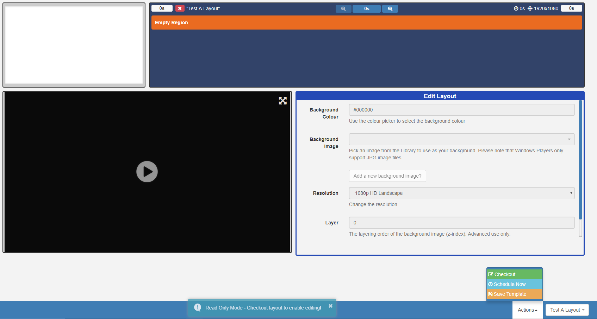
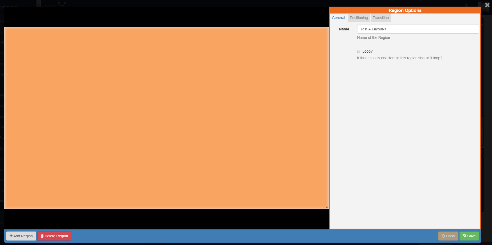
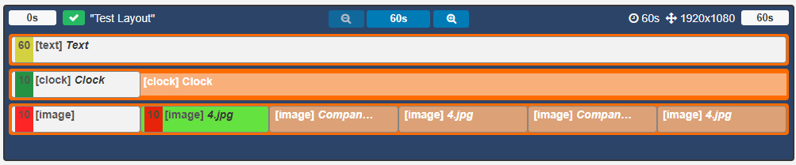
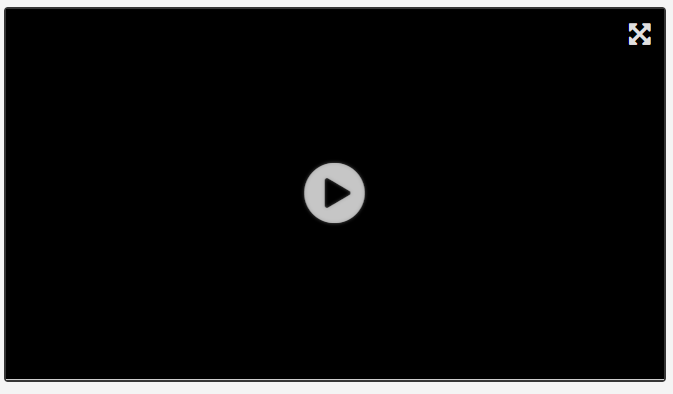
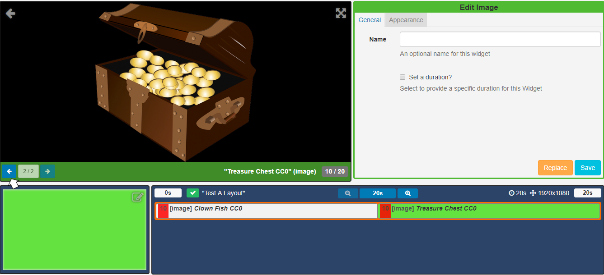
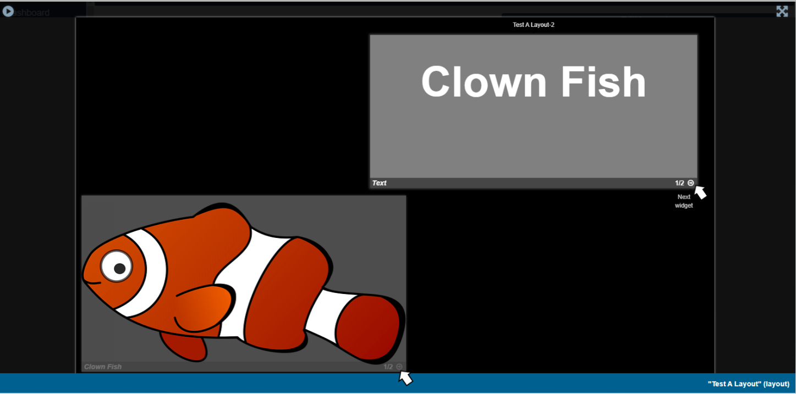
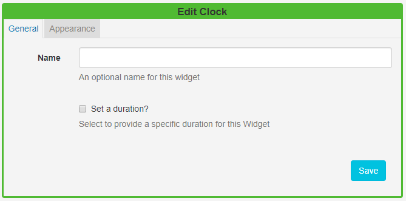
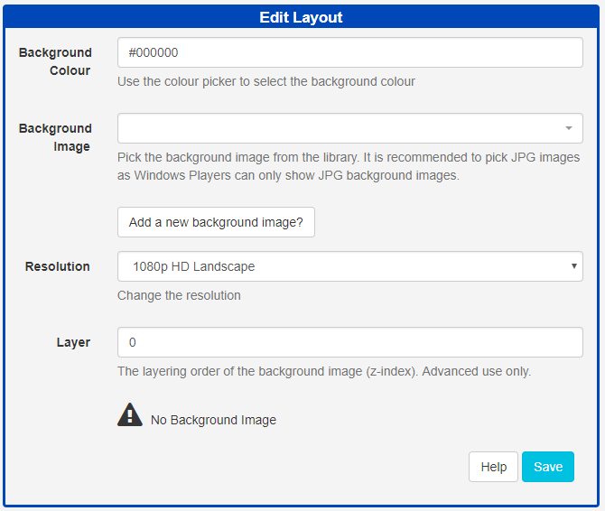

<!--toc=layouts-->

# Layout Designer

The Layout Designer is the heart of **content creation** in [[PRODUCTNAME]]. Each time a new Layout is added, or an existing one needs a design change, the Layout Designer is used.

{tip}
If you are using the **1.8** series CMS, please use the following link: [Layout Designer 1.8](layouts_designer_1.8.html)
{/tip}

[[PRODUCTNAME]] makes layout design simple through the use of **drag and drop**,**interactive previewing** and **design flexibility**. On adding a new Layout, the Layout Designer will open.

## Layout Navigator

This is located in the bottom corner of the Layout Designer window. As shown in the above image, all new Layouts, by default, have one full screen empty [Region](layouts_regions.html), represented as a semi-transparent overlay.  The Layout Navigator is used to add, position and resize Regions and gives an overview to the overall layout design.

Clicking on a **Region** in the opened Layout Navigator window, opens the **Region Options** form which allows for refinement of  **Positioning** and the application of **Transitions**.

## Layout Timeline

Located next to the Layout Navigator the Layout Timeline displays the duration of individual Widgets as well as complete layout duration which is based on the longest running region on the layout.

A status indicator is shown (cross or tick) to identify valid and invalid Layouts.  **Invalid layouts will be excluded from the Schedule and will not be played.**

{tip}
A Layout must contain at least one Region **and** each Region must contain at least **one** media item for it to be valid and play when scheduled.
{/tip}

## Preview

Preview your Layout, Widgets and Regions and make the necessary alterations to designs to ensure that everything plays as intended.  Click on the Play icon located in the top left of the Preview window to play a full Preview of your Layout. 

{tip}
View your Preview in full screen by clicking on the icon in the top right corner of the screen then press Play.
{/tip}

Click on a **Widget** to view media in the Preview window. Use the arrows to cycle through all Widgets that have been assigned to that **Region**. 

**Please note:** Video files will only play in the full Layout Preview.

{tip}
When you have multiple Regions, easily Preview all of the Media assigned by toggling to full screen and using the arrow tabs for each Region to cycle through the content.

{/tip}

{tip}
Click on the back arrow in the top right hand of the Preview window to return to the Layout Preview.
{/tip}

## Editor

Edit aspects of your Layout and assigned Widgets. Click on assigned **Widgets** from the **Layout Timeline** window to open the edit options available for that media item.

Use the arrow in the top right hand corner of the Preview window to return to the Layout and **Edit Layout** form.

Widgets can be edited by clicking on assigned **Widgets** on the **Layout Timeline** window to open the options available for that media item.

## Toolbox

Located on the bottom left of the toolbar assign actions using [Tools](layouts_tools.html), add  [Widgets](layouts_widgets.html) and search for [Library](layouts_library_search.html) media items to add to Layouts.

## Actions

Located on the bottom right of the toolbar, select from the menu of Actions that can be performed for **Published** Layouts.

- **Checkout**  - enable editing by putting the published Layout into a draft status.

- **Schedule Now**  - schedule published Layouts onto one or more Displays directly from the Layout Designer.

- **Save Template** - save your published designs by creating a [Template](layouts_templates.html) for reuse. Saving a template will store an exact copy of the Layout, including Regions, Playlists and media.

  {tip}
  Invalid Layouts cannot be published.
  {/tip}

### Draft Layout Status

Layouts that have been 'checked out' and in a draft status have action buttons to **Publish**, **Undo** and **Delete**, located on the bottom right of the toolbar.

 

### Set to Publish

Layouts can be **Published** straight away with updates automatically pushed to Layouts that are in the schedule. A date and time can also be selected to Publish a Layout at a **specified** time.

{tip}
You can also use the **row menu** for a selected draft Layout to set a **Publish time**.
{/tip}

### Layout Selector

The **Layout selector** provides easy navigation between all Layouts the logged in User has permission to edit without having to leave the Layout Designer screen.

{tip}
The toolbar has a memory so that when you next open [[PRODUCTNAME]] you can pick up exactly where you left off.
{/tip}